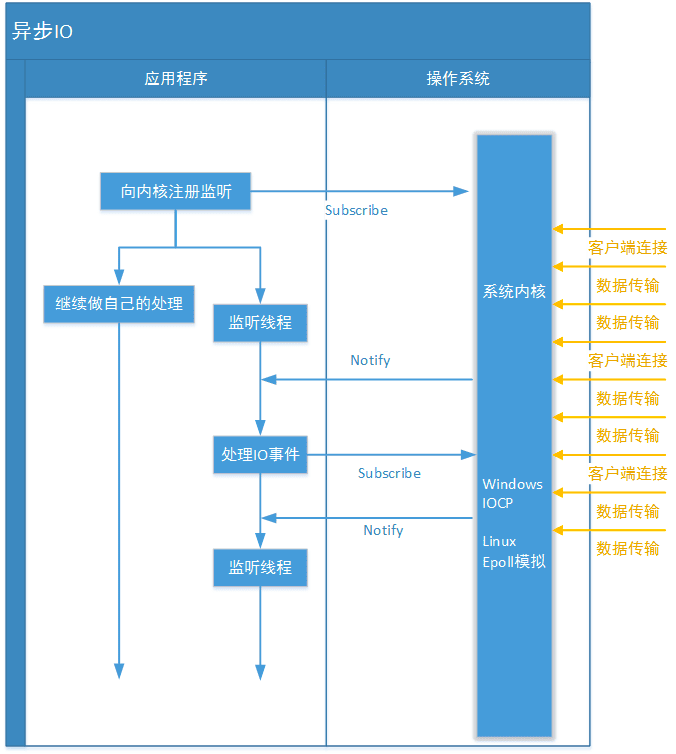

# AIO

异步IO则是采用“订阅-通知”模式: 即应用程序向操作系统注册IO监听，然后继续做自己的事情。当操作系统发生IO事件，并且准备好数据后，在主动通知应用程序，触发相应的函数:

和同步IO一样，异步IO也是由操作系统进行支持的。微软的windows系统提供了一种异步IO技术: IOCP(I/O Completion Port，I/O完成端口)；

Linux下由于没有这种异步IO技术，所以使用的是epoll(上文介绍过的一种多路复用IO技术的实现)对异步IO进行模拟。

代码示例，参考：[AIO示例](../../../src/main/java/com/netease/kafkamigration/kafka/aio)

注意在JAVA NIO框架中，我们说到了一个重要概念“selector”(选择器)。它负责代替应用查询中所有已注册的通道到操作系统中进行IO事件轮询、管理当前注册的通道集合，定位发生事件的通道等操操作；但是在JAVA AIO框架中，由于应用程序不是“轮询”方式，而是订阅-通知方式，所以不再需要“selector”(选择器)了，改由channel通道直接到操作系统注册监听。

JAVA AIO框架中，只实现了两种网络IO通道“AsynchronousServerSocketChannel”(服务器监听通道)、“AsynchronousSocketChannel”(socket套接字通道)。但是无论哪种通道他们都有独立的fileDescriptor(文件标识符)、attachment(附件，附件可以使任意对象，类似“通道上下文”)，并被独立的SocketChannelReadHandle类实例引用。我们通过debug操作来看看它们的引用结构:

在测试过程中，我们启动了两个客户端(客户端用什么语言来写都行，用阻塞或者非阻塞方式也都行，只要是支持 TCP Socket套接字的就行，然后我们观察服务器端对这两个客户端通道的处理情况.
