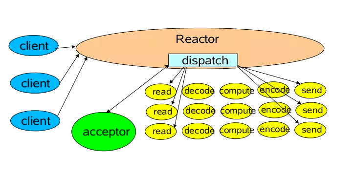
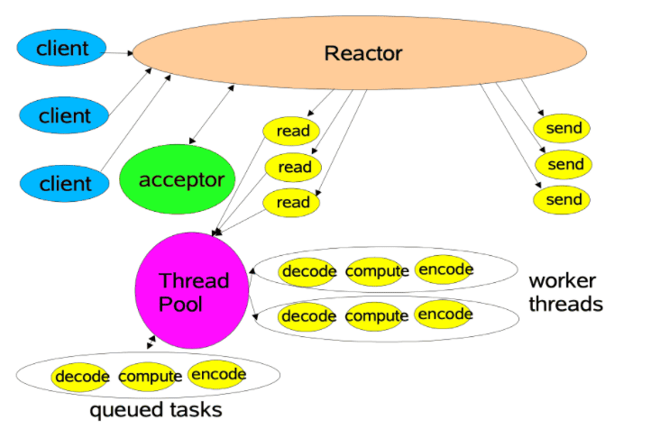
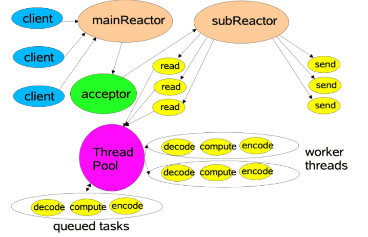
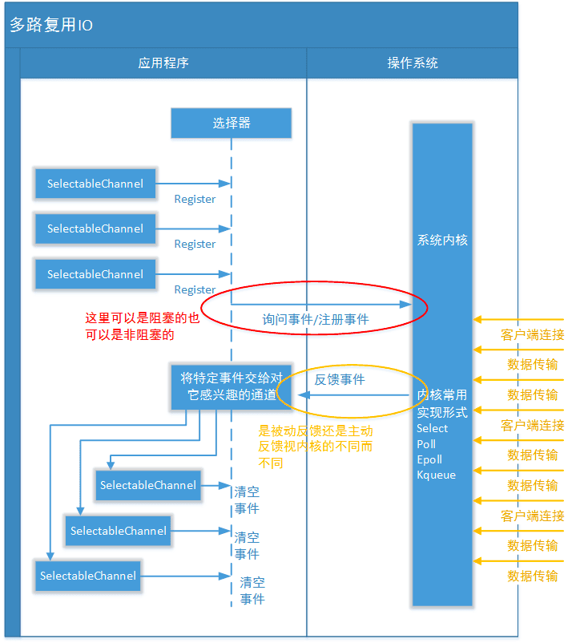
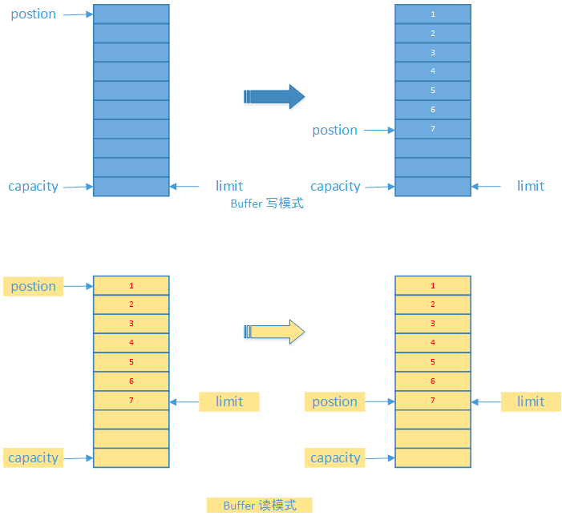

## NIO

- Standard IO是对字节流的读写，在进行IO之前，首先创建一个流对象，流对象进行读写操作都是按字节 ，一个字节一个字节的来读或写。
- NIO把IO抽象成块，类似磁盘的读写，每次IO操作的单位都是一个块，块被读入内存之后就是一个byte[]，NIO一次可以读或写多个字节。#

I/O流
- 一个输入流产生一个字节数据，一个输出流消费一个字节数据
- 创建过滤器很方便
- 处理数据的效率偏低
I/O块
- 按块处理数据比按流处理数据要快得多
- 面向流的一些数据处理较为负责，因此集成了一些NIO工具类  java.i0.*

#### **通道与缓冲区**

##### 1. 通道
通道 Channel 是对原 I/O 包中的流的模拟，可以通过它读取和写入数据。 

通道与流的不同之处在于
- 流只能在一个方向上移动(一个流必须是 InputStream 或者 OutputStream 的子类)，而通道是双向的，可以用于读、写或者同时用于读写。
- 通道包括以下类型
  - FileChannel: 从文件中读写数据
  - DatagramChannel: 通过 UDP 读写网络中数据
  - SocketChannel: 通过 TCP 读写网络中数据
  - ServerSocketChannel: 可以监听新进来的 TCP 连接，对每一个新进来的连接都会创建一个 SocketChannel。
##### 2. 缓冲区
发送给一个通道的所有数据都必须首先放到缓冲区中，同样地，从通道中读取的任何数据都要先读到缓冲区中。

也就是说，不会直接对通道进行读写数据，而是要先经过缓冲区。

缓冲区实质上是一个数组，但它不仅仅是一个数组。 缓冲区提供了对数据的结构化访问，而且还可以跟踪系统的读/写进程。

缓冲区包括以下类型:
- ByteBuffer
- CharBuffer
- ShortBuffer
- IntBuffer
- LongBuffer
- FloatBuffer
- DoubleBuffer

缓冲区状态变量
- capacity: 最大容量；
- position: 当前已经读写的字节数；
- limit: 还可以读写的字节数。

#### 选择器

NIO 常常被叫做非阻塞 IO，主要是因为 NIO 在网络通信中的非阻塞特性被广泛使用。

NIO 实现了 IO 多路复用中的 Reactor 模型，一个线程 Thread 使用一个选择器 Selector 通过轮询的方式去监听多个通道 Channel 上的事件，从而让一个线程就可以处理多个事件。

通过配置监听的通道 Channel 为非阻塞，那么当 Channel 上的 IO 事件还未到达时，就不会进入阻塞状态一直等待，而是继续轮询其它 Channel，找到 IO 事件已经到达的 Channel 执行。

因为创建和切换线程的开销很大，因此使用一个线程来处理多个事件而不是一个线程处理一个事件具有更好的性能。

应该注意的是，只有套接字 Channel 才能配置为非阻塞，而 FileChannel 不能，为 FileChannel 配置非阻塞也没有意义。

## IO 多路复用

目前流程的多路复用IO实现主要包括四种: select、poll、epoll、kqueue。下表是他们的一些重要特性的比较:

<table><thead><tr><th>IO模型</th><th>相对性能</th><th>关键思路</th><th>操作系统</th><th>JAVA支持情况</th></tr></thead><tbody><tr><td>select</td><td>较高</td><td>Reactor</td><td>windows/Linux</td><td>支持,Reactor模式(反应器设计模式)。Linux操作系统的 kernels 2.4内核版本之前，默认使用select；而目前windows下对同步IO的支持，都是select模型</td></tr><tr><td>poll</td><td>较高</td><td>Reactor</td><td>Linux</td><td>Linux下的JAVA NIO框架，Linux kernels 2.6内核版本之前使用poll进行支持。也是使用的Reactor模式</td></tr><tr><td>epoll</td><td>高</td><td>Reactor/Proactor</td><td>Linux</td><td>Linux kernels 2.6内核版本及以后使用epoll进行支持；Linux kernels 2.6内核版本之前使用poll进行支持；另外一定注意，由于Linux下没有Windows下的IOCP技术提供真正的 异步IO 支持，所以Linux下使用epoll模拟异步IO</td></tr><tr><td>kqueue</td><td>高</td><td>Proactor</td><td>Linux</td><td>目前JAVA的版本不支持</td></tr></tbody></table>

### Reactor模型和Proactor模型

#### Reactor事件驱动模型

在传统IO模型中，由于线程在等待连接以及进行IO操作时都会阻塞当前线程，这部分损耗是非常大的。因而jdk 1.4中就提供了一套非阻塞IO的API。该API本质上是以事件驱动来处理网络事件的，而Reactor是基于该API提出的一套IO模型。如下是Reactor事件驱动模型的示意图

从图中可以看出，在Reactor模型中，主要有四个角色：客户端连接，Reactor，Acceptor和Handler。

这里Acceptor会不断地接收客户端的连接，然后将接收到的连接交由Reactor进行分发，最后有具体的Handler进行处理。改进后的Reactor模型相对于传统的IO模型主要有如下优点：
- 从模型上来讲，如果仅仅还是只使用一个线程池来处理客户端连接的网络读写，以及业务计算，那么Reactor模型与传统IO模型在效率上并没有什么提升。但是Reactor模型是以事件进行驱动的，其能够将接收客户端连接，+ 网络读和网络写，以及业务计算进行拆分，从而极大的提升处理效率；
- Reactor模型是异步非阻塞模型，工作线程在没有网络事件时可以处理其他的任务，而不用像传统IO那样必须阻塞等待。

#### Reactor模型----业务处理与IO分离

在上面的Reactor模型中，由于网络读写和业务操作都在同一个线程中，在高并发情况下，这里的系统瓶颈主要在两方面：
- 高频率的网络读写事件处理；
- 大量的业务操作处理；

基于上述两个问题，这里在单线程Reactor模型的基础上提出了使用线程池的方式处理业务操作的模型。如下是该模型的示意图：

从图中可以看出，在多线程进行业务操作的模型下，该模式主要具有如下特点：
- 使用一个线程进行客户端连接的接收以及网络读写事件的处理；
- 在接收到客户端连接之后，将该连接交由线程池进行数据的编解码以及业务计算。

这种模式相较于前面的模式性能有了很大的提升，主要在于在进行网络读写的同时，也进行了业务计算，从而大大提升了系统的吞吐量。但是这种模式也有其不足，主要在于：
- 网络读写是一个比较消耗CPU的操作，在高并发的情况下，将会有大量的客户端数据需要进行网络读写，此时一个线程将不足以处理这么多请求。#

#### Reactor模型----并发读写

对于使用线程池处理业务操作的模型，由于网络读写在高并发情况下会成为系统的一个瓶颈，因而针对该模型这里提出了一种改进后的模型，即使用线程池进行网络读写，而仅仅只使用一个线程专门接收客户端连接。如下是该模型的示意图：

可以看到，改进后的Reactor模型将Reactor拆分为了mainReactor和subReactor。这里mainReactor主要进行客户端连接的处理，处理完成之后将该连接交由subReactor以处理客户端的网络读写。这里的subReactor则是使用一个线程池来支撑的，其读写能力将会随着线程数的增多而大大增加。对于业务操作，这里也是使用一个线程池，而每个业务请求都只需要进行编解码和业务计算。通过这种方式，服务器的性能将会大大提升，在可见情况下，其基本上可以支持百万连接。

#### JAVA对多路复用IO的支持

##### 重要概念: Channel

通道，被建立的一个应用程序和操作系统交互事件、传递内容的渠道(注意是连接到操作系统)。一个通道会有一个专属的文件状态描述符。那么既然是和操作系统进行内容的传递，那么说明应用程序可以通过通道读取数据，也可以通过通道向操作系统写数据。

##### 重要概念: Buffer

数据缓存区: 在JAVA NIO 框架中，为了保证每个通道的数据读写速度JAVA NIO 框架为每一种需要支持数据读写的通道集成了Buffer的支持。

这句话怎么理解呢? 例如ServerSocketChannel通道它只支持对OP_ACCEPT事件的监听，所以它是不能直接进行网络数据内容的读写的。所以ServerSocketChannel是没有集成Buffer的。

Buffer有两种工作模式: 写模式和读模式。在读模式下，应用程序只能从Buffer中读取数据，不能进行写操作。但是在写模式下，应用程序是可以进行读操作的，这就表示可能会出现脏读的情况。所以一旦您决定要从Buffer中读取数据，一定要将Buffer的状态改为读模式。

- position: 缓存区目前这在操作的数据块位置
- limit:缓存区最大可以进行操作的位置。缓存区的读写状态正式由这个属性控制的。
- capacity: 缓存区的最大容量。这个容量是在缓存区创建时进行指定的。由于高并发时通道数量往往会很庞大，所以每一个缓存区的容量最好不要过大。

##### 重要概念: Selector

Selector的英文含义是“选择器”，不过根据我们详细介绍的Selector的岗位职责，您可以把它称之为“轮询代理器”、“事件订阅器”、“channel容器管理机”都行。
- 事件订阅和Channel管理

应用程序将向Selector对象注册需要它关注的Channel，以及具体的某一个Channel会对哪些IO事件感兴趣。
Selector中也会维护一个“已经注册的Channel”的容器。

- 轮询代理

应用层不再通过阻塞模式或者非阻塞模式直接询问操作系统“事件有没有发生”，而是由Selector代其询问。

- 实现不同操作系统的支持

多路复用IO技术 是需要操作系统进行支持的，其特点就是操作系统可以同时扫描同一个端口上不同网络连接的事件。所以作为上层的JVM，必须要为 不同操作系统的多路复用IO实现编写不同的代码。