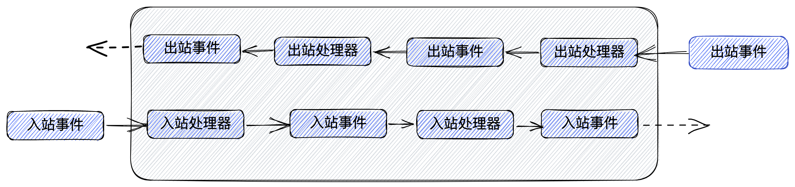

# Netty

目前流行的NIO框架非常的多。使用最多的有以下几种:
- 原生JAVA NIO框架

JAVA NIO通信框架基于多路复用IO原理，我们将详细讲解它的工作原理。
- APACHE MINA 2

是一个网络应用程序框架，用来帮助用户简单地开发高性能和高可扩展性的网络应用程序。它提供了一个通过Java NIO在不同的传输例如TCP/IP和UDP/IP上抽象的事件驱动的异步API。
- NETTY 4/5

Netty是由JBOSS提供的一个java开源框架。Netty提供异步的、事件驱动的网络应用程序框架和工具，用以快速开发高性能、高可靠性的网络服务器和客户端程序。
- Grizzly

Grizzly是一种应用程序框架，专门解决编写成千上万用户访问服务器时候产生的各种问题。使用JAVA NIO作为基础，并隐藏其编程的复杂性。

#### 优点
- api简单，开发门槛低
- 功能强大，内置了多种编码、解码功能
- 与其它业界主流的NIO框架对比，netty的综合性能最优
- 社区活跃，使用广泛，经历过很多商业应用项目的考验
- 定制能力强，可以对框架进行灵活的扩展

示例  [Netty示例](../../../src/main/java/com/netease/kafkamigration/kafka/netty)

---

## Netty In Action 读后感


### 1. Netty 核心组件

- Channel
- 回调
- Future
- 事件与ChannelHandler

#### 1.1 Channel

通道，代表一个到实体（如一个硬件设备、一个文件、一个网络套接字或者一个能够执行一个或者多个不同的IO操作的程序组件）的开发连接，如读操作和写操作。

#### 1.2 回调

一个方法： 其指向已经被提供给另外一个方法的方法的引用。

#### 1.3 Future

Future 提供了定义中在操作完成时通知应用程序的方式。

ChannelFuture 提供了几种额外的方法，这些方法使得我们可以注册一个或者多个ChannelFutureListener实例，该监听器的回调方法operationComplete(),将会在对应操作完成时被调用。

[示例代码](../../../src/main/java/com/netease/kafkamigration/kafka/netty/NettyDemo1.java)
```java
package com.netease.kafkamigration.kafka.netty;


import org.jboss.netty.channel.Channel;
import org.jboss.netty.channel.ChannelFuture;

import java.net.InetSocketAddress;

public class NettyDemo1 {
    public static void main(String[] args) {
        Channel channel = null;
        // 异步连接到远程节点
        ChannelFuture future = channel.connect(new InetSocketAddress(9999));
        // 注册一个 ChannelFutureListener 到 ChannelFuture
        future.addListener(channelFuture -> {
            if(channelFuture.isSuccess()){
                // 操作成功
                // 构建数据
                Object data = null;
                // 将数据异步发送到远程节点
                ChannelFuture write = channelFuture.getChannel().write(data);
                
            } else {
                // 操作失败，打赢输出失败原因
                channelFuture.getCause().printStackTrace();
                // 后续 可以根据需求具体处理
            }
            
        });

    }
    
}
```

需要注意的是，对错误的处理完全取决于你、目标，当然也包括目前任何对于特定类型的错误 加以的限制。例如，如果连接失败，你可以尝试重新连接或者建立一个到另一个远程节点的连接。 

如果你把 ChannelFutureListener 看作是回调的一个更加精细的版本，那么你是对的。 事实上，回调和 Future 是相互补充的机制；它们相互结合，构成了 Netty 本身的关键构件块之一。

#### 1.4 事件与ChannelHandler

ChannelHandler 链处理入站以及出站事件示意图



Netty 提供了大量预定义的可以开箱即用的 ChannelHandler 实现，包括用于各种协议
（如 HTTP 和 SSL/TLS）的 ChannelHandler。在内部，ChannelHandler 自己也使用了事件
和 Future，使得它们也成为了你的应用程序将使用的相同抽象的消费者。


#### 1.5 概念整合

##### 1.5.1 Future、回调和 ChannelHandler
Netty的异步编程模型是建立在Future和回调的概念之上的，而将事件派发到ChannelHandler
的方法则发生在更深的层次上。结合在一起，这些元素就提供了一个处理环境，使你的应用程序逻
辑可以独立于任何网络操作相关的顾虑而独立地演变。这也是 Netty 的设计方式的一个关键目标。

拦截操作以及高速地转换入站数据和出站数据，都只需要你提供回调或者利用操作所返回的
Future。这使得链接操作变得既简单又高效，并且促进了可重用的通用代码的编写

##### 1.5.2 选择器、事件和 EventLoop
Netty 通过触发事件将 Selector 从应用程序中抽象出来，消除了所有本来将需要手动编写
的派发代码。在内部，将会为每个 Channel 分配一个 EventLoop，用以处理所有事件，包括：
- 注册感兴趣的事件； 
- 将事件派发给 ChannelHandler； 
- 安排进一步的动作。

EventLoop 本身只由一个线程驱动，其处理了一个 Channel 的所有 I/O 事件，并且在该
EventLoop 的整个生命周期内都不会改变。这个简单而强大的设计消除了你可能有的在
ChannelHandler 实现中需要进行同步的任何顾虑，因此，你可以专注于提供正确的逻辑，用
来在有感兴趣的数据要处理的时候执行。如同我们在详细探讨 Netty 的线程模型时将会看到的，
该 API 是简单而紧凑的。


### 2. Netty 应用


