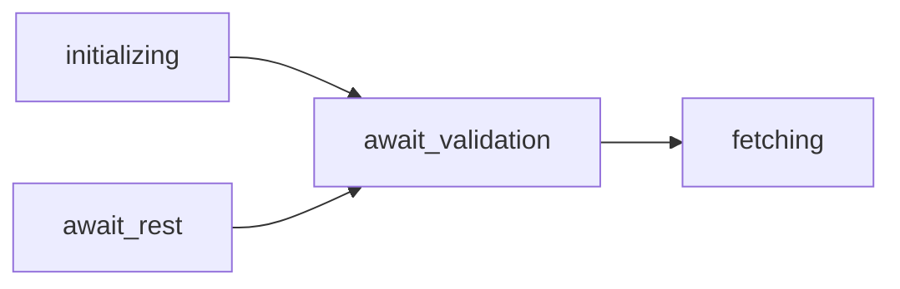

## kafkaConsumer源码解析

[TOC]

### 一：kafka consumer rebalance 协议详解

​		对于同一个 **Consumer Group** 来说，同一个 Topic 的**不同 partition 会分配给不同的 consumer 进行消费**，那**如何分配 partition**？如何在有新 consumer 加入以及 consumer 宕机的时候重新分配 partition，就是我们说的 consumer group rebalance。


#### 1.1 初始方案（Kafka 0.9版本前）

​		Kafka最开始的解决方案是通过ZooKeeper的**Watcher**实现的。每个Consumer Group在ZooKeeper下都维护了一个“**/consumers/[group_id]/ids**”路径，在此路径下使用临时节点记录属于此Consumer Group的消费者的Id，由Consumer启动时创建。还有两个与ids节点同级的节点，它们分别是：**owners节点，记录了分区与消费者的对应关系；offsets节点，记录了此Consumer Group在某个分区上的消费位置。**

​		每个Broker、Topic以及分区在ZooKeeper中也都对应一个路径，如下所示。

- /brokers/ids/broker_id：记录了host、port以及分配在此Broker上的Topic的分区列表。 

- /brokers/topics/[topic_name]：记录了每个Partition的Leader、ISR等信息。 

- /brokers/topics/[topic_name]/partitions/[partition_num]/state：记录了当前Leader、选举epoch等信息。 


​		每个 Consumer 都会在 **`/consumers/{group_id}/ids` 和 `/brokers/ids` 节点上注册一个 Watcher**，当 **`/consumers/{group_id}/ids` 的子节点发生变化**时，表示 **Consumer Group中的消费者出现了变化**；当 **`/brokers/ids` 子节点发生变化**时，表示 kafka 集群中的 **broker 出现了增减**。通过上述两个 Watcher，consumer 就可以监控 Consumer Group 状态以及 Kafka 集群的状态。

​		重度依赖于 Zookeeper 集群，会导致以下问题。

- 羊群效应：当 consumer 很多的时候，一个 consumer 或是一个 broker 的变化（加入、退出 consumer group或 broker 重启），就会导致**全部 consumer 被通知**，这个时候，很多 consumer 并不关心这个事件，过多无用的 Watcher 通知会给 Zookeeper 集群带来压力，也会给 consumer 带来压力。
- 脑裂：每个 consumer 都依赖 Zookeeper 集群来判断 Consumer Group 状态、Broker 的状态，但是**不同 consumer 在同一时刻可能连接到 Zookeeper 集群的不同节点**，由于**Zookeeper 只保证 最终一致性（不保证强一致性）**，那不同 consumer 看到的元数据就可能不一样，这就会造成多余的 Reblance 操作。

#### 1.2 Eager Rebalance Protocol

​		Eager Rebalance Protocol 的核心设计思想是：将全部的 consumer group 分成多个**子集**，每个 consumer group 集合在 **broker** 对应一个 **GroupCoordinator**，由 **GroupCoordinator 管理对应 consumer groups 的 rebalance**（每个 broker 都拥有成为 GroupCoordinator 的能力）。

​		kafka 通过加一层 GroupCoordinator 的方式，让所有 consumer 不再**直接依赖** Zookeeper，而是靠 GroupCoordinator 在Zookeeper 上添加 Watcher。

​		**1、** 当前 consumer 准备加入 consumer group 或 GroupCoordinator发生故障转移时，consumer 并不知道GroupCoordinator 的 host 和 port，所以 consumer 会向 Kafka 集群中的**任一 broker 节点发送 FindCoordinatorRequest 请求**，收到请求的 broker 节点会返回 **ConsumerMetadataResponse** 响应，其中就包含了**负责管理该 Consumer Group 的 GroupCoordinator 的地址**。

​		**2、** 接下来，consumer 会**连接到 GroupCoordinator 节点**，并周期性的发送**心跳请求**。GroupCoordinator 会通过心跳消费确定 consumer 是否正常在线，长时间收不到一个心跳信息时，GroupCoordinator 会认为 consumer 宕机了，就会为该 consumer group 触发新一轮的 Rebalance 操作。

​		**3、** 在 consumer 收到中带有 **IllegalGeneration** 异常的心跳响应时，就表明 GroupCoordinator 发起了 **Rebalance** 操作。此时 consumer 会向 GroupCoordinator 发送 **JoinGroupRequest** ，向 GroupCoordinator 表明自己要加入指定的Consumer Group。

​		**4、** **GroupCoordinator** 等待一个 consumer group 中全部 consumer 都发送了 JoinGroupRequest 请求之后，就会结合Zookeeper 中的 partition 的元数据，**进行 partition 的分配**。

​		**5、** GroupCoordinator 在分配完 partition 之后，会将 partition 与 consumer 之间的**映射关系写入到 Zookeeper 中保存**，同时还会将分配结果通过 **JoinGroupResponse** 返回给 consumer。

​		**6、** consumer 根据根据 **JoinGroupResponse** 响应中的**分配结果**来消费对应的 partition，同时会定时发送**HeartbeatRequest** 请求表明自己在线。如果后续出现 consumer 加入或下线、broker 上下线、partition 增加等状况时，GroupCoordinator 返回的 HeartbeatResponse 会包含 IllegalGeneration 异常，接下来就会进入步骤3。

​		上面这种方案虽然解决了“羊群效应”、“脑裂”问题，但是还是有两个问题：

- **分区分配的操作是在服务端的GroupCoordinator中完成的**，这就要求服务端实现Partition的分配策略。当要使用新的Partition分配策略时，就必须修改服务端的代码或配置，之后重启服务，这就显得比较麻烦。 

- **不同的Rebalance策略有不同的验证需求**。当需要自定义分区分配策略和验证需求时，就会很麻烦。 


​		**Kafka 0.9版本中进行了重新设计Eager Rebalance Protocol，将 partition 分配的工作放到了 consumer 这一端进行处理，Consumer Group 管理的工作则依然由GroupCoordinator 处理，**解决了 Eager Rebalance Protocol最开始版本中的**扩展性问题**。

​		该版本的 rebalance 协议将 JoinGroupRequest 的处理过程拆分成了两个阶段，分别是 **Join Group 阶段和 Synchronizing Group State 阶段**。

​		**1、** 当 consumer 通过 **FindCoordinatorRequest** 查找到其 Consumer Group 对应的 GroupCoordinator 之后，就会进入 **Join Group 阶段**。下面是 FindCoordinatorRequest 和 FindCoordinatorResponse 的具体格式：

```shell
// FindCoordinator请求结构
FindCoordinator Request (Version: 3) => key key_type TAG_BUFFER 
  key => COMPACT_STRING // The coordinator key.
  key_type => INT8 // The coordinator key type. (Group, transaction, etc.) 后面再说这两种类型，知道是个唯一标识就行了
  
// FindCoordinator响应结构
FindCoordinator Response (Version: 3) => throttle_time_ms error_code error_message node_id host port TAG_BUFFER 
  throttle_time_ms => INT32 // The duration in milliseconds for which the request was throttled due to a quota violation, or zero if the request did not violate any quota.
  error_code => INT16 // The error code, or 0 if there was no error.
  error_message => COMPACT_NULLABLE_STRING // The error message, or null if there was no error.
  node_id => INT32 // The node id. GroupCoordinator所在的nodeId以及hostName、port
  host => COMPACT_STRING // The host name.
  port => INT32 // The port.
```

​		**2、** Consumer 先向 GroupCoordinator 发送 **JoinGroupRequest** 请求，其中包含 consumer 的相关信息，如下图所示：


**JoinGroupRequest 的格式**

```shell
JoinGroup Request (Version: 7) => group_id session_timeout_ms rebalance_timeout_ms member_id group_instance_id protocol_type [protocols] TAG_BUFFER 
  group_id => COMPACT_STRING // The group identifier.
  session_timeout_ms => INT32 // The coordinator considers the consumer dead if it receives no heartbeat after this timeout in milliseconds.
  rebalance_timeout_ms => INT32 // The maximum time in milliseconds that the coordinator will wait for each member to rejoin when rebalancing the group.
  member_id => COMPACT_STRING // The member id assigned by the group coordinator.
  group_instance_id => COMPACT_NULLABLE_STRING // The unique identifier of the consumer instance provided by end user.
  protocol_type => COMPACT_STRING // The unique name the for class of protocols implemented by the group we want to join.
  protocols => name metadata TAG_BUFFER // The list of protocols that the member supports.
    name => COMPACT_STRING // The protocol name.
    metadata => COMPACT_BYTES // The protocol metadata.
```

​		**3、** GroupCoordinator 收到 JoinGroupRequest 后会**暂存该 consumer 信息**，然后**等待全部 consumer 的 JoinGroupRequest 请求**。JoinGroup Request 中的 `session.timeout.ms` 和 `rebalance_timeout_ms`（ `max.poll.interval.ms`）是就是用来告诉 GroupCoordinator 等待多久的。

​		**4、** GroupCoordinator 会根据全部 consumer 的 JoinGroupRequest 请求来确定 Consumer Group 中可用的 consumer，从中**选取一个 consumer 成为 Group Leader，同时还会决定 partition 分配策略，最后会将这些信息封装成JoinGroupResponse 返回给 Group Leader Consumer**，下面是 JoinGroupResponse 的具体格式。

```shell
JoinGroup Response (Version: 7) => throttle_time_ms error_code generation_id protocol_type protocol_name leader member_id [members] TAG_BUFFER 
  throttle_time_ms => INT32 // The duration in milliseconds for which the request was throttled due to a quota violation, or zero if the request did not violate any quota.
  error_code => INT16 // The error code, or 0 if there was no error.
  generation_id => INT32 // The generation ID of the group.
  protocol_type => COMPACT_NULLABLE_STRING // The group protocol name.
  protocol_name => COMPACT_NULLABLE_STRING // The group protocol selected by the coordinator.
  leader => COMPACT_STRING // The leader of the group.
  member_id => COMPACT_STRING // The member ID assigned by the group coordinator.
  members => member_id group_instance_id metadata TAG_BUFFER 
    member_id => COMPACT_STRING // The group member ID.
    group_instance_id => COMPACT_NULLABLE_STRING // The unique identifier of the consumer instance provided by end user.
    metadata => COMPACT_BYTES // The group member metadata.
```

​		**5、** **每个 consumer 都会收到 JoinGroupResponse 响应**，但是只有 **Group Leader** 收到的 JoinGroupResponse 响应中**封装的所有 consumer 信息以及 Group Leader 信息**。当其中一个 consumer 确定了自己的 Group Leader后，会根据 consumer 信息、kafka 集群元数据以及 partition 分配策略**计算 partition 的分片结果**。其他非 Group Leader consumer 收到 JoinResponse 为空响应，也就不会进行任何操作，只是**原地等待**。


​		**6、** 接下来，所有 consumer 进入 **Synchronizing Group State 阶段**，所有 consumer 会向 GroupCoordinator 发送 **SyncGroupRequest**。其中，Group Leader Consumer 的 SyncGroupRequest 请求**包含了 partition 分配结**果，普通 consumer 的 **SyncGroupRequest 为空请求**。


SyncGroup Request 请求的格式

```shell
SyncGroup Request (Version: 5) => group_id generation_id member_id group_instance_id protocol_type protocol_name [assignments] TAG_BUFFER 
  group_id => COMPACT_STRING // The unique group identifier.
  generation_id => INT32 // The generation of the group.
  member_id => COMPACT_STRING // The member ID assigned by the group.
  group_instance_id => COMPACT_NULLABLE_STRING // The unique identifier of the consumer instance provided by end user.
  protocol_type => COMPACT_NULLABLE_STRING // The group protocol type.
  protocol_name => COMPACT_NULLABLE_STRING // The group protocol name.
  assignments => member_id assignment TAG_BUFFER  //Each assignment.
    member_id => COMPACT_STRING // The ID of the member to assign.
    assignment => COMPACT_BYTES // The member assignment.
```

​		**7、** GroupCoordinator 接下来会将 **partition 分配结果封装成 SyncGroupResponse** 返回给所有 consumer。


SyncResponse 的格式

```shell
SyncGroup Response (Version: 5) => throttle_time_ms error_code protocol_type protocol_name assignment TAG_BUFFER 
  throttle_time_ms => INT32 // The duration in milliseconds for which the request was throttled due to a quota violation, or zero if the request did not violate any quota.
  error_code => INT16 // The error code, or 0 if there was no error.
  protocol_type => COMPACT_NULLABLE_STRING // The group protocol type.
  protocol_name => COMPACT_NULLABLE_STRING // The group protocol name.
  assignment => COMPACT_BYTES // The member assignment.
```

​		**8、** consumer 收到 SyncGroupResponse 后进行解析，就可以**明确 partition 与 consumer 的映射关系**。后续 consumer 还是会与 GroupCoordinator 保持定期的心跳。触发 rebalance 的条件也是**心跳响应中包含 IllegalGeneration 异常**。


**心跳请求/响应的格式**

```shell
Heartbeat Request (Version: 4) => group_id generation_id member_id group_instance_id TAG_BUFFER 
  group_id => COMPACT_STRING // The group id.
  generation_id => INT32 // The generation of the group.
  member_id => COMPACT_STRING // The member ID.
  group_instance_id => COMPACT_NULLABLE_STRING //The unique identifier of the consumer instance provided by end user.
  
Heartbeat Response (Version: 4) => throttle_time_ms error_code TAG_BUFFER 
  throttle_time_ms => INT32 // The duration in milliseconds for which the request was throttled due to a quota violation, or zero if the request did not violate any quota.
  error_code => INT16 // The error code, or 0 if there was no error.
```

​	

​		当然，该 Rebalance 协议，有两大问题

1. **长时间STW（stop the world）的影响**。也就是说在**整个 rebalance 的过程中**，**所有 partition 都会被回收**（revoke），consumer 是无法消费任何 partition 的。

​		例如，有一个 consumer 退出 consumer group 时，会发送 **LeaveGroup Request** 请求到 GroupCoordinator，如下图所示：


LeaveGroup Request 的格式

```shell
LeaveGroup Request (Version: 4) => group_id [members] TAG_BUFFER 
  group_id => COMPACT_STRING // The ID of the group to leave.
  members => member_id group_instance_id TAG_BUFFER  //List of leaving member identities.
    member_id => COMPACT_STRING // The member ID to remove from the group.
    group_instance_id => COMPACT_NULLABLE_STRING // The group instance ID to remove from the group.
```

​		**GroupCoordinator 将会在下个心跳响应中通知 consumer group 中剩余的 consumer 进行新一轮的 rebalance**。**在新一轮的 rebalance 完成之前，剩余的 consumer 都不会消费任何 message**。有新 consumer 加入 consumer group 也是一样。

2.  **consumer 长 GC 引发 rebalance**：如下图所示，此时 GroupCoordinator 会因为长时间收不到 consumer 心跳，认为 consumer 下线，触发 rebalance。


#### 1.3 Static Membership（2.3版本）

​		为了解决上述问题，kafka 在 **2.3 版本**中引入了 **Static Membership 协议**。详情参考：[https://cwiki.apache.org/confluence/display/KAFKA/KIP-345%3A+Introduce+static+membership+protocol+to+reduce+consumer+rebalances](https://cwiki.apache.org/confluence/display/KAFKA/KIP-345%3A+Introduce+static+membership+protocol+to+reduce+consumer+rebalances)

​		Static Membership 优化协议的核心：

- 在 consumer 端增加 `group.instance.id` 配置（`group.instance.id` 是 consumer 的唯一标识）。如果 consumer 启动的时候明确指定了 `group.instance.id` 配置值，consumer 会在 JoinGroup Request 中携带该值，表示该 consumer 为 static member。 为了保证 `group.instance.id` 的唯一性，我们可以考虑使用 hostname、ip 等。
- 在 GroupCoordinator 端会记录 **group.instance.id → member.id 的映射关系**，以及**已有的 partition 分配关系**。当 GroupCoordinator 收到已知 group.instance.id 的 consumer 的 JoinGroup Request 时，不会进行 rebalance，而是将**其原来对应的 partition 分配给它**。

Static Membership 协议可以让 consumer group **只在下面的 4 种情况下进行 rebalance**

- 有新 consumer 加入 consumer group 时
- Group Leader 重新加入 Group 时
- consumer 下线时间超过阈值（ `session.timeout.ms`）
- GroupCoordinator 收到 static member 的 LeaveGroup Request 时

​		在使用 Static Membership 协议的场景下；只要在 consumer 重新部署的时候，**不发送 LeaveGroup Request** 且在 **`session.timeout.ms` 时长内重启成功**，就不会触发 rebalance。


#### 1.4 Incremental Cooperative Rebalance（2.4版本）

​		在 **kafka 2.4 版本**中，为了进一步**减少 rebalance 带来的 `Stop The World`**，提出了 `Incremental Cooperative Rebalance` 协议。其核心思想就是使用将一次**全局的 rebalance，改成多次小规模 rebalance**，最终收敛到 rebalance 的状态。

​		**STW产生的原因：**如下图所示，**Eager Rebalance 协议中**，consumer 为了满足这个要求，在发送 **JoinGroup Request** 的时候就停止了所有 partition 的消费，直至收到 SyncGroup Response（也就是收到**新的 partition 分配结果**之后）。如果将分布式系统简化成一个多线程应用，整个 rebalance 过程就类似于一个内存屏障（Sync Barrier），用来同步所有 consumer 的状态。

​		

**Incremental Cooperative Rebalance** 协议，该协议最核心的思想：

- consumer **比较新旧两个 partition 分配结果**，只停止消费回收（revoke）的 partition，对于两次都分配给自己的 partition，consumer 根本没有必要停止消费，这也就解决了 `Stop The World` 的问题。
- **通过多轮的局部 rebalance 来最终实现全局的 rebalance**。


​		上图就展示了一个 consumer 在一次 **rebalance 中比较操作**： `owned partitions`和 `assigned partitions` 分别是该 consumer 在 rebalance 前后要处理的 partition 集合，其中，**consumer 在整个 rebalance 过程中无需停止对 `unchanged partitions` 集合中 partition 的消费**。

​		举例说明如下：

##### 一个新Consumer加入CG


如上图所示，当前有 consumer 1 和 consumer 2，分别消费 P1 ~ P3、P4~P6，6个 partition，此时 consumer3 加入到 consumer group 中，触发第一轮 rebalance：

- consumer 3 会向 GroupCoordinator **发送 JoinGroupRequest 触发第一轮 rebalance**。

- GroupCoordinator 会在下一轮心跳响应中通知 consumer 1 和 consumer 2 需要进行 rebalance。

- consumer 1 和 consumer 2 会将自己当前正在处理的 partition 信息封装到 JoinGroup Request 中（metadata 字段）发往 GroupCoordinator：

  - consumer 1 发送的 JoinGroup Request（assigned: P1、P2、P3）
  - consumer 2 发送的 JoinGroup Request（assigned: P4、P5、P6）。
  - consumer 3 发送的 JoinGroup Request（assigned: ）。

  **此时的 consumer 1 和 consumer 2 并不会停止对 partition 的消费。**

- 经过 GroupCoordinator 处理之后，此次选举 consumer 1 作为 Group Leader，GroupCoordinator 发送给 consumer 1 的 JoinGroup Response 中同样包含各个 consumer 目前处理的 partition 信息：c1 ( P1、P2、P3 )，c2 ( P4、P5、P6)。

- consumer 1 在进行 partition 分配的时候发现有三个 consumer 参与，决定把 P1、P2 继续分配给 consumer 1，P3 回收（revoke）；把 P4、P5 继续分配给 consumer 2，P6 回收。consumer 1 在完成上述分配之后，会将**分配结果封装成 SyncGroup Request 发送给 GroupCoordinator**。

- GroupCoordinator 会根据 consumer 1 的 SyncGroup Request，生成 SyncGroup Response 返回给三个 consumer：

  - consumer 1 收到的 SyncGroup Response（assigned: P1、P2，revoked：P3）
  - consumer 2 收到的 SyncGroup Response（assigned: P4、P5，revoked：P6）。
  - consumer 3 收到的 SyncGroup Response（assigned: ，revoked：）。

  **到此为止，第一轮 rebalance 结束，**在第一轮 rebalance 的过程中，**consumer 1 依旧在消费 P1、P2、P3，consumer 2 依旧在消费 P4、P5、P6。**、

  

- 在 consumer 1 和 consumer 2 收到包含 revoked 的 **SyncGroup Response** 之后，会**立刻停止对 P3 和 P6 的消费，并立即发起第二轮 rebalance。**

  - consumer 1 发送的 JoinGroup Request（assigned: P1、P2）
  - consumer 2 发送的 JoinGroup Request（assigned: P4、P5）。
  - consumer 3 发送的 JoinGroup Request（assigned: ）。

- 接下来，GroupCoordinator 将收到的全部 JoinGroup Request 整理后，将目前的分配关系封装到 JoinGroup Response 中返回给 Group Leader（这里假设还是 consumer 1），其他非 Group Leader 的 consumer 得到空 JoinGroup Response。

- consumer 1 此时发现该 topic 有 P1 到 P6 六个 partition，但目前 partition 只分配了 4 个 partition，还有一个 consumer 空闲，自然会选择将 P3、P6 分给 consumer 3。

- 经过 SyncGroup Request、SyncGruop Response 的交互之后：

  - consumer 1 收到的 SyncGroup Response（assigned: P1、P2，revoked：）
  - consumer 2 收到的 SyncGroup Response（assigned: P4、P5，revoked：）。
  - consumer 3 收到的 SyncGroup Response（assigned: P3、P6 ，revoked：）。

  **在 consumer 3 收到该 SyncGroup Response 之后，会立刻开始消费 P3、P6。到此为止，第二轮 rebalance 结束，整个 rebalance 也完成了**。

##### Consumer下线后上线（remaining delay 时间到期前）

		如上图所示，当前有三个 consumer，consumer 2 离开 consumer group 且离开时间超过了 **session.timeout 时长**，此时 GroupCoordinator 会触发第一轮 rebalance。

- 首先，GroupCoordinator 会在下一轮心跳响应中通知 consumer 1 和 consumer 3 **发起第一轮 rebalance**。

- consumer 1 和 consumer 3 会将自己当前正在处理的 partition 信息封装到 JoinGroup Request 中（metadata 字段）发往 GroupCoordinator：

  - consumer 1 发送的 JoinGroup Request（assigned: P1、P2）
  - consumer 3 发送的 JoinGroup Request（assigned: P3、P6）。

- 假设 GroupCoordinator 在这里选择 consumer 1 作为 Group Leader，GroupCoordinator 会将 partition 目前的分配状态通过 JoinGroup Response 发送给 consumer 1。

- consumer 1 发现 P4、P5 两个 partition 并未出现（处于 lost 状态），此时 consumer 1 并不会立即解决当前的不平衡问题，返回的 partition 分配结果不变（同时会携带一个 delay 时间，`scheduled.rebalance.max.delay.ms`，默认 5 分钟）。GroupCoordinator 会根据 consumer 1 的 SyncGroup Request，生成 SyncGroup Response 返回给两个存活的 consumer：

  - consumer 1 收到的 SyncGroup Response（delay，assigned: P1、P2，revoked：）

  - consumer 3 收到的 SyncGroup Response（delay，assigned: P3、P6，revoked：）。

    **到此为止，第一轮 rebalance 结束**。整个 rebalance 过程中，consumer 1 和 consumer 3 并不会停止消费。

  ​		在 `scheduled.rebalance.max.delay.ms` 这个时间段内，**consumer 2 故障恢复，重新加入到 consumer group 时**，会向 GroupCoordinator 发送 JoinGroup Request，**触发第二轮的 rebalance**。GroupCoordinator 在下一次心跳响应中会通知 consumer 1 和 consumer 3 参与第二轮 rebalance。

- consumer 1 和 consumer 3 在收到心跳之后，会发送 JoinGroup Request 参与第二轮 rebalance：

  - consumer 1 发送的 JoinGroup Request（assigned: P1、P2）
  - consumer 3 发送的 JoinGroup Request（assigned: P3、P6）。

- 在此次第二轮 rebalance 中，consumer 1 依旧被选为 Group Leader，它会发现 delay 的时间（`scheduled.rebalance.max.delay.ms`）是否已经到了，如果没到，则**依旧不会立即解决当前的不平衡问题**，继续返回目前的分配结果：

  - consumer 1 收到的 SyncGroup Response（remaining delay，assigned: P1、P2，revoked：）
  - consumer 2 收到的 SyncGroup Response（remaining delay，assigned:，revoked：）
  - consumer 3 收到的 SyncGroup Response（remaining delay，assigned: P3、P6，revoked：）。

  我们看到返回的 SyncGroup Response 中更新了 delay 的剩余时间（remaining delay = delay - pass_time）。**到此为止，第二轮 rebalance 结束**。整个 rebalance 过程中，consumer 1 和 consumer 3 并不会停止消费。

- 当 **remaining delay 时间到期**之后，consumer 全部重新送 JoinGroup Request，**触发第三轮 rebalance：**

  - consumer 1 发送的 JoinGroup Request（assigned: P1、P2）
  - consumer 2 发送的 JoinGroup Request（assigned: ）
  - consumer 3 发送的 JoinGroup Request（assigned: P3、P6）。

- 在此次 rebalance 中，consumer 1 依旧被选为 Group Leader，它会发现 delay 已经到期了，开始解决不平衡的问题，对 partition 进行重新分配。最新的分配结果最终通过 SyncGroup Response 返回到各个 consumer：

  - consumer 1 收到的 SyncGroup Response（assigned：P1、P2，revoked：）
  - consumer 2 收到的 SyncGroup Response（assigned：P4、P5，revoked：）
  - consumer 3 收到的 SyncGroup Response（assigned：P3、P6，revoked：）。

  **到此为止，第三轮 rebalance 结束**。整个 rebalance 过程中，consumer 1 和 consumer 3 的消费都不会停止。

​		**Incremental Cooperative Rebalance 协议本质**，如下图所示，它是使用**多轮 rebalance 的方式来实现 Syncchronization Barrier 的效果**，也就保证了**不会一次回收（revoke）全部 consumer 的全部 partition**，从而避免 `Stop The World`。


### 二、KafkaConsumer

​		与KafkaProducer不同的是，**KafkaConsumer不是一个线程安全的类**。为了便于分析，我们认为下面介绍的所有操作都是在同一线程中完成的，所以不需要考虑锁的问题。这种设计将实现多线程处理消息的逻辑转移到了调用KafkaConsumer的代码中，可以根据业务逻辑使用不同的实现方式。例如，可以使用“线程封闭”的方式，每个业务线程拥有一个KafkaConsumer对象，这种方式实现简单、快速。还可以**使用两个线程池实现“生产者—消费者”模式，解耦消息消费和消息处理的逻辑**。**其中一个线程池中每个线程拥有一个KafkaConsumer对象，负责从Kafka集群拉取消息，然后将消息放入队列中缓存，而另一个线程池中的线程负责从队列中获取消息，执行处理消息的业务逻辑。读者可以根据自己的工作场景，提出更为灵活的方案**。

​		下面开始对KafkaConsumer的分析。**KafkaConsumer实现了Consumer接口**，Consumer接口中定义了KafkaConsumer对外的API，其核心方法可以分为下面六类。 

- subscribe()方法：订阅指定的Topic，并为消费者自动分配分区。

- assign()方法：用户手动订阅指定的Topic，并且指定消费的分区。此方法与subscribe()方法互斥，在后面会详细介绍是如何实现互斥的。 

- commit*()方法：提交消费者已经消费完成的offset。 

- seek*()方法：指定消费者起始消费的位置。 

- poll()方法：负责从服务端获取消息。 

- pause()、resume()方法：暂停/继续Consumer，暂停后poll()方法会返回空。 

**KafkaConsumer中重要的字段如下**

```java
public class KafkaConsumer<K, V> implements Consumer<K, V> {

    private static final String CLIENT_ID_METRIC_TAG = "client-id";
    private static final long NO_CURRENT_THREAD = -1L;
    private static final String JMX_PREFIX = "kafka.consumer";
    static final long DEFAULT_CLOSE_TIMEOUT_MS = 30 * 1000;

    // Visible for testing
    final Metrics metrics;
    final KafkaConsumerMetrics kafkaConsumerMetrics;

    private Logger log;
    // Consumer的唯一标示
    private final String clientId;
    // 消费者组标识
    private final Optional<String> groupId;
    // 控制着Consumer与服务端GroupCoordinator之间的通信逻辑
    // 可以将其理解成Consumer与服务端 GroupCoordinator通信的门面。
    private final ConsumerCoordinator coordinator;
    // key反序列化器和value反序 列化器
    private final Deserializer<K> keyDeserializer;
    private final Deserializer<V> valueDeserializer;
    // 负责从服务端获取消息
    private final Fetcher<K, V> fetcher;
    // ConsumerInterceptor集合
    // ConsumerInterceptor.onConsumer()方法可以在消息通过poll()方法返回给用户之前对其进行拦截或修改；
    // ConsumerInterceptor.onCommit()方法也可以在服务端返回提交offset成功的响应时 对其进行拦截或修改。
    private final ConsumerInterceptors<K, V> interceptors;

    private final Time time;
    // 负责消费者与Kafka服务端的网络通信。
    private final ConsumerNetworkClient client;
    // 维护了消费者的消费状态。
    private final SubscriptionState subscriptions;
    // 记录了整个Kafka集群的元信息。
    private final ConsumerMetadata metadata;
    private final long retryBackoffMs;
    private final long requestTimeoutMs;
    private final int defaultApiTimeoutMs;
    private volatile boolean closed = false;
    private List<ConsumerPartitionAssignor> assignors;

    // KafkaConsumer的acquire()方法和 release()方法实现了一个“轻量级锁”
    // 它并非真正的锁，仅是检测是否有多线程并发操作KafkaConsumer而已。
    // currentThread holds the threadId of the current thread accessing KafkaConsumer
    // and is used to prevent multi-threaded access
    // 当前使用KafkaConsumer的线程Id
    private final AtomicLong currentThread = new AtomicLong(NO_CURRENT_THREAD);
    // refcount is used to allow reentrant access by the thread who has acquired currentThread
    // 重入次数
    private final AtomicInteger refcount = new AtomicInteger(0);

    // to keep from repeatedly scanning subscriptions in poll(), cache the result during metadata updates
    private boolean cachedSubscriptionHashAllFetchPositions;
...
}
```

**subscribe()方法、assign()方法**

```java
 		public void subscribe(Collection<String> topics, ConsumerRebalanceListener listener) {
        // 调用acquire和release方法，实现一个轻量级锁，判断是否有多个线程订阅
        acquireAndEnsureOpen();
        try {
            // 检测 GroupId 是否设置
            maybeThrowInvalidGroupIdException();
            if (topics == null)
                throw new IllegalArgumentException("Topic collection to subscribe to cannot be null");
            if (topics.isEmpty()) {
                // treat subscribing to empty topic list as the same as unsubscribing
                // 列表为空，则取消订阅
                this.unsubscribe();
            } else {
                for (String topic : topics) {
                    if (topic == null || topic.trim().isEmpty()) // 验证topicName是否为null或空
                        throw new IllegalArgumentException("Topic collection to subscribe to cannot contain null or empty topic");
                }
                // 检测是否分区分配方式，默认为 RangeAssignor
                throwIfNoAssignorsConfigured();
                // 清空非订阅分区拉取到的数据，避免消费错误
                fetcher.clearBufferedDataForUnassignedTopics(topics);
                log.info("Subscribed to topic(s): {}", Utils.join(topics, ", "));
                // 订阅主题
                if (this.subscriptions.subscribe(new HashSet<>(topics), listener))
                    // 标志：需更新主题元数据
                    // 该方法在kafkaProducer中详述过
                    metadata.requestUpdateForNewTopics();
            }
        } finally {
            // 释放轻量级锁
            release();
        }
    }

		public void assign(Collection<TopicPartition> partitions) {
        acquireAndEnsureOpen();
        try {
            if (partitions == null) {
                throw new IllegalArgumentException("Topic partition collection to assign to cannot be null");
            } else if (partitions.isEmpty()) {
                this.unsubscribe();
            } else {
                for (TopicPartition tp : partitions) {
                    String topic = (tp != null) ? tp.topic() : null;
                    if (topic == null || topic.trim().isEmpty())
                        throw new IllegalArgumentException("Topic partitions to assign to cannot have null or empty topic");
                }
                fetcher.clearBufferedDataForUnassignedPartitions(partitions);

                // make sure the offsets of topic partitions the consumer is unsubscribing from
                // are committed since there will be no following rebalance
                if (coordinator != null)
                    this.coordinator.maybeAutoCommitOffsetsAsync(time.milliseconds());

                log.info("Subscribed to partition(s): {}", Utils.join(partitions, ", "));
                if (this.subscriptions.assignFromUser(new HashSet<>(partitions)))
                    metadata.requestUpdateForNewTopics();
            }
        } finally {
            release();
        }
```

poll()方法

```java
		private ConsumerRecords<K, V> poll(final Timer timer, final boolean includeMetadataInTimeout) {
        // 上锁
        acquireAndEnsureOpen();
        try {
            this.kafkaConsumerMetrics.recordPollStart(timer.currentTimeMs());
            // 是否指定了订阅类型
            // subscriptionType：NONE, AUTO_TOPICS, AUTO_PATTERN, USER_ASSIGNED
            // 无/按指定的主题订阅，自动分区/按正则匹配的主题订阅，自动分区/用户手动指定主题和分区
            if (this.subscriptions.hasNoSubscriptionOrUserAssignment()) {
                throw new IllegalStateException("Consumer is not subscribed to any topics or assigned any partitions");
            }

            do {
                // 检测wakeup和wakeupDisabledCount，查看是否有其他线程中断。
                // 如果有中断请求，则抛出WakeupException异常，中断当前 ConsumerNetworkClient.poll()方法。
                client.maybeTriggerWakeup();
                // 分区分配所用时间是否包含载超时时间内
                if (includeMetadataInTimeout) {
                    // try to update assignment metadata BUT do not need to block on the timer for join group
                    // 更新分配信息
                    // updateAssignmentMetadataIfNeeded 下层调用 ConsumerCoordinator.poll() 处理各种协调事件，也包括含offset的自动提交
                    updateAssignmentMetadataIfNeeded(timer, false);
                } else {
                    // 使用一个新的 timer 阻塞直到分区分配完成
                    while (!updateAssignmentMetadataIfNeeded(time.timer(Long.MAX_VALUE), true)) {
                        log.warn("Still waiting for metadata");
                    }
                }
                // 拉群数据
                final Map<TopicPartition, List<ConsumerRecord<K, V>>> records = pollForFetches(timer);
                if (!records.isEmpty()) {
                    // before returning the fetched records, we can send off the next round of fetches
                    // and avoid block waiting for their responses to enable pipelining while the user
                    // is handling the fetched records.
                    //
                    // NOTE: since the consumed position has already been updated, we must not allow
                    // wakeups or any other errors to be triggered prior to returning the fetched records.
                    // 在返回获取的记录之前，我们可以发送下一轮获取，避免获取数据时阻塞等待
                    // 注意：由于消费的位置已经更新，在返回获取的记录之前，不能触发唤醒或任何其他错误。
                    if (fetcher.sendFetches() > 0 || client.hasPendingRequests()) {
                        // 异步发起请求
                        // 该请求加了可重入锁
                        client.transmitSends();
                    }
                    // interceptors拦截器处理
                    return this.interceptors.onConsume(new ConsumerRecords<>(records));
                }
            } while (timer.notExpired());

            return ConsumerRecords.empty();
        } finally {
            release();
            this.kafkaConsumerMetrics.recordPollEnd(timer.currentTimeMs());
        }
    }

		
		boolean updateAssignmentMetadataIfNeeded(final Timer timer, final boolean waitForJoinGroup) {
      	// 调用ConsumerCoordinator处理各种协调事件，也包括含offset的自动提交
        if (coordinator != null && !coordinator.poll(timer, waitForJoinGroup)) {
            return false;
        }

        return updateFetchPositions(timer);
    }
		

		
```


#### 2.1 ConsumerNetworkClient

​		kafkaProducer中介绍过NetworkClient的实现，它依赖于**KSelector、InFlightRequests、Metadata**等组件，**负责管理客户端与Kafka集群中各个Node节点之间的连接，通过KSelector法实现了发送请求的功能，并通过一系列handle*()方法处理请求响应、超时请求以及断线重连。**ConsumerNetworkClient在NetworkClient之上进行了**封装**，提供了更高级的功能和更易用的API。 

封装一层的意义：

- 更为方便的调用：无需判断连接是否Ready，或者发送成功后资源回收等问题。
- 将发送的请求放入unsent变量中；解耦、客户端快速响应。

```java
public class ConsumerNetworkClient implements Closeable {
    private static final int MAX_POLL_TIMEOUT_MS = 5000;

    // the mutable state of this class is protected by the object's monitor (excluding the wakeup
    // flag and the request completion queue below).
    private final Logger log;
    // NetworkClient 对象
    private final KafkaClient client;
    // 缓冲队列。UnsentRequests 对象，该对象内部维护了一个 unsent 属性，该属性是 ConcurrentMap<Node, ConcurrentLinkedQueue<ClientRequest>>
    // key 是 Node 节点，value 是 ConcurrentLinkedQueue<ClientRequest>。
    private final UnsentRequests unsent = new UnsentRequests();
    // 用于管理 Kafka 集群元数据
    private final Metadata metadata;
    private final Time time;
    // 在尝试重试对给定主题分区的失败请求之前等待的时间量，这避免了在某些故障情况下在紧密循环中重复发送请求。
    // 对应 retry.backoff.ms 配置，默认 100 ms。
    private final long retryBackoffMs;
    // 使用 Kafka 的组管理工具时，消费者协调器的心跳之间的预期时间。
    // 该值必须设置为低于 session.timeout.ms，但通常不应设置为高于该值的 1/3。它可以调整得更低，以控制正常重新平衡的预期时间。
    // 对应 heartbeat.interval.ms 配置，默认 3000 ms
    // 构造函数中，maxPollTimeoutMs 取的是 maxPollTimeoutMs 与 MAX_POLL_TIMEOUT_MS 的最小值，MAX_POLL_TIMEOUT_MS 默认为 5000 ms。
    // 即心跳间隔超时时间最大只能设置为 5000 ms （更大设置值也取5000 ms）
    private final int maxPollTimeoutMs;
    // 配置控制客户端等待请求响应的最长时间
    // 如果在超时之前没有收到响应，客户端将在必要时重新发送请求，或者如果重试用尽，则请求失败。
    // 对应 request.timeout.ms 配置，默认 305000 ms。
    private final int requestTimeoutMs;
    // 由调用 KafkaConsumer 对象的消费者线程之外的其它线程设置，表示要中断 KafkaConsumer 线程。
    private final AtomicBoolean wakeupDisabled = new AtomicBoolean();

    // We do not need high throughput, so use a fair lock to try to avoid starvation
    // 不需要高吞吐，使用公平锁来尽量避免饥饿
    private final ReentrantLock lock = new ReentrantLock(true);

    // when requests complete, they are transferred to this queue prior to invocation. The purpose
    // is to avoid invoking them while holding this object's monitor which can open the door for deadlocks.
    // 当请求完成时，它们在调用之前被转移到这个队列。
    // 目的是避免在持有此对象的监视器时调用它们，这可能导致死锁。
    private final ConcurrentLinkedQueue<RequestFutureCompletionHandler> pendingCompletion = new ConcurrentLinkedQueue<>();

    // 断开与协调器连接节点的队列
    private final ConcurrentLinkedQueue<Node> pendingDisconnects = new ConcurrentLinkedQueue<>();

    // this flag allows the client to be safely woken up without waiting on the lock above. It is
    // atomic to avoid the need to acquire the lock above in order to enable it concurrently.
    // 这个标志允许客户端被安全唤醒而无需等待上面的锁。
    // 因此要求其是原子性的。
    private final AtomicBoolean wakeup = new AtomicBoolean(false);
...
}
```

​		ConsumerNetworkClient 的核心方法是 **poll() 方法**，poll() 方法有很多重载方法，最终会调用 poll(Timer timer, PollCondition pollCondition, boolean disableWakeup) 方法，这三个参数含义是：timer 表示定时器限制此方法可以阻塞多长时间；pollCondition 表示可空阻塞条件；disableWakeup 表示如果 true 禁用触发唤醒。

​		send 方法向unsent变量中添加发送请求

```java
public RequestFuture<ClientResponse> send(Node node,
                                              AbstractRequest.Builder<?> requestBuilder,
                                              int requestTimeoutMs) {
        long now = time.milliseconds();
        RequestFutureCompletionHandler completionHandler = new RequestFutureCompletionHandler();
        ClientRequest clientRequest = client.newClientRequest(node.idString(), requestBuilder, now, true,
            requestTimeoutMs, completionHandler);
  			// unsent 中添加 clientRequest 请求
        unsent.put(node, clientRequest);

        // wakeup the client in case it is blocking in poll so that we can send the queued request
        client.wakeup();
        return completionHandler.future;
    }
```


​		poll 方法中请求的发送逻辑调用的是trySend方法

```java
		public void poll(Timer timer, PollCondition pollCondition, boolean disableWakeup) {
        // there may be handlers which need to be invoked if we woke up the previous call to poll
        // 完成对之前调用还未处理的请求
        firePendingCompletedRequests();

        lock.lock();
        try {
            // Handle async disconnects prior to attempting any sends
            // 处理待断开连接的请求集合
            handlePendingDisconnects();

            // send all the requests we can send now
            // 发送此刻可以发送的所有请求
            long pollDelayMs = trySend(timer.currentTimeMs());

            // check whether the poll is still needed by the caller. Note that if the expected completion
            // condition becomes satisfied after the call to shouldBlock() (because of a fired completion
            // handler), the client will be woken up.
            if (pendingCompletion.isEmpty() && (pollCondition == null || pollCondition.shouldBlock())) {
                // if there are no requests in flight, do not block longer than the retry backoff
                long pollTimeout = Math.min(timer.remainingMs(), pollDelayMs);
                if (client.inFlightRequestCount() == 0)
                    pollTimeout = Math.min(pollTimeout, retryBackoffMs);
                // 调用NetworkClient做进一步的网络IO
                client.poll(pollTimeout, timer.currentTimeMs());
            } else {
                client.poll(0, timer.currentTimeMs());
            }
            timer.update();

            // handle any disconnects by failing the active requests. note that disconnects must
            // be checked immediately following poll since any subsequent call to client.ready()
            // will reset the disconnect status
            // 检查是否与节点断开连接
            checkDisconnects(timer.currentTimeMs());
            if (!disableWakeup) {
                // trigger wakeups after checking for disconnects so that the callbacks will be ready
                // to be fired on the next call to poll()
                // 响应唤醒
                maybeTriggerWakeup();
            }
            // throw InterruptException if this thread is interrupted
            // 响应中断
            maybeThrowInterruptException();

            // try again to send requests since buffer space may have been
            // cleared or a connect finished in the poll
            // 再次发送请求
            trySend(timer.currentTimeMs());

            // fail requests that couldn't be sent if they have expired
            // 失败还未发送的请求
            failExpiredRequests(timer.currentTimeMs());

            // clean unsent requests collection to keep the map from growing indefinitely
            // 清空还未发送的请求队列
            unsent.clean();
        } finally {
            lock.unlock();
        }

        // called without the lock to avoid deadlock potential if handlers need to acquire locks
        // 完成请求处理
        firePendingCompletedRequests();

        // 抛出不可恢复的异常
        metadata.maybeThrowAnyException();
    }	


		private void firePendingCompletedRequests() {
        boolean completedRequestsFired = false;
        for (;;) {
            RequestFutureCompletionHandler completionHandler = pendingCompletion.poll();
            if (completionHandler == null)
                break;

          	// 触发监听器处理请求
            completionHandler.fireCompletion();
            completedRequestsFired = true;
        }

        // wakeup the client in case it is blocking in poll for this future's completion
        if (completedRequestsFired)
            client.wakeup();
    }


private class RequestFutureCompletionHandler implements RequestCompletionHandler {
        private final RequestFuture<ClientResponse> future;
        private ClientResponse response;
        private RuntimeException e;

        private RequestFutureCompletionHandler() {
            this.future = new RequestFuture<>();
        }

  	// 调用RequestFuture的同名方法处理。
  	// 责任链模式
		public void fireCompletion() {
            if (e != null) {
                future.raise(e);
            } else if (response.authenticationException() != null) {
                future.raise(response.authenticationException());
            } else if (response.wasDisconnected()) {
                log.debug("Cancelled request with header {} due to node {} being disconnected",
                        response.requestHeader(), response.destination());
                future.raise(DisconnectException.INSTANCE);
            } else if (response.versionMismatch() != null) {
                future.raise(response.versionMismatch());
            } else {
              	// 成功处理
                future.complete(response);
            }
     }
...
}


		long trySend(long now) {
        long pollDelayMs = maxPollTimeoutMs;

        // send any requests that can be sent now
        // 遍历 unsent 集合
        for (Node node : unsent.nodes()) {
            Iterator<ClientRequest> iterator = unsent.requestIterator(node);
            if (iterator.hasNext())
                pollDelayMs = Math.min(pollDelayMs, client.pollDelayMs(node, now));

            while (iterator.hasNext()) {
                ClientRequest request = iterator.next();
                // 调用 NetworkClient.ready(）检查是否可以发送请求
                if (client.ready(node, now)) {
                    // 调用 NetworkClient.send(）方法，等待发送请求。
                    client.send(request, now);
                    // 从 unsent 集合中删除此请求
                    iterator.remove();
                } else {
                    // try next node when current node is not ready
                    break;
                }
            }
        }
        return pollDelayMs;
    }
```


**ConsumerNetworkClient中几个常用方法**

- awaitMetadataUpdate()方法：循环调用poll()方法，直到Metadata版本号增加，实现阻塞等待Metadata更新完成。
- awaitPendingRequests()方法：等待unsent和InFightRequests中的请求全部完成（正常收到响应或出现异常）。 
- put()方法：向unsent中添加请求。 
- schedule()方法：向delayedTasks队列中添加定时任务。 
- leastLoadedNode()方法：查找Kafka集群中负载最低的Node。


#### 2.2 SubscriptionState

KafkaConsumer使用 SubscriptionState来追踪TopicPartition与offset对应关系（维护了Consumer的消费状态）。下面是其核心字段的含义。

```java
public class SubscriptionState {
    private static final String SUBSCRIPTION_EXCEPTION_MESSAGE =
            "Subscription to topics, partitions and pattern are mutually exclusive";

    private final Logger log;

    private enum SubscriptionType {
        NONE, AUTO_TOPICS, AUTO_PATTERN, USER_ASSIGNED
    }

    /* the type of subscription */
    // 订阅的类型：NONE, AUTO_TOPICS, AUTO_PATTERN, USER_ASSIGNED
    private SubscriptionType subscriptionType;

    /* the pattern user has requested */
    // consumer 订阅的所有topics （正则）
    private Pattern subscribedPattern;

    /* the list of topics the user has requested */
    // consumer 订阅的所有topics
    private Set<String> subscription;

    /* The list of topics the group has subscribed to. This may include some topics which are not part
     * of `subscription` for the leader of a group since it is responsible for detecting metadata changes
     * which require a group rebalance. */
    // consumer所属的group中，所有consumer订阅的topic。该字段只对consumer leader有用
    private Set<String> groupSubscription;

    /* the partitions that are currently assigned, note that the order of partition matters (see FetchBuilder for more details) */
    // partition分配好之后，该字段记录每个partition的消费状态(策略1和策略2，都需要这个字段）
    private final PartitionStates<TopicPartitionState> assignment;

    /* Default offset reset strategy */
    // 默认偏移重置策略 : LATEST, EARLIEST, NONE
    private final OffsetResetStrategy defaultResetStrategy;

    /* User-provided listener to be invoked when assignment changes */
    // 侦听 rebalance （分区分配发生变动）
    private ConsumerRebalanceListener rebalanceListener;

    private int assignmentId = 0;
...
}

```

上面说到subscrible方法与assign方法互斥，原因在下方代码中：

```java
private void setSubscriptionType(SubscriptionType type) {
        if (this.subscriptionType == SubscriptionType.NONE)
            this.subscriptionType = type;
        else if (this.subscriptionType != type) // 如果调了assign函数，再调subscrible，此时的type与SubscriptionState的subscriptionType是不一致的，会直接抛出下面异常。
            throw new IllegalStateException(SUBSCRIPTION_EXCEPTION_MESSAGE);
}

```

TopicPartitionState（为SubscriptionState的静态内部类）表示的是TopicPartition的消费状态，其关键字段 ：

```java
private static class TopicPartitionState {

        // 拉取状态，这里有四种状态：
        // INITIALIZING（正在初始化）、FETCHING（拉取中）、
        // AWAIT_RESET（等待重置）、AWAIT_VALIDATION（等待确认）
        private FetchState fetchState;
        // 当前已消费完offset的位置，里面包含当前leader节点、offset值、当前的offsetEpoch
        private FetchPosition position; // last consumed position

        // 高水位标记: 该值是代表所有isr已经同步的位置
        private Long highWatermark; // the high watermark from last fetch
        // 起始offset
        private Long logStartOffset; // the log start offset
        // 和事务相关的offset
        private Long lastStableOffset;
        // 是否用户暂停
        private boolean paused;  // whether this partition has been paused by the user
        // 重置策略 : LATEST, EARLIEST, NONE
        private OffsetResetStrategy resetStrategy;  // the strategy to use if the offset needs resetting
        // 下一次重试时间
        private Long nextRetryTimeMs;
        // 首选的副本读取节点值
        private Integer preferredReadReplica;
        // 首选的副本读取超时时间
        private Long preferredReadReplicaExpireTimeMs;
  ...
}
```

**FetchState(SubscriptionState内部接口)和FetchPosition**

​		**FetchState记录当前的拉取的状态**，各种操作的交互都是通过FetchState来实现的。FetchState本身是一个接口类，其提供以下几个方法：

```java
	interface FetchState {
        // 默认的状态转换
        default FetchState transitionTo(FetchState newState) {
            if (validTransitions().contains(newState)) {
                return newState;
            } else {
                return this;
            }
        }

        /**
         * Return the valid states which this state can transition to
         */
        // 返回该状态可以转换到哪些状态
        Collection<FetchState> validTransitions();

        /**
         * Test if this state requires a position to be set
         */
        // 判断该状态是否需要offset值
        boolean requiresPosition();

        /**
         * Test if this state is considered to have a valid position which can be used for fetching
         */
    		// 判断该状态是否存在有效的offset值
        boolean hasValidPosition();
    }
```


**Subscribe流程**

​		**指定模式初始化或者协调模式**，协调者分配分区信息会进入**initializing**

 

**poll流程中状态**

1）**元数据发生变化**，且**当前主节点不存在或者主节点offset不存在**，直接进入**fetching**（拉取中），否则进入await_validation。同时发起异步校验其他的topic partition的元数据是否变更，如果获取的版本不支持await-validation，直接进入fetching。如果当前状态为await-validation，**主节点版本更新**，进入**await_rest**，否则进入**fetching**状态

2）如果**initializing状态**，拉取offset数据，当前节点不存在或者主节点offset不存在，直接进入fetching；否则 进入await-validation

3）如果在更新offset之后还存在initializing状态，证明服务器的**offset已经过期**，进入await_reset

4）发送下一次消息消息拉取的时候，会校验元数据是否变更，进入到1、2步骤


**其他的消费者移动offset的流程**

1）当消费者主动**seekBegin，seekEnd**的操作，就会进入**await_reset**状态

2）当消费者主动调用**seek**操作，就会进入**await-validation**状态


一个正常的注册到消费的状态变化和重置的状态变化如下：



#### 2.3 ConsumerCoordinator

​		首先，Consumer启动后需要确定它所在的消费组对应的**GroupCoordinator所在的Broker**，并创建与该Broker相互通信的网络连接，后续通过Consumer内部的一个名为**ConsumerCoordinator**的组件与**GroupCoordinator**进行交互。整个流程我用下面这张图来表示：


**其父类AbstractCoordinator的核心字段**

- heartbeat：心跳任务的辅助类，其中记录了两次发送心跳消息的间隔（interval字段）、最近发送心跳的时间 （lastHeartbeatSend字段）、最后收到心跳响应的时间（lastHeartbeatReceive字段）、过期时间（timeout字段）、心跳任务重置时间（lastSessionReset字段），同时还提供了计算下次发送心跳的时间（timeToNextHeartbeat()方法）、检测是否过期的方法（sessionTimeoutExpired()方法）。 

- heartbeatTask：HeartbeatTask是一个定时任务，负责定时发送心跳请求和心跳响应的处理，会被添加到前面介绍的ConsumerNetworkClient. delayedTasks定时任务队列中。 

- groupId：当前消费者所属的Consumer Group的Id。 

- client：ConsumerNetworkClient对象，负责网络通信和执行定时任务。 

- needsJoinPrepare：标记是否需要执行发送JoinGroupRequest请求前的准备操作。 

- rejoinNeeded：此字段是否重新发送JoinGroupRequest请求的条件之一。 

**ConsumerCoordinator的核心字段。** 

- assignors：PartitionAssignor列表。在消费者发送的JoinGroupRequest请求中包含了消费者自身支持的PartitionAssignor信息，GroupCoordinator从所有消费者都支持的分配策略中选择一个，通知Leader使用此分配策略进行分区分配。此字段的值通过partition.assignment.strategy参数配置，可以配置多个。 

- metadata：记录了Kafka集群的元数据。 

- subscriptions：SubscriptionState对象。

- autoCommitEnabled：是否开启了自动提交offset。 

- autoCommitTask：自动提交offset的定时任务。 

- interceptors：ConsumerInterceptor集合。 

- excludeInternalTopics：标识是否排除内部Topic。 

- metadataSnapshot：用来存储Metadata的快照信息，主要用来检测Topic是否发生了分区数量的变化。在ConsumerCoordinator的构造方法中，会为Metadata添加一个监听器，当Metadata更新时会做下面几件事。 
  - 如果是AUTO_PATTERN模式，则使用用户自定义的正则表达式过滤Topic，得到需要订阅的Topic集合后，设置到SubscriptionState的subscription集合和groupSubscription集合中。
  - 如果是AUTO_PATTERN或AUTO_TOPICS模式，为当前Metadata做一个快照，这个快照底层是使用HashMap记录每个Topic中Partition的个数。将新旧快照进行比较，发生变化的话，则表示消费者订阅的Topic发生分区数量变化，则将SubscriptionState的needsPartitionAssignment字段置为true，需要重新进行分区分配。 
  - 使用metadataSnapshot字段记录变化后的新快照。


**调用链路如下：**

kafkaConsumer.updateAssignmentMetadataIfNeeded()

​		ConsumerCoordinator.poll()

​				ConsumerCoordinator.ensureCoordinatorReady()

​						ConsumerCoordinator.lookupCoordinator()

​								AbstractCoordinator.sendFindCoordinatorRequest()														

```java
	protected synchronized RequestFuture<Void> lookupCoordinator() {
        if (findCoordinatorFuture == null) {
            // find a node to ask about the coordinator
            // 1. 选择一个负载最小的Broker节点，发送请求查找GroupCoordinator
            Node node = this.client.leastLoadedNode();
            if (node == null) {
                log.debug("No broker available to send FindCoordinator request");
                return RequestFuture.noBrokersAvailable();
            } else {
                // 发送寻找请求
                findCoordinatorFuture = sendFindCoordinatorRequest(node);
            }
        }
        return findCoordinatorFuture;
    }

		private RequestFuture<Void> sendFindCoordinatorRequest(Node node) {
        // initiate the group metadata request
        log.debug("Sending FindCoordinator request to broker {}", node);
      	// 构建FindCoordinatorRequest
        FindCoordinatorRequest.Builder requestBuilder =
                new FindCoordinatorRequest.Builder(
                        new FindCoordinatorRequestData()
                            .setKeyType(CoordinatorType.GROUP.id())
                            .setKey(this.rebalanceConfig.groupId));
      	// NetworkClient调用send方法
        return client.send(node, requestBuilder)
                .compose(new FindCoordinatorResponseHandler());
    }
```


#### 2.4 ConsumerPartitionAssignor

​		**2.4 版本前是PartitionAssignor**

​		Leader消费者在收到JoinGroupResponse后，会按照其中指定的**分区分配策略**进行分区分配，**每个分区分配策略就是一个ConsumerPartitionAssignor接口的实现**。

​		RangeAssignor和RoundRobinAssignor都是Kafka提供的PartitionAssignor接口的默认实现。

- RangeAssignor实现原理是：针对每个Topic，n=分区数/消费者数量，m=分区数%消费者数量，前m个消费者每个分配n+1个分区，后面的（消费者数量-m）个消费者每个分配n个Partition。 

- RoundRobinAssignor原理是：将所有Topic的Partition按照字典序排列，然后对每个Consumer进行轮询分配。 

  

ConsumerPartitionAssignor 接口中定义了**五个内部类**

- **Subscription** 中保存了 consumer 参加 rebalance 之前已经订阅的 topic（topics字段）、已分配的 partition（ownedPartitions 字段，`List<TopicPartition>`），以及在 consumer 端配置的 groupInstanceId（在 Static Membership 优化中使用）。
- **Assignment** 中保存了 partition 的分配结果，partitions 字段（`List<TopicPartition>`）表示的是分配给某 consumer 的 TopicPartition 集合，userData 是用户自定义的数据。
- **GroupAssignment** 底层通过 `Map<String, Assignment>` 维护全部的 partition 分配结果。
- **GroupSubscription** 底层通过 `Map<String, Subscription>` 记录全部 consumer 目前已分配的 partition 信息。这两个 Map 的 Key 都是 consumer 在 consumer group 中的唯一标识 —— MemberId。
- **RebalanceProtocol** 是个枚举，可选值有 EAGER、COOPERATIVE 两个，对应了我们前面介绍的两个 rebalance 协议的名称。

**ConsumerPartitionAssignor 的方法**

- **assign**() 方法是其中最核心的方法 ，它接**收集 kafka 集群元数据信息以及每个 consumer 目前的 partition 订阅情况**，返回的是 GroupAssignment，也就是 partition 的分配结果。
- 在每个 consumer 收到 group leader 发来的 partition 分配结果时，会调用 **onAssignment**() 这个回调方法，此调用发生在解析 SyncGroupResponse 之后。
- **supportedProtocols**() 方法用于获取当前 ConsumerPartitionAssignor 支持的 rebalance 协议。

**AbstractPartitionAssignor** 抽象类实现了 ConsumerPartitionAssignor 接口，其中主要是对 **assign() 方法进行了简单的实现；如下所示**

```java
public GroupAssignment assign(Cluster metadata, GroupSubscription groupSubscription) {
    // 获取当前各个consumer已订阅的partition信息
    Map<String, Subscription> subscriptions = groupSubscription.groupSubscription();
    // 获取订阅了哪些topic
    Set<String> allSubscribedTopics = new HashSet<>();
    for (Map.Entry<String, Subscription> subscriptionEntry : subscriptions.entrySet())
        allSubscribedTopics.addAll(subscriptionEntry.getValue().topics());
    // 从Metadata元数据中获取每个topic的partition个数
    Map<String, Integer> partitionsPerTopic = new HashMap<>();
    for (String topic : allSubscribedTopics) {
        Integer numPartitions = metadata.partitionCountForTopic(topic);
        if (numPartitions != null && numPartitions > 0)
            partitionsPerTopic.put(topic, numPartitions);
    }
    // 调用子类的assign()方法进行partition分配
    Map<String, List<TopicPartition>> rawAssignments = assign(partitionsPerTopic, subscriptions);

    // 将partition分配结果封装成GroupAssignment对象返回
    Map<String, Assignment> assignments = new HashMap<>();
    for (Map.Entry<String, List<TopicPartition>> assignmentEntry : rawAssignments.entrySet())
        assignments.put(assignmentEntry.getKey(), new Assignment(assignmentEntry.getValue()));
    return new GroupAssignment(assignments);
}
```

详情参考： https://xxxlxy2008.github.io/kafka/7%E3%80%81%E6%B7%B1%E6%BD%9Ckafka-consumer2/


#### 2.5 心跳流程 

​		Consumer需要和Coordinator保持心跳，来证明当前消费者线程存活，有消费消息的能力，但心跳又不止这么简单，它也是Coordinator下**发rebalance请求的通道**，同时Consumer利用心跳也可以**主动离开消费者组**。

​		在Consumer端关于心跳的2个重要类为**HeartbeatThread和Heartbeat**

- HeartbeatThread是心跳线程
- Heartbeat用于记录心跳信息，Consumer poll时间，通过配置计算下一次心跳时间，计算Consumer两次poll的间隔是否超出maxPollIntervalMs。

##### 2.5.1 Heartbeat

参数如下：

```java
public final class Heartbeat {
    // 配置
    private final int sessionTimeoutMs;
    private final int heartbeatIntervalMs;
    private final int maxPollIntervalMs;
    private final long retryBackoffMs;

    // 上一次心跳发送时间，volatile用于监控读取
    private volatile long lastHeartbeatSend; // volatile since it is read by metrics
    // 上一次心跳响应接收时间
    private long lastHeartbeatReceive;
    // session重置/初始化的实际时间
    private long lastSessionReset;
    // consumer 上一次poll的实际时间
    private long lastPoll;
    private boolean heartbeatFailed;
}
```

重要方法：

- timeToNextHeartbeat用于计算距离下一次心跳的剩余时间

```java
public long timeToNextHeartbeat(long now) {
    // 距离上一次心跳的时间
    long timeSinceLastHeartbeat = now - Math.max(lastHeartbeatSend, lastSessionReset);

    // 计划下一次心跳的时间
    final long delayToNextHeartbeat;
    if (heartbeatFailed)
        // 失败，就是重试间隔
        delayToNextHeartbeat = retryBackoffMs;
    else
        // 正常的interval时间
        delayToNextHeartbeat = heartbeatIntervalMs;

    // 已经超出了计划心跳时间，需要立即心跳
    if (timeSinceLastHeartbeat > delayToNextHeartbeat)
        return 0;
    else
        // 按计划还有几秒进行下一次心跳
        return delayToNextHeartbeat - timeSinceLastHeartbeat;
}
```

- sessionTimeoutExpired 判断session是否过期

```java
public boolean sessionTimeoutExpired(long now) {
    // 距离上次发送心跳成功的时间 是否大于sessionTimeout
    return now - Math.max(lastSessionReset, lastHeartbeatReceive) > sessionTimeoutMs;
}
```

- resetTimeouts 将 session的lastSessionReset和consumer 上一次poll的时间置为当前时间

```java
public void resetTimeouts(long now) {
    this.lastSessionReset = now;
    this.lastPoll = now;
    this.heartbeatFailed = false;
}
```

##### 2.5.2 HeartbeatThread

​		HeartbeatThread有enabled和closed两个变量，分别表示**心跳线程的启动/暂停 和关闭**，close只会在调用Consumer的close方法时触发，用于关闭资源。

```java
private class HeartbeatThread extends KafkaThread {
    private boolean enabled = false;
    private boolean closed = false;
    private AtomicReference<RuntimeException> failed = new AtomicReference<>(null);

    // 设置线程名
    private HeartbeatThread() {
        super(HEARTBEAT_THREAD_PREFIX + (groupId.isEmpty() ? "" : " | " + groupId), true);
    }

    // 入组之后
    public void enable() {
        synchronized (AbstractCoordinator.this) {
            log.debug("Enabling heartbeat thread");
            this.enabled = true;
            heartbeat.resetTimeouts(time.milliseconds());
            AbstractCoordinator.this.notify();
        }
    }

    // 入组之前
    public void disable() {
        synchronized (AbstractCoordinator.this) {
            log.debug("Disabling heartbeat thread");
            this.enabled = false;
        }
    }

    // 关闭Consumer时
    public void close() {
        synchronized (AbstractCoordinator.this) {
            this.closed = true;
            AbstractCoordinator.this.notify();
        }
    }
}
```

**核心方法**

Consumer是可以以**多线程运行**的，为了保证线程安全，以AbstractCoordinator.this为锁；大致逻辑如下

1. coordinator未知(为null或无法连接)时，会去**查找coordinator**，如果失败了，会等待，retryBackoffMs表示重试间隔。
2. Consumer端计算sessionTimeout，标记coordinator未知。
3. 如果Consumer的两次poll间隔超过了**maxPollIntervalMs**，发起Leave Group请求。
4. Heartbeat#timeToNextHeartbeat返回的时间为0，表示还没到心跳的时间，等待。

```java
public void run() {
    try {
        while (true) {
            synchronized (AbstractCoordinator.this) {
                // 已关闭Consumer
                if (closed)
                    return;

                // 离开了消费者组，或者被coordinator踢出了消费者组
                // 设置enabled=false
                if (!enabled) {
                    // 看notify
                    AbstractCoordinator.this.wait();
                    continue;
                }

                // 消费者组未到stable状态
                if (state != MemberState.STABLE) {
                    // the group is not stable (perhaps because we left the group or because the coordinator
                    // kicked us out), so disable heartbeats and wait for the main thread to rejoin.
                    disable();
                    continue;
                }

                client.pollNoWakeup();
                long now = time.milliseconds();

                if (coordinatorUnknown()) {
                    if (findCoordinatorFuture != null || lookupCoordinator().failed())
                        // the immediate future check ensures that we backoff properly in the case that no
                        // brokers are available to connect to.
                        // 重试
                        AbstractCoordinator.this.wait(retryBackoffMs);
                } else if (heartbeat.sessionTimeoutExpired(now)) {
                    // the session timeout has expired without seeing a successful heartbeat, so we should
                    // probably make sure the coordinator is still healthy.
                    // 标记Coordinator未知，也在告诉了其他操作
                    markCoordinatorUnknown();
                } else if (heartbeat.pollTimeoutExpired(now)) {
                    // 两次poll间隔超过了maxPollIntervalMs
                    // the poll timeout has expired, which means that the foreground thread has stalled
                    // in between calls to poll(), so we explicitly leave the group.
                    maybeLeaveGroup();
                } else if (!heartbeat.shouldHeartbeat(now)) {
                    // timeToNextHeartbeat返回的时间还没到
                    // poll again after waiting for the retry backoff in case the heartbeat failed or the
                    // coordinator disconnected
                    AbstractCoordinator.this.wait(retryBackoffMs);
                } else {
                    // 记录心跳发送时间
                    heartbeat.sentHeartbeat(now);
                    // 发送心跳
                    sendHeartbeatRequest().addListener(new RequestFutureListener<Void>() {
                        @Override
                        public void onSuccess(Void value) {
                            synchronized (AbstractCoordinator.this) {
                                // 记录心跳接收时间
                                heartbeat.receiveHeartbeat(time.milliseconds());
                            }
                        }

                        @Override
                        public void onFailure(RuntimeException e) {
                            synchronized (AbstractCoordinator.this) {
                                if (e instanceof RebalanceInProgressException) {
                                    // it is valid to continue heartbeating while the group is rebalancing. This
                                    // ensures that the coordinator keeps the member in the group for as long
                                    // as the duration of the rebalance timeout. If we stop sending heartbeats,
                                    // however, then the session timeout may expire before we can rejoin.
                                    // 在rebalance期间的心跳也算
                                    heartbeat.receiveHeartbeat(time.milliseconds());
                                } else {
                                    heartbeat.failHeartbeat();
                                    // 唤醒，找wait
                                    // wake up the thread if it's sleeping to reschedule the heartbeat
                                    AbstractCoordinator.this.notify();
                                }
                            }
                        }
                    });
                }
            }
        }
    } 
    // 省略各种异常处理
}
```

**Consumer对心跳请求的响应处理**，这里主要是判断各类异常

```java
private class HeartbeatResponseHandler extends CoordinatorResponseHandler<HeartbeatResponse, Void> {
    @Override
    public void handle(HeartbeatResponse heartbeatResponse, RequestFuture<Void> future) {
        sensors.heartbeatLatency.record(response.requestLatencyMs());
        Errors error = heartbeatResponse.error();
        if (error == Errors.NONE) {
            log.debug("Received successful Heartbeat response");
            future.complete(null);
        } else if (error == Errors.COORDINATOR_NOT_AVAILABLE
                || error == Errors.NOT_COORDINATOR) {
            log.info("Attempt to heartbeat failed since coordinator {} is either not started or not valid.",
                    coordinator());
            markCoordinatorUnknown();
            future.raise(error);
        } else if (error == Errors.REBALANCE_IN_PROGRESS) {
            log.info("Attempt to heartbeat failed since group is rebalancing");
            requestRejoin();
            future.raise(Errors.REBALANCE_IN_PROGRESS);
        } else if (error == Errors.ILLEGAL_GENERATION) {
            log.info("Attempt to heartbeat failed since generation {} is not current", generation.generationId);
            resetGeneration();
            future.raise(Errors.ILLEGAL_GENERATION);
        } else if (error == Errors.UNKNOWN_MEMBER_ID) {
            log.info("Attempt to heartbeat failed for since member id {} is not valid.", generation.memberId);
            resetGeneration();
            future.raise(Errors.UNKNOWN_MEMBER_ID);
        } else if (error == Errors.GROUP_AUTHORIZATION_FAILED) {
            future.raise(new GroupAuthorizationException(groupId));
        } else {
            future.raise(new KafkaException("Unexpected error in heartbeat response: " + error.message()));
        }
    }
}
```

​		但这并没有结束, 在callback里，**更新Heartbeat状态类的lastHeartbeatReceive变量**，如果失败了则判断是否是在rebalance期间的心跳失败，如果是也算心跳成功，因为这属于被动失败，否则记为心跳失败，唤醒阻塞在AbstractCoordinator.this的线程。

```java
sendHeartbeatRequest().addListener(new RequestFutureListener<Void>() {
    @Override
    public void onSuccess(Void value) {
        synchronized (AbstractCoordinator.this) {
            // 记录心跳接收时间
            heartbeat.receiveHeartbeat(time.milliseconds());
        }
    }

    @Override
    public void onFailure(RuntimeException e) {
        synchronized (AbstractCoordinator.this) {
            if (e instanceof RebalanceInProgressException) {
                // it is valid to continue heartbeating while the group is rebalancing. This
                // ensures that the coordinator keeps the member in the group for as long
                // as the duration of the rebalance timeout. If we stop sending heartbeats,
                // however, then the session timeout may expire before we can rejoin.
                // 在rebalance期间的心跳也算
                heartbeat.receiveHeartbeat(time.milliseconds());
            } else {
                heartbeat.failHeartbeat();
                // 唤醒，找wait
                // wake up the thread if it's sleeping to reschedule the heartbeat
                AbstractCoordinator.this.notify();
            }
        }
    }
});
```


#### 2.6 Fetcher

Fetcher 封装消息拉取的方法，可以看成是消息拉取的门面类。

##### 2.6.1 Fetcher 核心属性

- **ConsumerNetworkClient client**  消费端网络客户端，Kafka 负责网络通讯实现类。
- **int minBytes ** 一次消息拉取需要拉取的最小字节数，如果不组，会阻塞，默认值为1字节，如果增大这个值会增大吞吐，但会增加延迟，可以通参数fetch.min.bytes 改变其默认值。
- **int maxBytes** 一次消息拉取允许拉取的最大字节数，但这不是绝对的，如果一个分区的第一批记录超过了该值，也会返回。默认为50M,可通过参数 fetch.max.bytes 改变其默认值。同时不能超过 broker的配置参数(message.max.bytes) 和 主题级别的配置(max.message.bytes)。
- **int maxWaitMs** 在 broker 如果符合拉取条件的数据小于 minBytes 时阻塞的时间，默认为 500ms ，可通属性 fetch.max.wait.ms 进行定制。
- **int fetchSize** 每一个分区返回的最大消息字节数，如果分区中的第一批消息大于 fetchSize 也会返回。
- **long retryBackoffMs** 失败重试后需要阻塞的时间，默认为 100 ms，可通过参数 retry.backoff.ms 定制。
- **long requestTimeoutMs** 客户端向 broker 发送请求最大的超时时间，默认为 30s，可以通过 request.timeout.ms 参数定制。
- **int maxPollRecords**单次拉取返回的最大记录数，默认值 500，可通过参数 max.poll.records 进行定制。
- **boolean checkCrcs** 是否检查消息的 crcs 校验和，默认为 true，可通过参数 check.crcs 进行定制。
- **Metadata metadata**元数据。
- **FetchManagerMetrics sensors** 消息拉取的统计服务类。
- **SubscriptionState subscriptions** 订阅信息状态。
- **ConcurrentLinkedQueue< CompletedFetch> completedFetches** 已完成的 Fetch 的请求结果，待消费端从中取出数据。
- **Deserializer< K> keyDeserializer** key 的反序列化器。
- **Deserializer< V> valueDeserializer** value 的饭序列化器。
- **IsolationLevel isolationLevel** Kafka的隔离级别（与事务消息相关）。
- **Map<Integer, FetchSessionHandler> sessionHandlers** 拉取会话监听器。

##### 2.6.2 Fetcher 核心方法

**Fetcher#fetchedRecords**

```java
public Map<TopicPartition, List<ConsumerRecord<K, V>>> fetchedRecords() {
    // 按分区存放已拉取的消息，返回给客户端进行处理
    Map<TopicPartition, List<ConsumerRecord<K, V>>> fetched = new HashMap<>();
  	// 剩余可拉取的消息条数
    int recordsRemaining = maxPollRecords;                                                              
    try {
      	// 跳出循环条件
        // 1. 拉取的消息已经达到一次拉取的最大消息条数，则跳出循环
        // 2. 所有拉取结果已处理
        while (recordsRemaining > 0) {  // 循环取已经完成了 Fetch 请求的消息
          	// 
            if (nextInLineRecords == null || nextInLineRecords.isFetched) {
              	// 
                CompletedFetch completedFetch = completedFetches.peek();
                if (completedFetch == null) break;
                try {
                  	// 重点： 解析成 PartitionRecords 对象
                    nextInLineRecords = parseCompletedFetch(completedFetch);
                } catch (Exception e) {
                    FetchResponse.PartitionData partition = completedFetch.partitionData;
                    if (fetched.isEmpty() && (partition.records == null || partition.records.sizeInBytes() == 0)) {
                        completedFetches.poll();
                    }
                    throw e;
                }
                completedFetches.poll();
             } else {
              	// 重点： 解析 PartitionRecords ，将消息封装成 ConsumerRecord，返回给消费端线程处理。
                List<ConsumerRecord<K, V>> records = fetchRecords(nextInLineRecords, recordsRemaining);
                TopicPartition partition = nextInLineRecords.partition;
                if (!records.isEmpty()) {
                    List<ConsumerRecord<K, V>> currentRecords = fetched.get(partition);
                    if (currentRecords == null) {
                        fetched.put(partition, records);
                    } else {
                        List<ConsumerRecord<K, V>> newRecords = new ArrayList<>(records.size() + currentRecords.size());
                        newRecords.addAll(currentRecords);
                        newRecords.addAll(records);
                        fetched.put(partition, newRecords);
                    }
                    recordsRemaining -= records.size();
                }
            }
        }
    } catch (KafkaException e) {
        if (fetched.isEmpty())
            throw e;
    }
    return fetched;
}

```

**Fetcher#parseCompletedFetch**

```java
private PartitionRecords parseCompletedFetch(CompletedFetch completedFetch) {
    TopicPartition tp = completedFetch.partition;
    FetchResponse.PartitionData<Records> partition = completedFetch.partitionData;
    long fetchOffset = completedFetch.fetchedOffset;
    PartitionRecords partitionRecords = null;
    Errors error = partition.error;
    try {
      	// 判断该分区是否可拉取，如果不可拉取，则忽略这批拉取的消息，判断是可拉取的要点如下
      	// 1. 当前消费者负载的队列包含该分区。
        // 2. 当前消费者针对该队列并没有被用户设置为暂停（消费端限流）。
      	// 3. 当前消费者针对该队列有有效的拉取偏移量。
        if (!subscriptions.isFetchable(tp)) {      
            log.debug("Ignoring fetched records for partition {} since it is no longer fetchable", tp);
        } else if (error == Errors.NONE) { // 该分支是处理正常返回的相关逻辑    
            Long position = subscriptions.position(tp);
            if (position == null || position != fetchOffset) {
              	// 如果当前针对该队列的消费位移 与 发起 fetch 请求时的 偏移量不一致，则认为本次拉取非法，直接返回 null 
                log.debug("Discarding stale fetch response for partition {} since its offset {} does not match " +
                            "the expected offset {}", tp, fetchOffset, position);
                return null;
            }
            log.trace("Preparing to read {} bytes of data for partition {} with offset {}",
                        partition.records.sizeInBytes(), tp, position);
            // 从返回结构中获取本次拉取的数据，使用数据迭代器，其基本数据单位为 RecordBatch，即一个发送批次
            Iterator<? extends RecordBatch> batches = partition.records.batches().iterator();
            partitionRecords = new PartitionRecords(tp, completedFetch, batches);

          	// 如果返回结果中没有包含至少一个批次的消息，但是 sizeInBytes 又大于0，则直接抛出错误，
            // 根据服务端的版本，其错误信息有所不同，但主要是建议我们如何处理，如果 broker 的版本低于 0.10.1.0，则建议升级 broker 版本，或增大客户端的 fetch size. 这种错误是因为一个批次的消息已经超过了本次拉取允许的最大拉取消息大小
            if (!batches.hasNext() && partition.records.sizeInBytes() > 0) {
                
                if (completedFetch.responseVersion < 3) {
                    Map<TopicPartition, Long> recordTooLargePartitions = Collections.singletonMap(tp, fetchOffset);
                    throw new RecordTooLargeException("There are some messages at [Partition=Offset]: " +
                                recordTooLargePartitions + " whose size is larger than the fetch size " + this.fetchSize +
                                " and hence cannot be returned. Please considering upgrading your broker to 0.10.1.0 or " +
                                "newer to avoid this issue. Alternately, increase the fetch size on the client (using " +
                                ConsumerConfig.MAX_PARTITION_FETCH_BYTES_CONFIG + ")",
                                recordTooLargePartitions);
                } else {
                    // This should not happen with brokers that support FetchRequest/Response V3 or higher (i.e. KIP-74)
                    throw new KafkaException("Failed to make progress reading messages at " + tp + "=" +
                            fetchOffset + ". Received a non-empty fetch response from the server, but no " +
                            "complete records were found.");
               }
            }

          	// 依次更新消费者本地关于该队列的订阅缓存信息的 highWatermark、logStartOffset、lastStableOffset
            if (partition.highWatermark >= 0) {   
                log.trace("Updating high watermark for partition {} to {}", tp, partition.highWatermark);
                subscriptions.updateHighWatermark(tp, partition.highWatermark);
            }

            if (partition.logStartOffset >= 0) {
                log.trace("Updating log start offset for partition {} to {}", tp, partition.logStartOffset);
                    subscriptions.updateLogStartOffset(tp, partition.logStartOffset);
            }

            if (partition.lastStableOffset >= 0) {
                log.trace("Updating last stable offset for partition {} to {}", tp, partition.lastStableOffset);
                    subscriptions.updateLastStableOffset(tp, partition.lastStableOffset);
            }
        } else if (error == Errors.NOT_LEADER_FOR_PARTITION ||
                       error == Errors.REPLICA_NOT_AVAILABLE ||
                       error == Errors.KAFKA_STORAGE_ERROR) {                   
                log.debug("Error in fetch for partition {}: {}", tp, error.exceptionName());
          	// 向服务端请求元数据并更新本地缓存
          	// NOT_LEADER_FOR_PARTITION 请求的节点上不是该分区的 Leader 分区。
          	// REPLICA_NOT_AVAILABLE 该分区副本之间无法复制
          	// KAFKA_STORAGE_ERROR 存储异常
            // Kafka 认为上述错误是可恢复的，而且对消费不会造成太大影响，故只是用 debug 打印日志，然后更新本地缓存即可。
            this.metadata.requestUpdate();
        } else if (error == Errors.UNKNOWN_TOPIC_OR_PARTITION) {
          	// 如果出现 UNKNOWN_TOPIC_OR_PARTITION 未知主题与分区时，则使用 warn 级别输出错误日志，并更新元数据。
            log.warn("Received unknown topic or partition error in fetch for partition {}", tp);
            this.metadata.requestUpdate();
        } else if (error == Errors.OFFSET_OUT_OF_RANGE) {
          	// 针对 OFFSET_OUT_OF_RANGE 偏移量超过范围异常的处理逻辑
          	// 如果此次拉取的开始偏移量与消费者本地缓存的偏移量不一致，则丢弃，说明该消息已过期，打印错误日志。
          	// 如果此次拉取的开始偏移量与消费者本地缓存的偏移量一致，说明此时的偏移量非法，如果有配置重置偏移量策略，则使用重置偏移量，否则抛出 OffsetOutOfRangeException 错误。
            if (fetchOffset != subscriptions.position(tp)) {
                log.debug("Discarding stale fetch response for partition {} since the fetched offset {} " +
                            "does not match the current offset {}", tp, fetchOffset, subscriptions.position(tp));
            } else if (subscriptions.hasDefaultOffsetResetPolicy()) {
                log.info("Fetch offset {} is out of range for partition {}, resetting offset", fetchOffset, tp);
                    subscriptions.requestOffsetReset(tp);
            } else {
                throw new OffsetOutOfRangeException(Collections.singletonMap(tp, fetchOffset));
            }
        } else if (error == Errors.TOPIC_AUTHORIZATION_FAILED) {
          	// 如果是 TOPIC_AUTHORIZATION_FAILED 没有权限(ACL)则抛出异常。
            log.warn("Not authorized to read from topic {}.", tp.topic());
                throw new TopicAuthorizationException(Collections.singleton(tp.topic()));
        } else if (error == Errors.UNKNOWN_SERVER_ERROR) {                
            log.warn("Unknown error fetching data for topic-partition {}", tp);
        } else {
            throw new IllegalStateException("Unexpected error code " + error.code() + " while fetching data");
        }
    } finally {  
      	// 如果本次拉取的结果不是NONE(成功)，并且是可恢复的，将该队列的订阅关系移动到消费者缓存列表的末尾。
      	// 如果成功，则返回拉取到的分区数据，其封装对象为 PartitionRecords。
        if (partitionRecords == null)
            completedFetch.metricAggregator.record(tp, 0, 0);

        if (error != Errors.NONE)
           // we move the partition to the end if there was an error. This way, it's more likely that partitions for
           // the same topic can remain together (allowing for more efficient serialization).
           subscriptions.movePartitionToEnd(tp);
    }
    return partitionRecords;
}

```

**Fetcher#fetchRecords**

```java
private List<ConsumerRecord<K, V>> fetchRecords(PartitionRecords partitionRecords, int maxRecords) {
    if (!subscriptions.isAssigned(partitionRecords.partition)) {   // 1
            // this can happen when a rebalance happened before fetched records are returned to the consumer's poll call
        log.debug("Not returning fetched records for partition {} since it is no longer assigned",
                    partitionRecords.partition);
    } else if (!subscriptions.isFetchable(partitionRecords.partition)) { // 2
        // this can happen when a partition is paused before fetched records are returned to the consumer's
        // poll call or if the offset is being reset
        log.debug("Not returning fetched records for assigned partition {} since it is no longer fetchable",
                    partitionRecords.partition);
    } else {
        long position = subscriptions.position(partitionRecords.partition);       // 3
        if (partitionRecords.nextFetchOffset == position) {      // 4
            List<ConsumerRecord<K, V>> partRecords = partitionRecords.fetchRecords(maxRecords);
            long nextOffset = partitionRecords.nextFetchOffset;
            log.trace("Returning fetched records at offset {} for assigned partition {} and update " +
                        "position to {}", position, partitionRecords.partition, nextOffset);
            subscriptions.position(partitionRecords.partition, nextOffset);

            Long partitionLag = subscriptions.partitionLag(partitionRecords.partition, isolationLevel);  
            if (partitionLag != null)
                this.sensors.recordPartitionLag(partitionRecords.partition, partitionLag);

            Long lead = subscriptions.partitionLead(partitionRecords.partition);
            if (lead != null) {
                this.sensors.recordPartitionLead(partitionRecords.partition, lead);
            }

            return partRecords;
        } else {   // 5
            // these records aren't next in line based on the last consumed position, ignore them
            // they must be from an obsolete request
            log.debug("Ignoring fetched records for {} at offset {} since the current position is {}",
                        partitionRecords.partition, partitionRecords.nextFetchOffset, position);
        }
    }

    partitionRecords.drain();
    return emptyList();
}
```

代码@1：从 PartitionRecords 中提取消息之前，再次判断订阅消息中是否包含当前分区，如果不包含，则使用 debug 打印日志，很有可能是发生了重平衡。

代码@2：是否允许拉取，如果用户主动暂停消费，则忽略本次拉取的消息。备注：Kafka 消费端如果消费太快，可以进行限流。

代码@3：从本地消费者缓存中获取该队列已消费的偏移量，在发送拉取消息时，就是从该偏移量开始拉取的。

代码@4：如果本地缓存已消费偏移量与从服务端拉回的起始偏移量相等的话，则认为是一个有效拉取，否则则认为是一个过期的拉取，该批消息已被消费，

代码@5。如果是一个有效请求，则使用 sensors 收集统计信息，并返回拉取到的消息， 返回结果被封装在 List<ConsumerRecord<K, V>> 。


**Fetcher#sendFetches**

发送 fetch 请求，注意这里并不会触发网络操作，而是组装拉取请求，将其放入网络缓存区。


```java
public synchronized int sendFetches() {
    Map<Node, FetchSessionHandler.FetchRequestData> fetchRequestMap = prepareFetchRequests();  // @1
    for (Map.Entry<Node, FetchSessionHandler.FetchRequestData> entry : fetchRequestMap.entrySet()) {   // @2
        final Node fetchTarget = entry.getKey();
        final FetchSessionHandler.FetchRequestData data = entry.getValue();
        final FetchRequest.Builder request = FetchRequest.Builder
            .forConsumer(this.maxWaitMs, this.minBytes, data.toSend())
            .isolationLevel(isolationLevel)
            .setMaxBytes(this.maxBytes)
            .metadata(data.metadata())
            .toForget(data.toForget());   // @3
 
        client.send(fetchTarget, request)    // @4
            .addListener(new RequestFutureListener<ClientResponse>() {
                @Override
                public void onSuccess(ClientResponse resp) {  // @5
                    synchronized (Fetcher.this) {
                        @SuppressWarnings("unchecked")
                        FetchResponse<Records> response = (FetchResponse<Records>) resp.responseBody();
                        FetchSessionHandler handler = sessionHandler(fetchTarget.id());
                        if (handler == null) {
                            log.error("Unable to find FetchSessionHandler for node {}. Ignoring fetch response.",
                                fetchTarget.id());
                            return;
                        }
                        if (!handler.handleResponse(response)) {
                            return;
                        }

                        Set<TopicPartition> partitions = new HashSet<>(response.responseData().keySet());
                        FetchResponseMetricAggregator metricAggregator = new FetchResponseMetricAggregator(sensors, partitions);
                        for (Map.Entry<TopicPartition, FetchResponse.PartitionData<Records>> entry : 
                                 response.responseData().entrySet()) {
                            TopicPartition partition = entry.getKey();
                            long fetchOffset = data.sessionPartitions().get(partition).fetchOffset;
                            FetchResponse.PartitionData<Records> fetchData = entry.getValue();
                            completedFetches.add(new CompletedFetch(partition, fetchOffset, fetchData, metricAggregator,
                                resp.requestHeader().apiVersion()));
                            }    // @6

                            sensors.fetchLatency.record(resp.requestLatencyMs());
                        }
                  }
                  public void onFailure(RuntimeException e) {  // @7
                    synchronized (Fetcher.this) {
                        FetchSessionHandler handler = sessionHandler(fetchTarget.id());
                        if (handler != null) {
                            handler.handleError(e);
                        }
                    }
                  }
        });
    }
    return fetchRequestMap.size();
}
```

代码@1：通过调用 Fetcher 的 prepareFetchRequests 方法按节点组装拉取请求，将在后面详细介绍。

代码@2：遍历上面的待发请求，进一步组装请求。下面就是分节点发送拉取请求。

代码@3：构建 FetchRequest 拉取请求对象。

代码@4：调用 NetworkClient 的 send 方法将其发送到发送缓存区，本文不会详细介绍网络方面的实现，但下文会截图说明拉取请求发送缓存区的一个关键点。

代码@5：这里会注册事件监听器，当消息从 broker 拉取到本地后触发回调，即消息拉取请求收到返回结果后会将返回结果放入到completedFetches 中

代码@6：这就和上文消息拉取时 Fetcher 的 fetchedRecords 方法形成闭环。

代码@7：消息拉取一次处理。

**Fetcher#prepareFetchRequests**

```java
private Map<Node, FetchSessionHandler.FetchRequestData> prepareFetchRequests() {
    Map<Node, FetchSessionHandler.Builder> fetchable = new LinkedHashMap<>();  
    for (TopicPartition partition : fetchablePartitions()) {    // @1
        Node node = metadata.partitionInfoIfCurrent(partition).map(PartitionInfo::leader).orElse(null);  // @2
        if (node == null) {    // @3
            metadata.requestUpdate();
        } else if (client.isUnavailable(node)) {   // @4
           client.maybeThrowAuthFailure(node);
           log.trace("Skipping fetch for partition {} because node {} is awaiting reconnect backoff", partition, node);
        } else if (client.hasPendingRequests(node)) {   // @5
            log.trace("Skipping fetch for partition {} because there is an in-flight request to {}", partition, node);
        } else {
            // if there is a leader and no in-flight requests, issue a new fetch
            FetchSessionHandler.Builder builder = fetchable.get(node);    // @7
            if (builder == null) {
                FetchSessionHandler handler = sessionHandler(node.id());
                if (handler == null) {
                    handler = new FetchSessionHandler(logContext, node.id());
                    sessionHandlers.put(node.id(), handler);
                }
                builder = handler.newBuilder();
                fetchable.put(node, builder);
            }
            long position = this.subscriptions.position(partition);
            builder.add(partition, new FetchRequest.PartitionData(position, FetchRequest.INVALID_LOG_START_OFFSET,
            this.fetchSize, Optional.empty()));
            log.debug("Added {} fetch request for partition {} at offset {} to node {}", isolationLevel,
                    partition, position, node);
        }
    }
    Map<Node, FetchSessionHandler.FetchRequestData> reqs = new LinkedHashMap<>();  
    for (Map.Entry<Node, FetchSessionHandler.Builder> entry : fetchable.entrySet()) {
        reqs.put(entry.getKey(), entry.getValue().build());
    }
    return reqs;
}
```

代码@1：首先通过调用 fetchablePartitions() 获取可发起拉取任务的分区信息，下文简单介绍一下。

代码@2：如果该分区在客户端本地缓存中获取该分区的 Leader 节点信息。

代码@3：如果其 Leader 节点信息为空，则发起更新元数据请求，本次拉取任务将不会包含该分区。

代码@4：如果客户端与该分区的 Leader 连接为完成，如果是因为权限的原因则抛出ACL相关异常，否则打印日志，本次拉取请求不会包含该分区。

代码@5：判断该节点是否有挂起的拉取请求，即发送缓存区中是待发送的请求,如果有，本次将不会被拉取。

代码@6：构建拉取请求，分节点组织请求。
