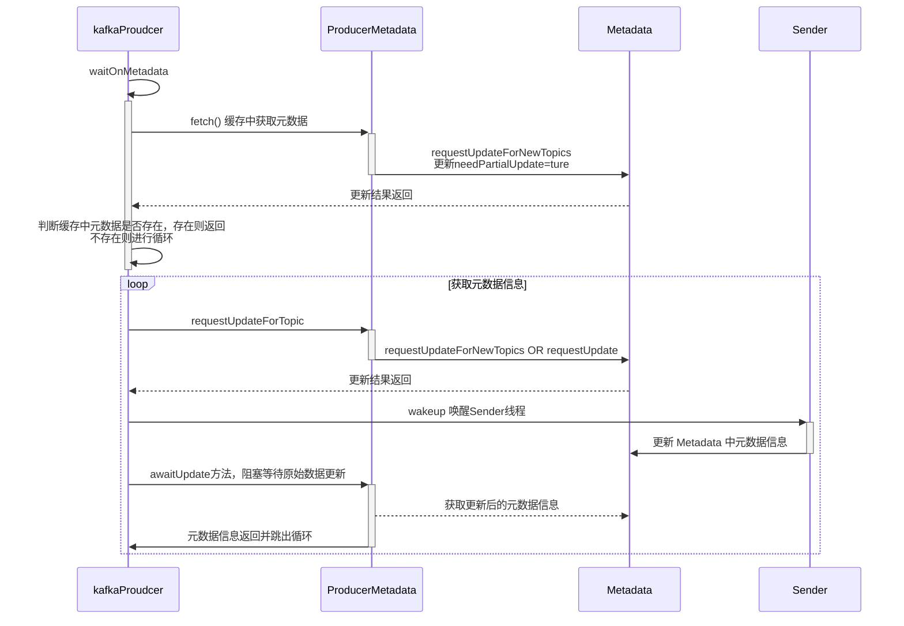

## KafkaProducer 源码解析


[TOC]


#### 一：消息发送流程


各操作功能如下：

① ProducerInterceptors对消息进行拦截。 

② Serializer对消息的key和value进行序列化。 

③ Partitioner为消息选择合适的Partition。 

④ RecordAccumulator收集消息，实现批量发送。 

⑤ Sender从RecordAccumulator获取消息。 

⑥ 构造ClientRequest。

⑦将ClientRequest交给NetworkClient，准备发送。 

⑧ NetworkClient将请求放入KafkaChannel的缓存。 

⑨ 执行网络I/O，发送请求。 

⑨ 收到响应，调用ClientRequest的回调函数。 

⑪ 调用RecordBatch的回调函数，最终调用每个消息上注册的回调函数。


消息的发送过程涉及两个线程的协同工作。

- 主线程：将业务消息封装成 ProducerRecord 对象，调用send方法将消息放入 RecordAccumulator 中暂存。
- Sender线程：从 RecordAccumulator 去除消息，并构建请求，最终执行网络IO。


KafkaProducer实现了Producer接口，在Producer接口中定义KafkaProducer对外提供的API，分为四类方法。 

- send()方法：发送消息，实际是将消息放入RecordAccumulator 暂存，等待发送。 

- flush()方法：刷新操作，等待RecordAccumulator中所有消息发送完成，在刷新完成之前会阻塞调用的线程。 

- partitionsFor()方法：在KafkaProducer中维护了一个Metadata对象用于存储Kafka集群的元数据，Metadata中的元数据会定期更 新。partitionsFor()方法负责从Metadata中获取指定Topic中的分区信息。 

- close()方法：关闭此Producer对象，主要操作是设置close标志，等待RecordAccumulator中的消息清空，关闭Sender线程。


介绍KafkaProducer中比较重要的字段

```java
public class KafkaProducer<K, V> implements Producer<K, V> {

    private final Logger log;
    private static final String JMX_PREFIX = "kafka.producer";
    public static final String NETWORK_THREAD_PREFIX = "kafka-producer-network-thread";
    public static final String PRODUCER_METRIC_GROUP_NAME = "producer-metrics";

    // 生产者的唯一标识
    private final String clientId;
    // Visible for testing
    final Metrics metrics;
    // 分区选择器，根据一定的策略，将消息路由到合适的分区。
    private final Partitioner partitioner;
    // 消息的最大长度，这个长度包含了消息头、序列化后的key和序列化后的value的长度
    private final int maxRequestSize;
    // 发送单个消息的缓冲区大小
    private final long totalMemorySize;
    // producer 的元数据信息
    private final ProducerMetadata metadata;
    // RecordAccumulator，用于收集并缓存消息，等待Sender线程发送
    private final RecordAccumulator accumulator;
    // 发送消息的Sender任务，实现了Runnable接口，在 ioThread线程中执行。
    private final Sender sender;
    // 执行Sender任务发送消息的线程，称为“Sender线程”。
    private final Thread ioThread;
    // 压缩算法，可选项有none、gzip、snappy、lz4。这是针对RecordAccumulator中多条消息进行的压缩，所以消息越多，压缩效果越好。
    private final CompressionType compressionType;
    private final Sensor errors;
    private final Time time;
    // key的序列化器。
    private final Serializer<K> keySerializer;
    // value的序列化器。
    private final Serializer<V> valueSerializer;
    // 配置对象，使用反射初始化KafkaProducer配 置的相对对象。
    private final ProducerConfig producerConfig;
    // 等待更新Kafka集群元数据的最大时长。
    private final long maxBlockTimeMs;
    // ProducerInterceptor集合，ProducerInterceptor可以在消息发送之前对其进行拦截或修改；也可以先于用户的Callback，对ACK响应进行预处理。
    private final ProducerInterceptors<K, V> interceptors;
    // 维护 node api 版本，以便在NetworkClient之外访问
    private final ApiVersions apiVersions;
    // 维护事务状态，保证生产的幂等
    private final TransactionManager transactionManager;

...
...
  
  KafkaProducer(ProducerConfig config,
                  Serializer<K> keySerializer,
                  Serializer<V> valueSerializer,
                  ProducerMetadata metadata,
                  KafkaClient kafkaClient,
                  ProducerInterceptors<K, V> interceptors,
                  Time time) {
        try {
            this.producerConfig = config;
            this.time = time;
           	// 根据config配置实例化clientId、transactionalId等属性
            String transactionalId = config.getString(ProducerConfig.TRANSACTIONAL_ID_CONFIG);

            this.clientId = config.getString(ProducerConfig.CLIENT_ID_CONFIG);

            LogContext logContext;
            if (transactionalId == null)
                logContext = new LogContext(String.format("[Producer clientId=%s] ", clientId));
            else
                logContext = new LogContext(String.format("[Producer clientId=%s, transactionalId=%s] ", clientId, transactionalId));
            log = logContext.logger(KafkaProducer.class);
            log.trace("Starting the Kafka producer");

            // metrics 设置初始化，用于监控
            Map<String, String> metricTags = Collections.singletonMap("client-id", clientId);
            MetricConfig metricConfig = new MetricConfig().samples(config.getInt(ProducerConfig.METRICS_NUM_SAMPLES_CONFIG))
                    .timeWindow(config.getLong(ProducerConfig.METRICS_SAMPLE_WINDOW_MS_CONFIG), TimeUnit.MILLISECONDS)
                    .recordLevel(Sensor.RecordingLevel.forName(config.getString(ProducerConfig.METRICS_RECORDING_LEVEL_CONFIG)))
                    .tags(metricTags);
            List<MetricsReporter> reporters = config.getConfiguredInstances(ProducerConfig.METRIC_REPORTER_CLASSES_CONFIG,
                    MetricsReporter.class,
                    Collections.singletonMap(ProducerConfig.CLIENT_ID_CONFIG, clientId));
            // JMX
            JmxReporter jmxReporter = new JmxReporter();
            jmxReporter.configure(config.originals(Collections.singletonMap(ProducerConfig.CLIENT_ID_CONFIG, clientId)));
            reporters.add(jmxReporter);
            MetricsContext metricsContext = new KafkaMetricsContext(JMX_PREFIX,
                    config.originalsWithPrefix(CommonClientConfigs.METRICS_CONTEXT_PREFIX));
            this.metrics = new Metrics(metricConfig, reporters, time, metricsContext);
            // 分区选择器初始化
            this.partitioner = config.getConfiguredInstance(
                    ProducerConfig.PARTITIONER_CLASS_CONFIG,
                    Partitioner.class,
                    Collections.singletonMap(ProducerConfig.CLIENT_ID_CONFIG, clientId));
            long retryBackoffMs = config.getLong(ProducerConfig.RETRY_BACKOFF_MS_CONFIG);
            // key、value 的序列化器初始化
            if (keySerializer == null) {
                this.keySerializer = config.getConfiguredInstance(ProducerConfig.KEY_SERIALIZER_CLASS_CONFIG,
                                                                                         Serializer.class);
                this.keySerializer.configure(config.originals(Collections.singletonMap(ProducerConfig.CLIENT_ID_CONFIG, clientId)), true);
            } else {
                config.ignore(ProducerConfig.KEY_SERIALIZER_CLASS_CONFIG);
                this.keySerializer = keySerializer;
            }
            if (valueSerializer == null) {
                this.valueSerializer = config.getConfiguredInstance(ProducerConfig.VALUE_SERIALIZER_CLASS_CONFIG,
                                                                                           Serializer.class);
                this.valueSerializer.configure(config.originals(Collections.singletonMap(ProducerConfig.CLIENT_ID_CONFIG, clientId)), false);
            } else {
                config.ignore(ProducerConfig.VALUE_SERIALIZER_CLASS_CONFIG);
                this.valueSerializer = valueSerializer;
            }
						// ProducerInterceptor Record过滤、拦截初始化
            List<ProducerInterceptor<K, V>> interceptorList = (List) config.getConfiguredInstances(
                    ProducerConfig.INTERCEPTOR_CLASSES_CONFIG,
                    ProducerInterceptor.class,
                    Collections.singletonMap(ProducerConfig.CLIENT_ID_CONFIG, clientId));
            if (interceptors != null)
                this.interceptors = interceptors;
            else
                this.interceptors = new ProducerInterceptors<>(interceptorList);
            ClusterResourceListeners clusterResourceListeners = configureClusterResourceListeners(keySerializer,
                    valueSerializer, interceptorList, reporters);
            this.maxRequestSize = config.getInt(ProducerConfig.MAX_REQUEST_SIZE_CONFIG);
            this.totalMemorySize = config.getLong(ProducerConfig.BUFFER_MEMORY_CONFIG);
            this.compressionType = CompressionType.forName(config.getString(ProducerConfig.COMPRESSION_TYPE_CONFIG));

            this.maxBlockTimeMs = config.getLong(ProducerConfig.MAX_BLOCK_MS_CONFIG);
            int deliveryTimeoutMs = configureDeliveryTimeout(config, log);

            this.apiVersions = new ApiVersions();
            this.transactionManager = configureTransactionState(config, logContext);
            // RecordAccumulator，用于收集并缓存消息  初始化
            this.accumulator = new RecordAccumulator(logContext,
                    config.getInt(ProducerConfig.BATCH_SIZE_CONFIG),
                    this.compressionType,
                    lingerMs(config),
                    retryBackoffMs,
                    deliveryTimeoutMs,
                    metrics,
                    PRODUCER_METRIC_GROUP_NAME,
                    time,
                    apiVersions,
                    transactionManager,
                    new BufferPool(this.totalMemorySize, config.getInt(ProducerConfig.BATCH_SIZE_CONFIG), metrics, time, PRODUCER_METRIC_GROUP_NAME));

            List<InetSocketAddress> addresses = ClientUtils.parseAndValidateAddresses(
                    config.getList(ProducerConfig.BOOTSTRAP_SERVERS_CONFIG),
                    config.getString(ProducerConfig.CLIENT_DNS_LOOKUP_CONFIG));
            // kafka 元数据初始化
            if (metadata != null) {
                this.metadata = metadata;
            } else {
                this.metadata = new ProducerMetadata(retryBackoffMs,
                        config.getLong(ProducerConfig.METADATA_MAX_AGE_CONFIG),
                        config.getLong(ProducerConfig.METADATA_MAX_IDLE_CONFIG),
                        logContext,
                        clusterResourceListeners,
                        Time.SYSTEM);
                this.metadata.bootstrap(addresses);
            }
            this.errors = this.metrics.sensor("errors");
            this.sender = newSender(logContext, kafkaClient, this.metadata);
            String ioThreadName = NETWORK_THREAD_PREFIX + " | " + clientId;
            this.ioThread = new KafkaThread(ioThreadName, this.sender, true);
            // 启动Sender对应的线程
            this.ioThread.start();
            config.logUnused();
            AppInfoParser.registerAppInfo(JMX_PREFIX, clientId, metrics, time.milliseconds());
            log.debug("Kafka producer started");
        } catch (Throwable t) {
            // call close methods if internal objects are already constructed this is to prevent resource leak. see KAFKA-2121
            close(Duration.ofMillis(0), true);
            // now propagate the exception
            throw new KafkaException("Failed to construct kafka producer", t);
        }
    }
}
```


kafkaProducer 的 send 方法 调用流程以及源码


```java
		...
		public Future<RecordMetadata> send(ProducerRecord<K, V> record, Callback callback) {
        // intercept the record, which can be potentially modified; this method does not throw exceptions
        // 调用ProducerInterceptors.onSend()方法，通过ProducerInterceptor对消息进行拦截或修改。
        ProducerRecord<K, V> interceptedRecord = this.interceptors.onSend(record);
        return doSend(interceptedRecord, callback);
    }
    ...
    private Future<RecordMetadata> doSend(ProducerRecord<K, V> record, Callback callback) {
        TopicPartition tp = null;
        try {
            throwIfProducerClosed();
            // first make sure the metadata for the topic is available
            long nowMs = time.milliseconds();
            ClusterAndWaitTime clusterAndWaitTime;
            try {
                // 调用waitOnMetadata()方法获取Kafka集群的信息，底层会唤醒Send线程更新Metadata中保存的Kafka集群元数据。
                clusterAndWaitTime = waitOnMetadata(record.topic(), record.partition(), nowMs, maxBlockTimeMs);
            } catch (KafkaException e) {
                if (metadata.isClosed())
                    throw new KafkaException("Producer closed while send in progress", e);
                throw e;
            }
            nowMs += clusterAndWaitTime.waitedOnMetadataMs;
            long remainingWaitMs = Math.max(0, maxBlockTimeMs - clusterAndWaitTime.waitedOnMetadataMs);
            Cluster cluster = clusterAndWaitTime.cluster;
            byte[] serializedKey;
            try {
                // 调用serialize()方法序列化消息的key。
                serializedKey = keySerializer.serialize(record.topic(), record.headers(), record.key());
            } catch (ClassCastException cce) {
                throw new SerializationException("Can't convert key of class " + record.key().getClass().getName() +
                        " to class " + producerConfig.getClass(ProducerConfig.KEY_SERIALIZER_CLASS_CONFIG).getName() +
                        " specified in key.serializer", cce);
            }
            byte[] serializedValue;
            try {
                // 调用Serializer.serialize()方法序列化消息的value。
                serializedValue = valueSerializer.serialize(record.topic(), record.headers(), record.value());
            } catch (ClassCastException cce) {
                throw new SerializationException("Can't convert value of class " + record.value().getClass().getName() +
                        " to class " + producerConfig.getClass(ProducerConfig.VALUE_SERIALIZER_CLASS_CONFIG).getName() +
                        " specified in value.serializer", cce);
            }
            // 调用partition()为消息选择合适的分区
            int partition = partition(record, serializedKey, serializedValue, cluster);
            tp = new TopicPartition(record.topic(), partition);

            setReadOnly(record.headers());
            Header[] headers = record.headers().toArray();

            int serializedSize = AbstractRecords.estimateSizeInBytesUpperBound(apiVersions.maxUsableProduceMagic(),
                    compressionType, serializedKey, serializedValue, headers);
            ensureValidRecordSize(serializedSize);
            long timestamp = record.timestamp() == null ? nowMs : record.timestamp();
            if (log.isTraceEnabled()) {
                log.trace("Attempting to append record {} with callback {} to topic {} partition {}", record, callback, record.topic(), partition);
            }
            // producer callback will make sure to call both 'callback' and interceptor callback
            // 该回调确保同时能调用 callback（客户端） 以及 interceptor 的回调方法
            Callback interceptCallback = new InterceptorCallback<>(callback, this.interceptors, tp);

            if (transactionManager != null && transactionManager.isTransactional()) {
                transactionManager.failIfNotReadyForSend();
            }
            // 调用RecordAccumulator.append()方法，将消息追加到 RecordAccumulator中。
            RecordAccumulator.RecordAppendResult result = accumulator.append(tp, timestamp, serializedKey,
                    serializedValue, headers, interceptCallback, remainingWaitMs, true, nowMs);

            if (result.abortForNewBatch) {
                int prevPartition = partition;
                partitioner.onNewBatch(record.topic(), cluster, prevPartition);
                partition = partition(record, serializedKey, serializedValue, cluster);
                tp = new TopicPartition(record.topic(), partition);
                if (log.isTraceEnabled()) {
                    log.trace("Retrying append due to new batch creation for topic {} partition {}. The old partition was {}", record.topic(), partition, prevPartition);
                }
                // producer callback will make sure to call both 'callback' and interceptor callback
                interceptCallback = new InterceptorCallback<>(callback, this.interceptors, tp);

                result = accumulator.append(tp, timestamp, serializedKey,
                    serializedValue, headers, interceptCallback, remainingWaitMs, false, nowMs);
            }

            if (transactionManager != null && transactionManager.isTransactional())
                transactionManager.maybeAddPartitionToTransaction(tp);

            // 批量发送已满或者新的批量发送已创建
            if (result.batchIsFull || result.newBatchCreated) {
                log.trace("Waking up the sender since topic {} partition {} is either full or getting a new batch", record.topic(), partition);
              	// 唤醒Sender线程，由Sender线程将RecordAccumulator中缓存的 消息发送出去。
                this.sender.wakeup();
            }
            return result.future;
            // handling exceptions and record the errors;
            // for API exceptions return them in the future,
            // for other exceptions throw directly
        } catch (ApiException e) {
            log.debug("Exception occurred during message send:", e);
            if (callback != null)
                callback.onCompletion(null, e);
            this.errors.record();
            this.interceptors.onSendError(record, tp, e);
            return new FutureFailure(e);
        } catch (InterruptedException e) {
            this.errors.record();
            this.interceptors.onSendError(record, tp, e);
            throw new InterruptException(e);
        } catch (KafkaException e) {
            this.errors.record();
            this.interceptors.onSendError(record, tp, e);
            throw e;
        } catch (Exception e) {
            // we notify interceptor about all exceptions, since onSend is called before anything else in this method
            this.interceptors.onSendError(record, tp, e);
            throw e;
        }
    }
```


#### 二：ProducerInterceptors 与 ProducerInterceptor


​	**ProducerInterceptors是一个ProducerInterceptor集合**，其onSend方法、onAcknowledgement方法、onSendError方法，实际上是**循环调用其封装的ProducerInterceptor集合的对应方法**。 

示例Demo

```java
package org.apache.kafka.clients.producerDemo.internalsDemo;

import org.apache.kafka.clients.producer.ProducerInterceptor;
import org.apache.kafka.clients.producer.ProducerRecord;
import org.apache.kafka.clients.producer.RecordMetadata;
import java.util.Map;

public class ProducerInterceptorDemo implements ProducerInterceptor<String, String> {
    @Override
    public ProducerRecord<String, String> onSend(ProducerRecord<String, String> record) {
        // send 方法前拦截 示例：拦截 record 的 key 为 zhansan；并将其他key的header中添加tag为Outlaws
        if("zhansan".equals(record.key())){
            return null;
        }
        record.headers().add("tag", "Outlaws".getBytes());
        return record;
    }

    @Override
    public void onAcknowledgement(RecordMetadata metadata, Exception exception) {

    }

    @Override
    public void close() {

    }

    @Override
    public void configure(Map<String, ?> configs) {

    }
}
```

**额外说明： KafkaProducer 可以在config中配置 interceptor.classes （多个拦截器之间使用逗号隔开），来注入拦截器处理。**

#### 三：kafka集群元数据

##### 3.1 Cluster

​		从生产者角度来看，**分区的数量以及Leader副本的分布是动态变化的**。Leader副本随时都有可能出现故障进而导致Leader副本的重新选举，新的Leader副本会在其 他Broker上继续对外提供服务。

​		KafkaProducer要将此消息**追加到指定Topic的某个分区的Leader副本**中，首先需要知道**Topic的分区数量**，经过路由后确定目标分区，之后KafkaProducer需要知道**目标分区的Leader副本所在服务器的地址、端口等信息，才能建立连接**，将消息发送到Kafka中。

​		因此获取元数据信息，并且同步更新元数据信息。

​		**使用Node、TopicPartition、PartitionInfo这三个类封装了Kafka集群的相关元数据。**


- Node表示集群中的一个节点，Node记录这个节点的host、ip、port等信息。 

- TopicPartition表示某Topic的一个分区，其中的topic字段是Topic的名称，partition字段则此分区在Topic中的分区编号（ID）。 

- PartitionInfo表示一个分区的详细信息。其中topic字段和partition字段的含义与TopicPartition中的相同，除此之外，leader字段记录了Leader副本所在节点的id，replica字段记录了全部副本所在的节点信息，inSyncReplicas字段记录了ISR集合中所有副本所在的节点信息。

通过这三个类的组合，我们可以完整表示出KafkaProducer需要的集群元数据。**这些元数据保存在了Cluster这个类中**。

```java
public final class Cluster {

    private final boolean isBootstrapConfigured;
    // kafka 几区节点信息列表
    private final List<Node> nodes;
    private final Set<String> unauthorizedTopics;
    private final Set<String> invalidTopics;
    private final Set<String> internalTopics;
    private final Node controller;
    // 记录了TopicPartition与PartitionInfo 的映射关系。
    private final Map<TopicPartition, PartitionInfo> partitionsByTopicPartition;
    // 记录了Topic名称和PartitionInfo的映射关系，可以按照Topic名称查询其中全部分区的详细信息。
    private final Map<String, List<PartitionInfo>> partitionsByTopic;
    // Topic与PartitionInfo的映射关系，这里的List＜PartitionInfo＞中存放的分区必须是有Leader副本的Partition，而partitionsByTopic中记录的分区则不一定有Leader副本，因为某些中间状态，例如Leader副本宕机而触发的选举过程中，分区不一定有Leader副本
    private final Map<String, List<PartitionInfo>> availablePartitionsByTopic;
    // 记录了Node与PartitionInfo的映射关系，可 以按照节点Id查询其上分布的全部分区的详细信息。
    private final Map<Integer, List<PartitionInfo>> partitionsByNode;
    // BrokerId与Node节点之间对应关系，方便按照 BrokerId进行索引。
    private final Map<Integer, Node> nodesById;
    private final ClusterResource clusterResource;
    private final Map<String, Uuid> topicIds;
...
}
```

- Cluster的方法比较简单，主要是对上述集合的操作，**方便集群元数据的查询**。
- 属性均被private final修饰，保证了不被其他程序修改，保证了该对象的不可变性，也是线程安全的对象。


##### 3.2 Metadata

```java
public class Metadata implements Closeable {
    private final Logger log;
    // 两次发出更新Cluster保存的元数据信息的最小时间差，默认为100ms。这是为了防止更新操作过于频繁而造成网络阻塞和增加服务端压力。在Kafka中与重试操作有关的操作中，都有这种“退避（backoff）时间”设计的身影。
    private final long refreshBackoffMs;
    // 每隔多久，更新一次(元数据的过期时间)。默认是300×1000， 也就是5分种。
    private final long metadataExpireMs;
    // 更新版本号，每更新成功1次，version自增1,主要是用于判断metadata是否更新
    private int updateVersion;  // bumped on every metadata response
    // 请求版本号，每发送一次请求，version自增1
    private int requestVersion; // bumped on every new topic addition
    // 记录上一次更新元数据的时间戳（也包含更新失败的情况）。
    private long lastRefreshMs;
    // 上一次成功更新的时间戳。如果每次都成功，则lastSuccessfulRefreshMs、lastRefreshMs相等。否则，lastRefreshMs＞ lastSuccessulRefreshMs。
    private long lastSuccessfulRefreshMs;
    private KafkaException fatalException;
    // 非法的topics
    private Set<String> invalidTopics;
    // 未认证的topics
    private Set<String> unauthorizedTopics;
    // 元数据信息的Cache缓存
    private MetadataCache cache = MetadataCache.empty();

    // 强制更新标记
    private boolean needFullUpdate;
    // 周期性更新标记
    private boolean needPartialUpdate;
    // 会收到metadata updates的Listener列表
    private final ClusterResourceListeners clusterResourceListeners;
    private boolean isClosed;
    // 存储Partition最近一次的leaderEpoch
    private final Map<TopicPartition, Integer> lastSeenLeaderEpochs;
...
}


// 元数据信息
public class MetadataCache {
    private final String clusterId;
    private final Map<Integer, Node> nodes;
    private final Set<String> unauthorizedTopics;
    private final Set<String> invalidTopics;
    private final Set<String> internalTopics;
    private final Node controller;
    private final Map<TopicPartition, PartitionMetadata> metadataByPartition;
    private final Map<String, Uuid> topicIds;
    // Cluster信息
  	private Cluster clusterInstance;
...
}
```

**Metadata的核心方法**

```java
 		// 更新needFullUpdate（强制更新元数据开关），Sender线程会执行更新元数据相关操作
		public synchronized int requestUpdate() {
        this.needFullUpdate = true;
        return this.updateVersion;
    }

    // 更新needPartialUpdate（周期性更新元数据开关），Sender线程会执行更新元数据相关操作
    public synchronized int requestUpdateForNewTopics() {
        // Override the timestamp of last refresh to let immediate update.
        this.lastRefreshMs = 0;
        this.needPartialUpdate = true;
        this.requestVersion++;
        return this.updateVersion;
    }

		// 其继承类ProducerMatadata.awaitUpdate()方法
		/**
     * Wait for metadata update until the current version is larger than the last version we know of
     * 阻塞等待元数据更新，直到当前版本大于已知的最大版本。
     */
    public synchronized void awaitUpdate(final int lastVersion, final long timeoutMs) throws InterruptedException {
        long currentTimeMs = time.milliseconds();
        long deadlineMs = currentTimeMs + timeoutMs < 0 ? Long.MAX_VALUE : currentTimeMs + timeoutMs;
        time.waitObject(this, () -> {
            // Throw fatal exceptions, if there are any. Recoverable topic errors will be handled by the caller.
            maybeThrowFatalException();
            return updateVersion() > lastVersion || isClosed();
        }, deadlineMs);

        if (isClosed())
            throw new KafkaException("Requested metadata update after close");
    }
		
```

额外说明：

- 主线程**更新 Metadata 中needFullUpdate、needPartialUpdate**，唤醒Sender线程后，Sender线程唤醒NetworkClient线程，NetworkClient线程在poll()方法调用时，判断needFullUpdat和needPartialUpdate，若其中任一为true，则**执行 Metadata 中元数据信息更新操作**。Metadata中的字段被主线程和Sender线程操作，其必须为线程安全，故**元数据相关的方法采用synchronized修饰**。

###### 3.2.1 Metadata 读取与更新机制

**核心方法KafkaProducer.waitOnMetadata()** ：负责触发Kafka集群元数据的更新，并阻塞主线程等待Sender线程更新元数据完毕。

Metadata 会在下面两种情况下进行更新：

- 强制更新：调用 Metadata.requestUpdate() 将 needFullUpdate 置为 true 来强制更新。
- 周期性更新：通过 Metadata 的 lastSuccessfulRefreshMs 和 metadataExpireMs 来实现，一般情况下，默认周期时间就是 metadataExpireMs，5 分钟时长。

在 NetworkClient 的 poll() 方法调用时，会去检查两种更新机制，只要达到一种，就会触发更新操作。

~~~java
// kafkaProudcer中方法（阻塞获取并更新元数据信息）
	private ClusterAndWaitTime waitOnMetadata(String topic, Integer partition, long nowMs, long maxWaitMs) throws InterruptedException {
        // add topic to metadata topic list if it is not there already and reset expiry
        // 从 MetadataCache 中获取cluster信息
        Cluster cluster = metadata.fetch();

        // invalidTopics 无效topic中是否包含producer传入topic
        if (cluster.invalidTopics().contains(topic))
            throw new InvalidTopicException(topic);

        // metadata（ProducerMetadata继承了Metadata）中 topics 添加topic与topic的过期时间
        // 其中调用了 Metadata 的 requestUpdateForNewTopics方法
        metadata.add(topic, nowMs);

        // cluster 根据topic查询分区信息（获取分区数量）
        Integer partitionsCount = cluster.partitionCountForTopic(topic);
        // Return cached metadata if we have it, and if the record's partition is either undefined
        // or within the known partition range
        if (partitionsCount != null && (partition == null || partition < partitionsCount))
            return new ClusterAndWaitTime(cluster, 0);

        long remainingWaitMs = maxWaitMs;
        long elapsed = 0;
        // Issue metadata requests until we have metadata for the topic and the requested partition,
        // or until maxWaitTimeMs is exceeded. This is necessary in case the metadata
        // is stale and the number of partitions for this topic has increased in the meantime.
        do {
            if (partition != null) {
                log.trace("Requesting metadata update for partition {} of topic {}.", partition, topic);
            } else {
                log.trace("Requesting metadata update for topic {}.", topic);
            }
            metadata.add(topic, nowMs + elapsed);
            // ProducerMetadata 的 requestUpdateForTopic 方法
            // 根据判断newTopic列表中是否包含该topic来进行 Metadata 的 requestUpdateForNewTopics 和 requestUpdate 方法调用。
            int version = metadata.requestUpdateForTopic(topic);
            // 唤醒Sender线程
            sender.wakeup();
            try {
                // 阻塞等待元数据更新完毕
                metadata.awaitUpdate(version, remainingWaitMs);
            } catch (TimeoutException ex) {
                // Rethrow with original maxWaitMs to prevent logging exception with remainingWaitMs
                throw new TimeoutException(
                        String.format("Topic %s not present in metadata after %d ms.",
                                topic, maxWaitMs));
            }
            // 再次获取cluster
            cluster = metadata.fetch();
            elapsed = time.milliseconds() - nowMs;
            if (elapsed >= maxWaitMs) {
                throw new TimeoutException(partitionsCount == null ?
                        String.format("Topic %s not present in metadata after %d ms.",
                                topic, maxWaitMs) :
                        String.format("Partition %d of topic %s with partition count %d is not present in metadata after %d ms.",
                                partition, topic, partitionsCount, maxWaitMs));
            }
            //
            metadata.maybeThrowExceptionForTopic(topic);
            remainingWaitMs = maxWaitMs - elapsed;
            // 更新分区数量信息，跳出循环
            partitionsCount = cluster.partitionCountForTopic(topic);
        } while (partitionsCount == null || (partition != null && partition >= partitionsCount));

        return new ClusterAndWaitTime(cluster, elapsed);
    }
~~~

**时序图如下**





##### 3.3 Serializer 与 Deserializer

​		客户端发送的消息的**key和value都是byte数组**，Serializer和 Deserializer接口提供了将**Java对象序列化（反序列化）为byte数组的功能**。在KafkaProducer中，根据配置文件，使用合适的Serializer。


##### 3.4 Partitioner

​		KafkaProducer.send()方法的下一步操作是选择消息的分区。在有的应用场景中，由业务逻辑控制每个消息追加到合适的分区中，而有时候 业务逻辑并不关心分区的选择。在KafkaProducer.partition()方法中，**优先根据ProducerRecord中partition字段指定的序号选择分区**，如果ProducerRecord.partition字段没有明确指定分区编号，则通过**Partitioner.partition()方法选择Partition**。 

​		**DefaultPartitioner.partition()方法**负责在ProduceRecord中没有明确指定分区编号的时候，为其选择合适的分区：如果消息没有key，会先根据stickyPartitionCache缓存进行粘性获取，无则根据 ThreadLocalRandom.current().nextInt() 与 availablePartitions（有效分区数） 个数取模来确定分区编号，并修改其粘性关系；如果消息有key的话，则对key进行hash，然后与分区数量取模，来确定key所在的分区达到负载均衡。

​		额外说明：使用ThreadLocalRandom的目的是为了保证Partitioner的线程安全。

源码如下：

```java
		public int partition(String topic, Object key, byte[] keyBytes, Object value, byte[] valueBytes, Cluster cluster,
                         int numPartitions) {
        if (keyBytes == null) {
            return stickyPartitionCache.partition(topic, cluster);
        }
        // hash the keyBytes to choose a partition
        return Utils.toPositive(Utils.murmur2(keyBytes)) % numPartitions;
    }

		// stickyPartitionCache.partition()
	  private final ConcurrentMap<String, Integer> indexCache;
		public int partition(String topic, Cluster cluster) {
        Integer part = indexCache.get(topic);
        if (part == null) {
            return nextPartition(topic, cluster, -1);
        }
        return part;
    }

    public int nextPartition(String topic, Cluster cluster, int prevPartition) {
        List<PartitionInfo> partitions = cluster.partitionsForTopic(topic);
        Integer oldPart = indexCache.get(topic);
        Integer newPart = oldPart;
        // Check that the current sticky partition for the topic is either not set or that the partition that 
        // triggered the new batch matches the sticky partition that needs to be changed.
        if (oldPart == null || oldPart == prevPartition) {
            List<PartitionInfo> availablePartitions = cluster.availablePartitionsForTopic(topic);
            if (availablePartitions.size() < 1) {
                Integer random = Utils.toPositive(ThreadLocalRandom.current().nextInt());
                newPart = random % partitions.size();
            } else if (availablePartitions.size() == 1) {
                newPart = availablePartitions.get(0).partition();
            } else {
                while (newPart == null || newPart.equals(oldPart)) {
                    int random = Utils.toPositive(ThreadLocalRandom.current().nextInt());
                    newPart = availablePartitions.get(random % availablePartitions.size()).partition();
                }
            }
            // Only change the sticky partition if it is null or prevPartition matches the current sticky partition.
            if (oldPart == null) {
                indexCache.putIfAbsent(topic, newPart);
            } else {
                indexCache.replace(topic, prevPartition, newPart);
            }
            return indexCache.get(topic);
        }
        return indexCache.get(topic);
    }
```


#### 四：RecordAccumulator

​		KafkaProducer可以有同步和异步两种方式发送消息，其实两者的**底层实现相同**，都是通过**异步方式**实现的。

​		主线程调用**KafkaProducer.send()**方法发送消息的时候，先将消息放到**RecordAccumulator中暂存**，然后主线程就可以从send()方法中返回了，此时消息并没有真正地发送给Kafka，而是缓存在了RecordAccumulator中。之后，业务线程通过KafkaProducer.send()方法不断向RecordAccumulator追加消息，当达到一定的条件，会**唤醒Sender线程发送RecordAccumulator中的消息**。 

​		**RecordAccumulator至少有一个业务线程和一个Sender线程并发操作，所以必须是线程安全的。**

​		描述： RecordAccumulator、RecordBatch、MemoryRecordsBuilder、MemoryRecords、BufferPool、ByteBuffer

抓住重点，细节后续再扣。

##### 4.1 MemoryRecordsBuilder

​		每个 MemoryRecordsBuilder 底层依赖一个MemoryRecords（ByteBuffer）完成 message 的存储。

​		在MemoryRecordsBuilder中**ByteBufferOutputStream完成了对ByteBuffer的封装**，实现了 OutputStream，这样我们就可以按照**流的方式写入数据**。

​		同时，ByteBufferOutputStream 提供了自动扩容底层 ByteBuffer 的能力。

```java
public class MemoryRecordsBuilder implements AutoCloseable {
    private static final float COMPRESSION_RATE_ESTIMATION_FACTOR = 1.05f;
    private static final DataOutputStream CLOSED_STREAM = new DataOutputStream(new OutputStream() {
        @Override
        public void write(int b) {
            throw new IllegalStateException("MemoryRecordsBuilder is closed for record appends");
        }
    });

    private final TimestampType timestampType;
    // 指定当前 MemoryRecordsBuilder 使用哪种压缩算法来压缩 ByteBuffer 中的数据
    // kafka 目前已支持的压缩算法有：GZIP、SNAPPY、LZ4、ZSTD 四种。注意 只有 kafka V2 版本协议支持 ZSTD 压缩算法。
    private final CompressionType compressionType;
    // Used to hold a reference to the underlying ByteBuffer so that we can write the record batch header and access
    // the written bytes. ByteBufferOutputStream allocates a new ByteBuffer if the existing one is not large enough,
    // so it's not safe to hold a direct reference to the underlying ByteBuffer.
    // 对底层 ByteBuffer(Record数据存储) 的引用，以便我们可以以字符流的形式进行输入。
    // 当 ByteBuffer 存储长度不足时，ByteBufferOutputStream 会分配一个新的 ByteBuffer
    // 因此这种引用并不是线程安全的。
    private final ByteBufferOutputStream bufferStream;
    private final byte magic;
    private final int initialPosition;
    private final long baseOffset;
    private final long logAppendTime;
    private final boolean isControlBatch;
    private final int partitionLeaderEpoch;
    private final int writeLimit;
    private final int batchHeaderSizeInBytes;

    // Use a conservative estimate of the compression ratio. The producer overrides this using statistics
    // from previous batches before appending any records.
    private float estimatedCompressionRatio = 1.0F;

    // Used to append records, may compress data on the fly
    private DataOutputStream appendStream;
    private boolean isTransactional;
    private long producerId;
    private short producerEpoch;
    private int baseSequence;
    private int uncompressedRecordsSizeInBytes = 0; // Number of bytes (excluding the header) written before compression
    private int numRecords = 0;
    private float actualCompressionRatio = 1;
    private long maxTimestamp = RecordBatch.NO_TIMESTAMP;
    private long offsetOfMaxTimestamp = -1;
    private Long lastOffset = null;
    private Long firstTimestamp = null;

    private MemoryRecords builtRecords;
    private boolean aborted = false;
...
  	public MemoryRecordsBuilder(ByteBuffer buffer,...) { // 省略其他参数
    	// 将MemoryRecordsBuilder关联的ByteBuffer封装成ByteBufferOutputStream流
    	this(new ByteBufferOutputStream(buffer), ...);
		}

		public MemoryRecordsBuilder(ByteBufferOutputStream bufferStream,...) { // 省略其他参数
    	// 省略其他字段的初始化
    	this.bufferStream = bufferStream;
   		// 在bufferStream流外层套一层压缩流，然后再套一层DataOutputStream流
    	this.appendStream = new DataOutputStream(compressionType.wrapForOutput(this.bufferStream, magic));
		}	
}

```


**这里是装饰器模式的典型**，通过bufferStream装饰，添加自动扩容的功能；通过appendStream装饰后，添加压缩功能。

MemoryRecordsBuilder 的重要方法

- append()方法：1. 把字节数组形式的key和value转为HeapByteBuffer。 2. 计算写入的offset，如果不是第一次写入，那么lastOffset+1，否则是baseOffset。 3. 如果magic号大于1，那么调用appendDefaultRecord()，否则调用appendLegacyRecord()。
- hasRoomFor()方法：根据Compressor估算的已写字节数，估计MemoryRecords剩余空间是否足够写入指定的数据。
- close()方法：出现ByteBuffer扩容的情况时，MemoryRecords.buffer字段与ByteBufferOutputStream.buffer字段所指向的不再是同一个ByteBuffer对象，在close()方法中，会将MemoryRecords.buffer字段指向扩容后的ByteBuffer对象。

​		append方法源码如下：

```java
public Long append(long timestamp, ByteBuffer key, ByteBuffer value, Header[] headers) {
	return appendWithOffset(nextSequentialOffset(), timestamp, key, value, headers);
}

private long nextSequentialOffset() {
  // 这里的baseOffset是RecordBatch中的baseOffset，lastOffset用来记录当前写入Record的offset值，后面会用lastOffset-baseOffset计算offset delta。每次有新Record写入的时候，都会递增lastOffset
  return lastOffset == null ? baseOffset : lastOffset + 1;
}

private Long appendWithOffset(long offset, boolean isControlRecord, long timestamp, ByteBuffer key, ByteBuffer value, Header[] headers) {
    if (isControlRecord != this.isControlBatch) // 检查isControl标志是否一致
        throw new IllegalArgumentException("...");

    if (lastOffset != null && offset <= this.lastOffset) // 保证offset递增
        throw new IllegalArgumentException("...");

    if (timestamp < 0 && timestamp != RecordBatch.NO_TIMESTAMP) // 检查时间戳
        throw new IllegalArgumentException("...");
  
    // 检查：只有V2版本message才能有header
    if (magic < RecordBatch.MAGIC_VALUE_V2 && headers != null && headers.length > 0)
        throw new IllegalArgumentException("...");

    if (this.firstTimestamp == null) // 更新firstTimestamp
        this.firstTimestamp = timestamp;

    if (magic > RecordBatch.MAGIC_VALUE_V1) { // 针对V2的写入
        appendDefaultRecord(offset, timestamp, key, value, headers);
        return null;
    } else { // 针对V0、V1的写入
        return appendLegacyRecord(offset, timestamp, key, value, magic);
    }
}
```

​		**appendDefaultRecord() 方法中会计算 Record 中的 offsetDelta、timestampDelta，然后完成 Record 写入，最后更新RecordBatch 的元数据**

```java
private void appendDefaultRecord(long offset, long timestamp, ByteBuffer key, ByteBuffer value,
                                    Header[] headers) throws IOException {
    ensureOpenForRecordAppend(); // 检查appendStream状态
    // 计算offsetDelta
    int offsetDelta = (int) (offset - this.baseOffset);
    // 计算timestampDelta
    long timestampDelta = timestamp - this.firstTimestamp; 
    // 这里使用的DefaultRecord是一个工具类，其writeTo()方法会按照V2 Record的格式向appendStream流中
    int sizeInBytes = DefaultRecord.writeTo(appendStream, offsetDelta, timestampDelta, key, value, headers);
    // 修改RecordBatch中的元信息，例如，Record数量（numRecords）
    recordWritten(offset, timestamp, sizeInBytes);
}
```

​		MemoryRecordsBuilder 中另一个需要关注的方法是 **hasRoomFor() 方法**，它主要用来估计当前 MemoryRecordsBuilder 是否还有空间来容纳此次写入的Record。

```java
public boolean hasRoomFor(long timestamp, ByteBuffer key, ByteBuffer value, Header[] headers) {
    // 检查两个状态，一个是appendStream流状态，另一个是当前已经写入的预估字节数是否以及超过了writeLimit字段指定的写入上限，这里的writeLimit字段用来记录MemoryRecordsBuilder能够写入的字节数上限值
    if (isFull()) 
        return false;

    // 每个RecordBatch至少可以写入一个Record，此时要是一个Record都没有，则可以继续写入
    if (numRecords == 0)
        return true;

    final int recordSize;
    if (magic < RecordBatch.MAGIC_VALUE_V2) { // V0、V1版本的判断
        recordSize = Records.LOG_OVERHEAD + LegacyRecord.recordSize(magic, key, value);
    } else { 
        // 估算此次写入的Record大小
        int nextOffsetDelta = lastOffset == null ? 0 : (int) (lastOffset - baseOffset + 1);
        long timestampDelta = firstTimestamp == null ? 0 : timestamp - firstTimestamp;
        recordSize = DefaultRecord.sizeInBytes(nextOffsetDelta, timestampDelta, key, value, headers);
    }
    // 已写入字节数+此次写入Record的字节数不能超过writeLimit
    return this.writeLimit >= estimatedBytesWritten() + recordSize;
}
```


##### 4.2 ProducerBatch

```java
public final class ProducerBatch {

    private static final Logger log = LoggerFactory.getLogger(ProducerBatch.class);

    private enum FinalState { ABORTED, FAILED, SUCCEEDED }

    final long createdMs;
    // 当前ProducerBatch中缓存的Record都会发送到该TopicPartition中
    final TopicPartition topicPartition;
    // 当前ProducerBatch发送状况的Future对象
    final ProduceRequestResult produceFuture;

    // Thunk 对象集合，其中封装了每一个Record关联的Future和Callback对象
    private final List<Thunk> thunks = new ArrayList<>();
    // 存储数据的MemoryRecordsBuilder对象
    private final MemoryRecordsBuilder recordsBuilder;
    // 尝试发送当前ProducerBatch的次数
    private final AtomicInteger attempts = new AtomicInteger(0);
    private final boolean isSplitBatch;
    private final AtomicReference<FinalState> finalState = new AtomicReference<>(null);

    int recordCount; // 保存的Record的个数
    int maxRecordSize; // 最大Record的字节数
    // 最后一次发送的时间戳
    private long lastAttemptMs;
    // 最后一次向ProducerBatch中Append消息的时间戳
    private long lastAppendTime;
    private long drainedMs;
    // 是否正在重试。
    private boolean retry;
    private boolean reopened;
...
  
 		public FutureRecordMetadata tryAppend(long timestamp, byte[] key, byte[] value, Header[] headers, Callback callback, long now) {
        // 检查MemoryRecordsBuilder是否还有空间继续写入
        if (!recordsBuilder.hasRoomFor(timestamp, key, value, headers)) {
            return null; // 没有空间写入的话，则返回null
        } else {
            // 调用append()方法写入Record
            Long checksum = this.recordsBuilder.append(timestamp, key, value, headers);
            // 更新maxRecordSize和lastAppendTime
            this.maxRecordSize = Math.max(this.maxRecordSize, AbstractRecords.estimateSizeInBytesUpperBound(magic(),
                    recordsBuilder.compressionType(), key, value, headers));
            this.lastAppendTime = now;
            // 创建FutureRecordMetadata对象
            FutureRecordMetadata future = new FutureRecordMetadata(this.produceFuture,
                    this.recordCount,timestamp, checksum,
                    key == null ? -1 : key.length,
                    value == null ? -1 : value.length, Time.SYSTEM);
            // 将Callback和FutureRecordMetadata记录到thunks中
            thunks.add(new Thunk(callback, future));
            this.recordCount++; // 更新recordCount字段
            return future; // 返回FutureRecordMetadata
        }
    }
}
```


​		ProducerBatch 的实现，其中最核心方法是 **tryAppend() 方法**。核心步骤如下：

1. 通过 MemoryRecordsBuilder的**hasRoomFor() 方法**检查当前 ProducerBatch 是否还有足够的空间来存储此次待写入的 Record。
2. 调用 MemoryRecordsBuilder.append() 方法将 **Record 追加到底层的 ByteBuffer 中**。
3. 创建 **FutureRecordMetadata 对象**，FutureRecordMetadata 继承了 Future 接口，对应此次 Record 的发送。
4. 将 FutureRecordMetadata 对象以及 Record 关联的 Callback 回调**封装成Thunk 对象**，记录到 thunks （List类型）中。


​		当 ProducerBatch 形成的请求被 broker 端响应（正常响应、超时、异常响应）或是 KafkaProducer 关闭的时候，都会调用 **ProduceRequestResult.done()** 方法，该方法就会调用 CountDownLatch 对象的 **countDown() 方法唤醒阻塞在 CountDownLatch 对象的 await() 方法的线程**。ProducerBatch 首先会更新 finalState 状态，然后调用 completeFutureAndFireCallbacks() 方法触发各个 Record 的 Callback 回调。

```java
public boolean done(long baseOffset, long logAppendTime, RuntimeException exception) {
    // 根据exception字段决定此次ProducerBatch发送的最终状态
    final FinalState tryFinalState = (exception == null) ? FinalState.SUCCEEDED : FinalState.FAILED;
    // CAS操作更新finalState状态，只有第一次更新的时候，才会触发completeFutureAndFireCallbacks()方法
    if (this.finalState.compareAndSet(null, tryFinalState)) {
        completeFutureAndFireCallbacks(baseOffset, logAppendTime, exception);
        return true;
    }
    // done()方法可能被调用一次或是两次，如果是SUCCEED状态切换成其他的失败状态，直接会抛出异常
    if (this.finalState.get() != FinalState.SUCCEEDED) {
        // 省略日志输出代码
    } else {
        throw new IllegalStateException("...");
    }
    return false;
}
```

​		在 completeFutureAndFireCallbacks() 方法中，会**遍历 thunks 集合触发每个 Record 的 Callback**，更新 ProduceRequestResult 中的 baseOffset、logAppendTime、error字段，并调用 ProduceRequestResult.done() 方法释放阻塞在其上的线程。

```java
private void completeFutureAndFireCallbacks(long baseOffset, long logAppendTime, RuntimeException exception) {
    // 更新ProduceRequestResult中的baseOffset、logAppendTime、error字段
    produceFuture.set(baseOffset, logAppendTime, exception);
    // 遍历thunks集合，触发每个Record的Callback回调
    for (Thunk thunk : thunks) { // 省略try/catch代码块
        if (exception == null) {
            RecordMetadata metadata = thunk.future.value();
            if (thunk.callback != null)
                thunk.callback.onCompletion(metadata, null);
        } else {
            if (thunk.callback != null)
                thunk.callback.onCompletion(null, exception);
        }
    }
    // 调用底层CountDownLatch.countDown()方法，释放阻塞在其上的线程
    produceFuture.done();
}


// ProduceRequestResult.done 方法
public void done() {
  if (baseOffset == null)
    throw new IllegalStateException("The method `set` must be invoked before this method.");
  this.latch.countDown();
}

```


​		**FutureRecordMetadata**：它实现了 JDK 中的 Future 接口，表示一个 **Record 的状态**。FutureRecordMetadata 中除了维护一个关联的ProduceRequestResult 对象之外，还维护了一个 relativeOffset 字段，**relativeOffset 用来记录对应 Record 在 ProducerBatch 中的偏移量**。

```java
public RecordMetadata get(long timeout, TimeUnit unit) throws InterruptedException, ExecutionException, TimeoutException {
    // 计算超时时间
    long now = time.milliseconds();
    long timeoutMillis = unit.toMillis(timeout);
    long deadline = Long.MAX_VALUE - timeoutMillis < now ? Long.MAX_VALUE : now + timeoutMillis;
    // 依赖ProduceRequestResult中的CountDown来实现阻塞等待
    boolean occurred = this.result.await(timeout, unit);
    if (!occurred)
        throw new TimeoutException("Timeout after waiting for " + timeoutMillis + " ms.");
    if (nextRecordMetadata != null) // 可以先忽略nextRecordMetadata，后面介绍split的时候，再深入介绍
        return nextRecordMetadata.get(deadline - time.milliseconds(), TimeUnit.MILLISECONDS);
    // 调用value()方法返回RecordMetadata对象
    return valueOrError();
}

// value() 方法，其中会将 partition信息、baseOffset、relativeOffset、时间戳（LogAppendTime或CreateTime）等信息封装成 RecordMetadata 对象返回。
RecordMetadata value() {
    if (nextRecordMetadata != null) // 先忽略nextRecordMetadata
        return nextRecordMetadata.value();
    // 将partition信息、baseOffset、relativeOffset、时间戳（LogAppendTime或CreateTime）等信息封装成RecordMetadata对象返回
    return new RecordMetadata(result.topicPartition(), this.result.baseOffset(), 
                              this.relativeOffset, timestamp(), this.checksum, 
                              this.serializedKeySize, this.serializedValueSize);
}
```


##### 4.3 BufferPool

​		ByteBuffer的**创建和释放**是比较消耗资源的，为了实现内存的高效利用，基本上每个成熟的框架或工具都有一套内存管理机制。Kafka客户端使用BufferPool来实现**ByteBuffer的复用**。

​		每个BufferPool对象只针对特定大小（由**poolableSize字段指**定）的ByteBuffer进行管理，对于其他大小的ByteBuffer并不会缓存进BufferPool。一般情况下，我们会调整MemoryRecords的大小（**RecordAccumulator.batchSize字段指定**），使**每个MemoryRecords可以缓存多条消息**。

​		当一条消息的字节数**大于MemoryRecords**时，就不会复用BufferPool中缓存的ByteBuffer，而是**额外分配ByteBuffer**，在它被使用完后也不会放入 BufferPool进行管理，而是**直接丢弃由GC回收**。如果经常出现这种例外情况，就需要考虑调整**batchSize**的配置了。

```java
public class BufferPool {

    static final String WAIT_TIME_SENSOR_NAME = "bufferpool-wait-time";

    // 记录了整个Pool的大小
    private final long totalMemory;
    // 每一个ByteBuffer对象的大小
    private final int poolableSize;
    // 因为有多线程并发分配和回收ByteBuffer，所以使用可重入锁控制并发，保证线程安全。
    private final ReentrantLock lock;
    // 是一个ArrayDeque＜ByteBuffer＞队列，其中缓存了指定 大小的ByteBuffer对象。
    private final Deque<ByteBuffer> free;
    // 记录因申请不到足够空间而阻塞的线程，此队列中实际记录的是阻塞线程对应的Condition对象。
    private final Deque<Condition> waiters;
    /** Total available memory is the sum of nonPooledAvailableMemory and the number of byte buffers in free * poolableSize.  */
    // 记录了可用的空间大小，这个空间是 totalMemory减去free列表中全部ByteBuffer的大小(free的个数 * poolableSize)。
    private long nonPooledAvailableMemory;
    private final Metrics metrics;
    private final Time time;
    private final Sensor waitTime;
    private boolean closed;
  ...
}
```


```java
public ByteBuffer allocate(int size, long maxTimeToBlockMs) throws InterruptedException {
    if (size > this.totalMemory) // 首先检查目标ByteBuffer的大小是否大于了
        throw new IllegalArgumentException("Attempt to allocate " + size
                                               + " bytes, but there is a hard limit of "
                                               + this.totalMemory
                                               + " on memory allocations.");

    ByteBuffer buffer = null;
    this.lock.lock(); // 加锁
    
    // 检查当前BufferPool的状态，如果当前BufferPool处于关闭状态，则直接抛出异常(略)

    try {
        // 目标大小恰好为poolableSize，且free列表为空的话，直接复用free列表中的ByteBuffer
        if (size == poolableSize && !this.free.isEmpty())
            return this.free.pollFirst();

        // 计算free列表中的ByteBuffer总空间
        int freeListSize = freeSize() * this.poolableSize;
        // 当前BufferPool能够释放出目标大小的空间，则直接通过freeUp()方法进行分配
        if (this.nonPooledAvailableMemory + freeListSize >= size) {
            freeUp(size);
            this.nonPooledAvailableMemory -= size;
        } else {
            int accumulated = 0;
            // 如果当前BufferPool空间不足以提供目标空间，则需要阻塞当前线程
            Condition moreMemory = this.lock.newCondition();
            try {
                // 计算当前线程最大阻塞时长
                long remainingTimeToBlockNs = TimeUnit.MILLISECONDS.toNanos(maxTimeToBlockMs);
                this.waiters.addLast(moreMemory);
                while (accumulated < size) { // 循环等待分配成功
                    long startWaitNs = time.nanoseconds();
                    long timeNs;
                    boolean waitingTimeElapsed;
                    try {
                        // 当前线程阻塞等待，返回结果为false则表示阻塞超时
                        waitingTimeElapsed = !moreMemory.await(remainingTimeToBlockNs, TimeUnit.NANOSECONDS);
                    } finally {
                        long endWaitNs = time.nanoseconds();
                        timeNs = Math.max(0L, endWaitNs - startWaitNs);
                    }
                    // 检查当前BufferPool的状态，如果当前BufferPool处于关闭状态，则直接抛出异常(略)
                    if (waitingTimeElapsed) { 
                        // 指定时长内依旧没有获取到目标大小的空间，则抛出异常
                        throw new BufferExhaustedException("...");
                    }

                    remainingTimeToBlockNs -= timeNs;
                    // 目标大小是poolableSize大小的ByteBuffer，且free中出现了空闲的ByteBuffer
                    if (accumulated == 0 && size == this.poolableSize && !this.free.isEmpty()) {
                        buffer = this.free.pollFirst();
                        accumulated = size;
                    } else {
                        // 先分配一部分空间，并继续等待空闲空间
                        freeUp(size - accumulated);
                        int got = (int) Math.min(size - accumulated, this.nonPooledAvailableMemory);
                        this.nonPooledAvailableMemory -= got;
                        accumulated += got;
                    }
                }
                accumulated = 0;
            } finally {
                // 如果上面的while循环不是正常结束的，则accumulated不为0，这里会归还
                this.nonPooledAvailableMemory += accumulated;
                this.waiters.remove(moreMemory);
            }
        }
    } finally {
        // 当前BufferPool要是还存在空闲空间，则唤醒下一个等待线程来尝试分配ByteBuffer
        try {
            if (!(this.nonPooledAvailableMemory == 0 && this.free.isEmpty()) && !this.waiters.isEmpty())
                this.waiters.peekFirst().signal();
        } finally {
            lock.unlock(); // 解锁
        }
    }

    if (buffer == null) 
        // 分配成功但无法复用free列表中的ByteBuffer(可能目标大小不是poolableSize大小，或是free列表本身是空的)
        return safeAllocateByteBuffer(size);
    else
        return buffer; // 直接复用free大小的ByteBuffer
}

// 这里简单看一下freeUp()方法，这里会不断从free列表中释放空闲的ByteBuffer来补充nonPooledAvailableMemory
private void freeUp(int size) {
    while (!this.free.isEmpty() && this.nonPooledAvailableMemory < size)
        this.nonPooledAvailableMemory += this.free.pollLast().capacity();
}
```

**从 BufferPool 中分配出来的 ByteBuffer 在使用之后，会调用 deallocate() 方法来释放。**

```java
public void deallocate(ByteBuffer buffer, int size) {
    lock.lock(); // 加锁
    try {
        // 如果待释放的ByteBuffer大小为poolableSize，则直接放入free列表中
        if (size == this.poolableSize && size == buffer.capacity()) {
            buffer.clear();
            this.free.add(buffer);
        } else {
            // 如果不是poolableSize大小，则由 JVM GC来回收ByteBuffer并增加nonPooledAvailableMemory
            this.nonPooledAvailableMemory += size;
        }
        // 唤醒waiters中的第一个阻塞线程
        Condition moreMem = this.waiters.peekFirst();
        if (moreMem != null)
            moreMem.signal();
    } finally {
        lock.unlock(); // 释放锁
    }
}
```


##### 4.4 RecordAccumulator

KafkaProducer.send()方法最终会调用RecordsAccumulator.append()方法将消息追加到RecordAccumulator中。

```java
public final class RecordAccumulator {

    private final Logger log;
    private volatile boolean closed;
    private final AtomicInteger flushesInProgress;
    private final AtomicInteger appendsInProgress;
    // 指定每个RecordBatch底层ByteBuffer的大小。
    private final int batchSize;
    // 压缩类型
    private final CompressionType compression;
    // produce 的最大等待发送时间  linger.ms
    private final int lingerMs;
    private final long retryBackoffMs;
    private final int deliveryTimeoutMs;
    // BufferPool对象
    private final BufferPool free;
    private final Time time;
    private final ApiVersions apiVersions;
    // TopicPartition与RecordBatch集合的映射关系，类型是 CopyOnWriteMap，是线程安全的集合，
    // 但其中的Deque是ArrayDeque类型，是非线程安全的集合。追加新消息或发送RecordBatch的时候，需要加锁同步。
    // 每个Deque中都保存了发往对应TopicPartition的RecordBatch集合。
    private final ConcurrentMap<TopicPartition, Deque<ProducerBatch>> batches;
    // 未发送完成的RecordBatch集合，底层通过Set＜RecordBatch＞集合实现
    private final IncompleteBatches incomplete;
    // The following variables are only accessed by the sender thread, so we don't need to protect them.
    private final Set<TopicPartition> muted;
    // 使用drain方法批量导出RecordBatch时，为了防止饥饿，使用drainIndex记录上次发送停止时的位置，下次继续从此位置开始发送。
    private int drainIndex;
    private final TransactionManager transactionManager;
    private long nextBatchExpiryTimeMs = Long.MAX_VALUE; // the earliest time (absolute) a batch will expire.
...
}
```

**append 方法源码**

```java
public RecordAppendResult append(TopicPartition tp,
                                     long timestamp,
                                     byte[] key,
                                     byte[] value,
                                     Header[] headers,
                                     Callback callback,
                                     long maxTimeToBlock,
                                     boolean abortOnNewBatch,
                                     long nowMs) throws InterruptedException {
        // We keep track of the number of appending thread to make sure we do not miss batches in
        // abortIncompleteBatches().
        // 统计正在向 RecordAccumulator 中追加数据的线程数
        appendsInProgress.incrementAndGet();
        ByteBuffer buffer = null;
        if (headers == null) headers = Record.EMPTY_HEADERS;
        try {
            // check if we have an in-progress batch
            // 1. 查找TopicPartition对应的Deque
            Deque<ProducerBatch> dq = getOrCreateDeque(tp);
            synchronized (dq) {  // 2. 对Deque对象加锁
                if (closed)
                    throw new KafkaException("Producer closed while send in progress");
                // 3. 向Deque中最后一个RecordBatch追加Record
                RecordAppendResult appendResult = tryAppend(timestamp, key, value, headers, callback, dq, nowMs);
                if (appendResult != null)
                    return appendResult; // 5. 追加成功并返回
            } //  4. 解锁

            // we don't have an in-progress record batch try to allocate a new batch
            if (abortOnNewBatch) {
                // Return a result that will cause another call to append.
                return new RecordAppendResult(null, false, false, true);
            }

            byte maxUsableMagic = apiVersions.maxUsableProduceMagic();
            int size = Math.max(this.batchSize, AbstractRecords.estimateSizeInBytesUpperBound(maxUsableMagic, compression, key, value, headers));
            log.trace("Allocating a new {} byte message buffer for topic {} partition {} with remaining timeout {}ms", size, tp.topic(), tp.partition(), maxTimeToBlock);
            // 6. 追加失败，从bufferPool中申请空间
            buffer = free.allocate(size, maxTimeToBlock);

            // Update the current time in case the buffer allocation blocked above.
            nowMs = time.milliseconds();
            synchronized (dq) { // 对Deque对象加锁
                // Need to check if producer is closed again after grabbing the dequeue lock.
                if (closed)
                    throw new KafkaException("Producer closed while send in progress");
                // 7. 加锁后再次调用tryAppend方法，向Deque中最后一个RecordBatch追加Record
                RecordAppendResult appendResult = tryAppend(timestamp, key, value, headers, callback, dq, nowMs);
                if (appendResult != null) {
                    // Somebody else found us a batch, return the one we waited for! Hopefully this doesn't happen often...
                    return appendResult; // 8. 追加成功返回
                }
                // 9. 追加失败，将ByteBuffer封装成MemoryRecordsBuilder
                MemoryRecordsBuilder recordsBuilder = recordsBuilder(buffer, maxUsableMagic);
                // 10. 创建ProducerBatch对象
                ProducerBatch batch = new ProducerBatch(tp, recordsBuilder, nowMs);
                // 11. 通过tryAppend()方法将Record追加到ProducerBatch中
                FutureRecordMetadata future = Objects.requireNonNull(batch.tryAppend(timestamp, key, value, headers,
                        callback, nowMs));

                // 12. 将ProducerBatch添加到ArrayDeque<ProducerBatch>中
                dq.addLast(batch);
                // 13. 将ProducerBatch添加到IncompleteBatches中
                incomplete.add(batch);

                // Don't deallocate this buffer in the finally block as it's being used in the record batch
                // 置空buffer，释放资源
                buffer = null;
                return new RecordAppendResult(future, dq.size() > 1 || batch.isFull(), true, false);
            }
        } finally {
            if (buffer != null)  // 如果buffer不为空，则表示写入过程中出现异常，这里会释放ByteBuffer
                free.deallocate(buffer);
            // 当前Record已经写入完成，递减appendsInProgress
            appendsInProgress.decrementAndGet();
        }
    }
```

问题1：对 ArrayDeque 进行加锁的代码，ArrayDeque 本身是非线程安全的集合，加锁处理可以理解，但是**为什么分两次加锁**呢？

​		这主要是因为在向 BufferPool 申请新 ByteBuffer 的时候，可能会导致阻塞。我们假设在一个 synchronized 块中完成上面所有追加操作，线程A发送的 Record 比较大，需要向 BufferPool 申请新空间，而此时 BufferPool 空间不足，线程A 就会阻塞在 BufferPool 上等待，此时它依然持有对应 ArrayDeque 的锁；线程B 发送的 Record 较小，而此时的 ArrayDeque 最后一个 ProducerBatch 剩余空间正好足够写入该 Record，但是由于线程A 未释放Deque的锁，所以也需要一起等待，这就造成线程 B 不必要阻塞，降低了吞吐量。这里本质其实是通过减少锁的持有时间来进行的优化。

问题2： 除了两次 ArrayDeque 加锁操作，我们还看到第二次加锁后重试。

​		这主要是为了防止多个线程并发从 BufferPool 申请空间后，造成**内部碎片**。这种场景如下图所示，线程 A 发现最后一个 ProducerBatch 空间不足，申请空间并创建一个新ProducerBatch 对象添加到 ArrayDeque 的尾部，然后线程 B 与线程 A 并发执行，也将新创建一个 ProducerBatch 添加到ArrayDeque 尾部。从上面 tryAppend() 方法的逻辑中我们可以看到，**后续的写入只会在 ArrayDeque 尾部的 ProducerBatch 上进行，这样就会导致下图中的 ProducerBatch3 不再被写入，从而出现内部碎片**。


**RecordAccumulator.ready()方法**，它是 Sender 线程发送 Record 到 kafka broker 之前被调用的，该方法会根据集群元数据，获取能够接收待发送 Record 的节点集合。

```java
public ReadyCheckResult ready(Cluster cluster, long nowMs) {
    // 用来记录可以向哪些Node节点发送数据
    Set<Node> readyNodes = new HashSet<>();  
    // 记录下次需要调用ready()方法的时间间隔
    long nextReadyCheckDelayMs = Long.MAX_VALUE;
    // 记录Cluster元数据中找不到leader replica的topic
    Set<String> unknownLeaderTopics = new HashSet<>();
    // 是否有线程在阻塞等待BufferPool释放空间
    boolean exhausted = this.free.queued() > 0;

    // 下面遍历batches集合，对其中每个partition的leader replica所在的Node都进行判断
    for (Map.Entry<TopicPartition, Deque<ProducerBatch>> entry : this.batches.entrySet()) {
        Deque<ProducerBatch> deque = entry.getValue();
        synchronized (deque) {
            ProducerBatch batch = deque.peekFirst();
            if (batch != null) {
                TopicPartition part = entry.getKey();
                // 查找目标partition的leader replica所在的节点
                Node leader = cluster.leaderFor(part);
                if (leader == null) {
                    // leader replica找不到，会认为是异常情况，不能发送消息
                    unknownLeaderTopics.add(part.topic());
                } else if (!readyNodes.contains(leader) && !isMuted(part)) {
                    boolean full = deque.size() > 1 || batch.isFull();
                    long waitedTimeMs = batch.waitedTimeMs(nowMs);
                    boolean backingOff = batch.attempts() > 0 && waitedTimeMs < retryBackoffMs;
                    long timeToWaitMs = backingOff ? retryBackoffMs : lingerMs;
                    boolean expired = waitedTimeMs >= timeToWaitMs;
                    // 检查上述五个条件，找到此次发送涉及到的Node
                    boolean sendable = full || expired || exhausted || closed || flushInProgress();
                    if (sendable && !backingOff) {
                        readyNodes.add(leader); 
                    } else {
                        long timeLeftMs = Math.max(timeToWaitMs - waitedTimeMs, 0);
                        // 记录下次需要调用ready()方法检查的时间间隔
                        nextReadyCheckDelayMs = Math.min(timeLeftMs, nextReadyCheckDelayMs);
                    }
                }
            }
        }
    }
    return new ReadyCheckResult(readyNodes, nextReadyCheckDelayMs, unknownLeaderTopics);
}
```

1. batchs 集合中的 ArrayDeque 中有多个 RecordBatch 或是第一个 RecordBatch 是否满了。
2. 等待时间是否足够长。这主要是两个方面，如果有重试的话，需要超过 retryBackoffMs 的退避时长；如果没有重试的话，需要超过 linger.ms 配置指定的等待时长（linger.ms 默认是 0）。
3. 是否有其他线程在等待 BufferPool 释放空间。
4.  是否有线程调用了 flush() 方法，正在等待 flush 操作完成。

​		遍历batches集合中每个分区，首先查找目标 partition 的 **leader replica 所在的Node**，只有知道 Node 信息，KafkaProducer 才知道往哪里发。然后针对每个 ArrayDeque 进行处理，如果满足上述四个条件，则将对应的 **Node 信息记录到 readyNodes 集合**中。最后，ready() 方法返回的是 ReadyCheckResult 对象，其中记录了满足发送条件的 Node 集合、在遍历过程中找不到 leader replica 的 topic 以及下次调用 ready() 方法进行检查的时间间隔

​		调用 RecordAccumulator.ready() 方法得到的 **readyNodes 集合**后，此集合还要经过 NetworkClient 的过滤之后，才能得到最终能够发送消息的 Node 集合。

​		之后，Sender 线程会调用 RecordAccumulator.drain() 方法会根据上述 **Node 集合**获取要发送的 **ProducerBatch**，返回Map<Integer, List>集合，其中的 Key 是目标 **Node 的 Id**，Value 是此次待发送的 **ProducerBatch 集合**。在调用KafkaProducer的上层业务逻辑中，则是按照TopicPartition的方式产生数据，它只关心发送到哪个TopicPartition，并不关心这些TopicPartition在哪个Node节点上。**在网络IO层面，生产者是面向Node节点发送消息数据**，它只**建立到Node的连接并发送数据，并不关心这些数据属于哪个TopicPartition**。drain( )方法的核心功能是将 **TopicPartition -> ProducerBatch 集合的映射关系**，转换成了 **Node -> ProducerBatch 集合的映射**。

```java
public Map<Integer, List<ProducerBatch>> drain(Cluster cluster, Set<Node> nodes, int maxSize, long now) {
    if (nodes.isEmpty())
        return Collections.emptyMap();
    // 转换后的结果，Key是目标Node的Id，Value是发送到目标Node的ProducerBatch集合
    Map<Integer, List<ProducerBatch>> batches = new HashMap<>();
    for (Node node : nodes) {
        // 获取目标Node的ProducerBatch集合
        List<ProducerBatch> ready = drainBatchesForOneNode(cluster, node, maxSize, now);
        batches.put(node.id(), ready);
    }
    return batches;
}

private List<ProducerBatch> drainBatchesForOneNode(Cluster cluster, Node node, int maxSize, long now) {
    int size = 0;
    // 获取当前Node上的partition集合
    List<PartitionInfo> parts = cluster.partitionsForNode(node.id());
    // 记录发往目标Node的ProducerBatch集合
    List<ProducerBatch> ready = new ArrayList<>();
    // drainIndex是batches的下标，记录上次发送停止时的位置，下次继续从此位置开始发送。
    // 如果始终从索引0的队列开始发送，可能会出现一直只发送前几个partition的消息的情况，造成其他partition饥饿。
    int start = drainIndex = drainIndex % parts.size();
    do {
        // 获取partition的元数据
        PartitionInfo part = parts.get(drainIndex);
        TopicPartition tp = new TopicPartition(part.topic(), part.partition());
        this.drainIndex = (this.drainIndex + 1) % parts.size();
        // 检查目标partition对应的ArrayDeque是否为空(略)
        synchronized (deque) {
            // 获取ArrayDeque中第一个ProducerBatch对象
            ProducerBatch first = deque.peekFirst();
            if (first == null)
                continue;
            // 重试操作的话，需要检查是否已经等待了足够的退避时间(略)
            if (size + first.estimatedSizeInBytes() > maxSize && !ready.isEmpty()) {
                // 此次请求要发送的数据量已满，结束循环
                break;
            } else {
                if (shouldStopDrainBatchesForPartition(first, tp))
                    break;
                // 获取ArrayDeque中第一个ProducerBatch
                ProducerBatch batch = deque.pollFirst();
                // 事务相关的处理(略)
                // 关闭底层输出流，将ProducerBatch设置成只读状态
                batch.close();
                size += batch.records().sizeInBytes();
                // 将ProducerBatch记录到ready集合中
                ready.add(batch);
                // 修改ProducerBatch的drainedMs标记
                batch.drained(now);
            }
        }
    } while (start != drainIndex);
    return ready;
}
```


#### 五： Sender分析

Sender的主要组件有哪些。


- ProducerMetadata : 元数据信息
- RecordAccumulator ：消息累加器（存储消息）
- NetworkClient ：网络连接请求（发送、接收）

```java
public class Selector implements Selectable, AutoCloseable {
    // 在 Java NIO 中用来监听网络I/O事件
    private final java.nio.channels.Selector nioSelector;
    // channels 管理
    private final Map<String, KafkaChannel> channels; 
    // 发送完成的Send集合
    private final List<Send> completedSends;
    // 已经接收完毕的请求集合
    private final LinkedHashMap<String, NetworkReceive> completedReceives;
    // 立即连接的集合
    private final Set<SelectionKey> immediatelyConnectedKeys;
    // 关闭连接的 channel 集合
    private final Map<String, KafkaChannel> closingChannels;
    // 断开连接的节点集合
    private final Map<String, ChannelState> disconnected;
    // 连接成功的节点集合
    private final List<String> connected;
    // 发送失败的请求集合
    private final List<String> failedSends;
    // 用来构建 KafkaChannel 的工具类
    private final ChannelBuilder channelBuilder;
    // 最大可以接收的数据量大小
    private final int maxReceiveSize;
    // 空闲超时到期连接管理器
    private final IdleExpiryManager idleExpiryManager;
    // 用来管理 ByteBuffer 的内存池
    private final MemoryPool memoryPool;
 ...
}
```

由于其集成了Runnable接口，核心方法为run方法，源码如下：

```java
		// run 方法内部是循环调用runOnce方法
		public void run() {
        log.debug("Starting Kafka producer I/O thread.");

        // main loop, runs until close is called
        while (running) {
            try {
                runOnce();
            } catch (Exception e) {
                log.error("Uncaught error in kafka producer I/O thread: ", e);
            }
        }

        log.debug("Beginning shutdown of Kafka producer I/O thread, sending remaining records.");

        // okay we stopped accepting requests but there may still be
        // requests in the transaction manager, accumulator or waiting for acknowledgment,
        // wait until these are completed.
        while (!forceClose && ((this.accumulator.hasUndrained() || this.client.inFlightRequestCount() > 0) || hasPendingTransactionalRequests())) {
            try {
                runOnce();
            } catch (Exception e) {
                log.error("Uncaught error in kafka producer I/O thread: ", e);
            }
        }

        // Abort the transaction if any commit or abort didn't go through the transaction manager's queue
        while (!forceClose && transactionManager != null && transactionManager.hasOngoingTransaction()) {
            if (!transactionManager.isCompleting()) {
                log.info("Aborting incomplete transaction due to shutdown");
                transactionManager.beginAbort();
            }
            try {
                runOnce();
            } catch (Exception e) {
                log.error("Uncaught error in kafka producer I/O thread: ", e);
            }
        }

        if (forceClose) {
            // We need to fail all the incomplete transactional requests and batches and wake up the threads waiting on
            // the futures.
            if (transactionManager != null) {
                log.debug("Aborting incomplete transactional requests due to forced shutdown");
                transactionManager.close();
            }
            log.debug("Aborting incomplete batches due to forced shutdown");
            this.accumulator.abortIncompleteBatches();
        }
        try {
            this.client.close();
        } catch (Exception e) {
            log.error("Failed to close network client", e);
        }

        log.debug("Shutdown of Kafka producer I/O thread has completed.");
    }

    /**
     * Run a single iteration of sending
     *
     */
    void runOnce() {
        if (transactionManager != null) {
            try {
                transactionManager.maybeResolveSequences();

                // do not continue sending if the transaction manager is in a failed state
                if (transactionManager.hasFatalError()) {
                    RuntimeException lastError = transactionManager.lastError();
                    if (lastError != null)
                        maybeAbortBatches(lastError);
                    client.poll(retryBackoffMs, time.milliseconds());
                    return;
                }

                // Check whether we need a new producerId. If so, we will enqueue an InitProducerId
                // request which will be sent below
                transactionManager.bumpIdempotentEpochAndResetIdIfNeeded();

                if (maybeSendAndPollTransactionalRequest()) {
                    return;
                }
            } catch (AuthenticationException e) {
                // This is already logged as error, but propagated here to perform any clean ups.
                log.trace("Authentication exception while processing transactional request", e);
                transactionManager.authenticationFailed(e);
            }
        }
				// 以上均为事务消息相关的处理逻辑
        long currentTimeMs = time.milliseconds();
      	// 创建发送到kafka集群的请求
        long pollTimeout = sendProducerData(currentTimeMs);
        client.poll(pollTimeout, currentTimeMs);
    }
```

**创建发送到kafka集群的请求: sendProducerData 方法源码**

```java
private long sendProducerData(long now) {
        // 从Metadata获取Kafka集群元数据。
        Cluster cluster = metadata.fetch();
        // get the list of partitions with data ready to send
        // 调用RecordAccumulator.ready()方法，根据RecordAccumulator的缓存情况，选出可以向哪些Node节点发送消息，返回ReadyCheckResult对象
        RecordAccumulator.ReadyCheckResult result = this.accumulator.ready(cluster, now);

        // if there are any partitions whose leaders are not known yet, force metadata update
        // ReadyCheckResult中标识有unknownLeadersExist
        if (!result.unknownLeaderTopics.isEmpty()) {
            // The set of topics with unknown leader contains topics with leader election pending as well as
            // topics which may have expired. Add the topic again to metadata to ensure it is included
            // and request metadata update, since there are messages to send to the topic.
            for (String topic : result.unknownLeaderTopics)
                this.metadata.add(topic, now);

            log.debug("Requesting metadata update due to unknown leader topics from the batched records: {}",
                result.unknownLeaderTopics);
            // 调用 Metadata的requestUpdate方法，标记需要更新Kafka的集群信息.
            this.metadata.requestUpdate();
        }

        // remove any nodes we aren't ready to send to
        // 移除不准备发送请求的node
        Iterator<Node> iter = result.readyNodes.iterator();
        long notReadyTimeout = Long.MAX_VALUE;
        while (iter.hasNext()) {
            Node node = iter.next();
            // 循环调用 NetworkClient.ready() 方法，确定是否移除该node
            // 检查标准：
            // 检查当前 KafkaProducer 是否与目标 Node 建立了网络连接，如果没有建立，则尝试初始化网络连接，如果初始化失败，则直接返回 false，表示此时不适合向该 Node 发送请求。
            // 其次就是检查当前已发送但未响应的请求是否已经达到上限，要是有很多这种请求存在，可能是 broker 宕机了或是 broker 处理能力不足，此时也不适合继续发送请求。
            // 除了进行网络方面的检查之外，还会检查 kafka 元数据是否需要更新，如果需要更新的话，也不能发送请求。毕竟使用过期的或是错误的元数据来发送数据，请求也不会发送成功。
            if (!this.client.ready(node, now)) {
                iter.remove();
                notReadyTimeout = Math.min(notReadyTimeout, this.client.pollDelayMs(node, now));
            }
        }

        // create produce requests
        // 调用 RecordAccumulator.drain() 方法，获取待发送的 message 集合。
        // 其中的 Key 是目标的 NodeId，Value 是发往目标 Node 的 ProducerBatch 集合
        Map<Integer, List<ProducerBatch>> batches = this.accumulator.drain(cluster, result.readyNodes, this.maxRequestSize, now);
        // 调用 addToInflightBatches() 方法将待发送的 ProducerBatch 发送记录到 inFlightBatches 集合中。
        // inFlightBatches: 记录了已发送但是未响应的 ProducerBatch。
        addToInflightBatches(batches);
        // 检查 guaranteeMessageOrder 字段, 它与 max.in.flight.requests.per.connection 配置相关。
        // max.in.flight.requests.per.connection 是用来控制每个网络连接用来 inflight （发送但未响应）的请求个数。
        // 如果该配置设置为 1 的话，就会实现 KafkaProducer 逐个发送请求的效果，此时的 guaranteeMessageOrder 就为 true。
        if (guaranteeMessageOrder) {
            // Mute all the partitions drained
            for (List<ProducerBatch> batchList : batches.values()) {
                for (ProducerBatch batch : batchList)
                    // 将目标 partition 加入到 RecordAccumulator.muted 集合。
                    // 调用 ready() 方法以及 drain() 方法时，会忽略 muted 集合 partition 的数据。
                    // 请求返回时，KafkaProducer 会将相关 partition 从 muted 集合中删除。
                    this.accumulator.mutePartition(batch.topicPartition);
            }
        }

        accumulator.resetNextBatchExpiryTime();
        // getExpiredInflightBatches() 方法获取 inFlightBatches 集合中已经过期的 ProducerBatch 集合。
        List<ProducerBatch> expiredInflightBatches = getExpiredInflightBatches(now);
        // expiredBatches() 方法用来获取 RecordAccumulator 中已经过期的 ProducerBatch 集合。
        List<ProducerBatch> expiredBatches = this.accumulator.expiredBatches(now);
        // 过期的ProducerBatch 集合，合并到 expiredBatches
        expiredBatches.addAll(expiredInflightBatches);
        // 这里的过期时长是 delivery.timeout.ms 配置项指定的，它表示的是调用 KafkaProducer.send() 方法之后的过期时长，它应该大于等于 request.timeout.ms 和 ling.ms 两配置之和。
        // request.timeout.ms 是 NetworkClient 等待响应的最大时长。
        // ling.ms 是 message 在 KafkaProducer 缓存的最大时长。


        // Reset the producer id if an expired batch has previously been sent to the broker. Also update the metrics
        // for expired batches. see the documentation of @TransactionState.resetIdempotentProducerId to understand why
        // we need to reset the producer id here.
        if (!expiredBatches.isEmpty())
            log.trace("Expired {} batches in accumulator", expiredBatches.size());
        // 超时 ProducerBatch 集合 遍历
        for (ProducerBatch expiredBatch : expiredBatches) {
            String errorMessage = "Expiring " + expiredBatch.recordCount + " record(s) for " + expiredBatch.topicPartition
                + ":" + (now - expiredBatch.createdMs) + " ms has passed since batch creation";
            // failBatch() 方法中会调用 ProducerBatch.done() 方法来完成 ProducerBatch（即更新 ProducerBatch 的状态并触发其中所有 Record 的Callback）。
            failBatch(expiredBatch, -1, NO_TIMESTAMP, new TimeoutException(errorMessage), false);
            if (transactionManager != null && expiredBatch.inRetry()) {
                // This ensures that no new batches are drained until the current in flight batches are fully resolved.
                transactionManager.markSequenceUnresolved(expiredBatch);
            }
        }
        // metrics 更新
        sensors.updateProduceRequestMetrics(batches);

        // If we have any nodes that are ready to send + have sendable data, poll with 0 timeout so this can immediately
        // loop and try sending more data. Otherwise, the timeout will be the smaller value between next batch expiry
        // time, and the delay time for checking data availability. Note that the nodes may have data that isn't yet
        // sendable due to lingering, backing off, etc. This specifically does not include nodes with sendable data
        // that aren't ready to send since they would cause busy looping.
        // 计算 pollTimeout，该时长是最近一个 ProducerBatch 的过期时长，也是后面 NetworkClient.poll() 方法的最长等待时间
        long pollTimeout = Math.min(result.nextReadyCheckDelayMs, notReadyTimeout);
        pollTimeout = Math.min(pollTimeout, this.accumulator.nextExpiryTimeMs() - now);
        pollTimeout = Math.max(pollTimeout, 0);
        if (!result.readyNodes.isEmpty()) {
            // 若 ReadyCheckResult 的 readyNodes 为空，则设置 pollTimeout 为 0
            log.trace("Nodes with data ready to send: {}", result.readyNodes);
            // if some partitions are already ready to be sent, the select time would be 0;
            // otherwise if some partition already has some data accumulated but not ready yet,
            // the select time will be the time difference between now and its linger expiry time;
            // otherwise the select time will be the time difference between now and the metadata expiry time;
            pollTimeout = 0;
        }
        // 调用 Sender.sendProduceRequests() 方法将每组 ProducerBatch（按照目标 Node 进行分组）封装成相应的 ClientRequest 请求。
        // 最后调用 NetworkClient.send() 方法发送 ClientRequest 请求
        sendProduceRequests(batches, now);
        return pollTimeout;
    }
```


##### 5.1 创建请求

​		在Sender.sendProduceRequest()方法中，会将ProducerBatch封装成 ClientRequest 请求发送出去。

​		Sender.sendProduceRequest 方法：

```java
private void sendProduceRequest(long now, int destination, short acks, int timeout, List<ProducerBatch> batches) {
        if (batches.isEmpty())
            return;

        final Map<TopicPartition, ProducerBatch> recordsByPartition = new HashMap<>(batches.size());

        // find the minimum magic version used when creating the record sets
        byte minUsedMagic = apiVersions.maxUsableProduceMagic();
        for (ProducerBatch batch : batches) {
            if (batch.magic() < minUsedMagic)
                minUsedMagic = batch.magic();
        }
        ProduceRequestData.TopicProduceDataCollection tpd = new ProduceRequestData.TopicProduceDataCollection();
        for (ProducerBatch batch : batches) {
            TopicPartition tp = batch.topicPartition;
            MemoryRecords records = batch.records();

            // down convert if necessary to the minimum magic used. In general, there can be a delay between the time
            // that the producer starts building the batch and the time that we send the request, and we may have
            // chosen the message format based on out-dated metadata. In the worst case, we optimistically chose to use
            // the new message format, but found that the broker didn't support it, so we need to down-convert on the
            // client before sending. This is intended to handle edge cases around cluster upgrades where brokers may
            // not all support the same message format version. For example, if a partition migrates from a broker
            // which is supporting the new magic version to one which doesn't, then we will need to convert.
            if (!records.hasMatchingMagic(minUsedMagic))
                records = batch.records().downConvert(minUsedMagic, 0, time).records();
            ProduceRequestData.TopicProduceData tpData = tpd.find(tp.topic());
            if (tpData == null) {
                tpData = new ProduceRequestData.TopicProduceData().setName(tp.topic());
                tpd.add(tpData);
            }
            tpData.partitionData().add(new ProduceRequestData.PartitionProduceData()
                    .setIndex(tp.partition())
                    .setRecords(records));
            recordsByPartition.put(tp, batch);
        }

        String transactionalId = null;
        if (transactionManager != null && transactionManager.isTransactional()) {
            transactionalId = transactionManager.transactionalId();
        }
				// 创建 ProduceRequest.Builder 对象
        ProduceRequest.Builder requestBuilder = ProduceRequest.forMagic(minUsedMagic,
                new ProduceRequestData()
                        .setAcks(acks)
                        .setTimeoutMs(timeout)
                        .setTransactionalId(transactionalId)
                        .setTopicData(tpd));
        RequestCompletionHandler callback = response -> handleProduceResponse(response, recordsByPartition, time.milliseconds());

        String nodeId = Integer.toString(destination);
        // 构建ClientRequest
        ClientRequest clientRequest = client.newClientRequest(nodeId, requestBuilder, now, acks != 0,
                requestTimeoutMs, callback);
   			// NetworkClient 发送 ClientRequest
        client.send(clientRequest, now);
        log.trace("Sent produce request to {}: {}", nodeId, requestBuilder);
    }
```

- 按照 TopicPartition 维度对传入的 ProducerBatch 进行分类，得到 Map<TopicPartition, ProducerBatch> 集合，这个集合是在收到响应的时候用的。在构造这个 recordsByPartition 集合的时候，会同时构造一个 ProduceRequestData.TopicProduceDataCollection 对，其中也是按照 topic->partition->MemoryRecords 的格式组织数据的。
- 创建 ProduceRequest.Builder 对象，它用来创建 ProduceRequest 请求，ProduceRequest 请求才是真正发送到 broker 的请求

**ProducerRequest请求的具体格式如下（版本 Version 9）：**


Request Header 中各个字段的含义如下，这个 Request Header 也是整个 Kafka Protocol （kafka通讯协议）中所有请求的通用请求头：

| api_key             | short  | API标识                                                      |
| ------------------- | ------ | ------------------------------------------------------------ |
| request_api_key     | short  | API标识                                                      |
| request_api_version | short  | API版本号                                                    |
| correlation_id      | int    | 序号，由客户端产生的、单调递增的，服务端不做任何修改，在Response中会回传给客户端 |
| client_id           | String | 客户端ID，可为null                                           |

Produce Request 中的各个字段含义如下：

| 字段名称         | 类型   | 字段含义                                                     |
| ---------------- | ------ | ------------------------------------------------------------ |
| transactional_id | String | 事务标识，如果不是事务消息的话，该字段为 null                |
| acks             | short  | 服务端响应此请求之前，需要有多少Replica成功复制了此请求的消息。可选值有： 0 表示 KafkaProducer 不关心请求响应， 1 表示返回响应时至少 leader replica 存储了该消息 -1 表示整个ISR都完成了复制 |
| timeout_ms       | int    | 等待响应的最长时间                                           |
| topic_data       |        | 发往每个 topic 的数据                                        |
| name             | String | topic 名称                                                   |
| partition_data   |        | 发往每个 partition 的数据                                    |
| index            | int    | partition 编号                                               |
| records          |        | Record 集合                                                  |


##### 5.2 KSelector

​		NetworkClient的整个结构，以及其依赖的他组件。如下图：


​		这个 Selector 并不是 JDK 内的 java.nio.channels.Selector，而是**org.apache.kafka.common.network.Selector**（为了区分两者，这里将 org.apache.kafka.common.network.Selector 称为 **KSelect**）。

```java
public class Selector implements Selectable, AutoCloseable {

    public static final long NO_IDLE_TIMEOUT_MS = -1;
    public static final int NO_FAILED_AUTHENTICATION_DELAY = 0;

    private enum CloseMode {
        GRACEFUL(true),            // process outstanding buffered receives, notify disconnect
        NOTIFY_ONLY(true),         // discard any outstanding receives, notify disconnect
        DISCARD_NO_NOTIFY(false);  // discard any outstanding receives, no disconnect notification

        boolean notifyDisconnect;

        CloseMode(boolean notifyDisconnect) {
            this.notifyDisconnect = notifyDisconnect;
        }
    }

    private final Logger log;
    // java.nio.channels.Selector类型，用来监听网络I/O 事件。
    private final java.nio.channels.Selector nioSelector;
    // 维护了 NodeId与KafkaChannel之间的映射关系，表示生产者客户端与 各个Node之间的网络连接。
    // KafkaChannel是在SocketChannel上 的又一层封装。
    private final Map<String, KafkaChannel> channels;
    private final Set<KafkaChannel> explicitlyMutedChannels;
    private boolean outOfMemory;
    // 记录已经完全发送出去的请求。
    private final List<NetworkSend> completedSends;
    // 记录已经完全接收到的请求。
    private final LinkedHashMap<String, NetworkReceive> completedReceives;
    private final Set<SelectionKey> immediatelyConnectedKeys;
    private final Map<String, KafkaChannel> closingChannels;
    private Set<SelectionKey> keysWithBufferedRead;
    // 记录一次poll过程中发现的断开的连接和新建立的连接。
    private final Map<String, ChannelState> disconnected;
    private final List<String> connected;
    // 记录向哪些Node发送的请求失败了。
    private final List<String> failedSends;
    private final Time time;
    private final SelectorMetrics sensors;
    // 用于创建KafkaChannel的Builder。根据不同配 置创建不同的TransportLayer的子类，然后创建KafkaChannel。
    private final ChannelBuilder channelBuilder;
    private final int maxReceiveSize;
    private final boolean recordTimePerConnection;
    private final IdleExpiryManager idleExpiryManager;
    private final LinkedHashMap<String, DelayedAuthenticationFailureClose> delayedClosingChannels;
    private final MemoryPool memoryPool;
    private final long lowMemThreshold;
    private final int failedAuthenticationDelayMs;

    //indicates if the previous call to poll was able to make progress in reading already-buffered data.
    //this is used to prevent tight loops when memory is not available to read any more data
    private boolean madeReadProgressLastPoll = true;
...
}
```

​		KafkaChannel 是底层依赖 SocketChannel 完成数据的读写，下图展示了其三个关键依赖，**NetworkSend 和NetworkReceive 是读写操作的真实数据所在，底层通过ByteBuffer实现**。KafkaChannel 中的 send 字段用来**记录暂存当前待发送的 NetworkSend 对象**（即请求数据），receive 字段用来**暂存当前待处理的 NetworkReceive 对象**（即响应数据）。TransportLayer 封装 SocketChannel 及SelectionKey，**TransportLayer 根据不同网络协议提供不同的策略实现**，例如图中 PlaintextTransportLayer 实现就是普通的网络连接，SslTransportLayer 就是使用 SSL 加密的网络连接。


核心方法： KSelector.**connect()方法**主要负责创建KafkaChannel，并添加到channels集合中保存。

```java
	public void connect(String id, InetSocketAddress address, int sendBufferSize, int receiveBufferSize) throws IOException {
        // 检查是否与Node重复创建连接
        ensureNotRegistered(id);
        // 创建SocketChannel对象
        SocketChannel socketChannel = SocketChannel.open();
        SelectionKey key = null;
        try {
            // 配置SocketChannel对象，将SocketChannel设置为非阻塞模式，keeplive设置为true，
            // 指定SO_RCVBUF、SO_SNDBUF两个Buffer的大小
            configureSocketChannel(socketChannel, sendBufferSize, receiveBufferSize);
            // 因为是非阻塞方式，这里调用的SocketChannel.connect()方法是发起一个连接，
            // connect方法在连接正式建立之前就可能返回，在后面会通过channel.finishConnect()方法
            // 确认连接是否真正建立
            boolean connected = doConnect(socketChannel, address);
            // 将这个socketChannel注册到nioSelector上，并关注OP_CONNECT事件，这里返回的SelectionKey中attach了关联的KafkaChannel对象
            key = registerChannel(id, socketChannel, SelectionKey.OP_CONNECT);

            if (connected) {
                // OP_CONNECT won't trigger for immediately connected channels
                // 如果立即建立了连接，则connected为true，且OP_CONNECT事件不会再被触发
                log.debug("Immediately connected to node {}", id);
                immediatelyConnectedKeys.add(key);
                key.interestOps(0);
            }
        } catch (IOException | RuntimeException e) {
            if (key != null)
                immediatelyConnectedKeys.remove(key);
            channels.remove(id);
            socketChannel.close();
            throw e;
        }
    }
```

连接创建成功后，开始发送数据。发送数据的调用流程如下：

kafkaProducer完成RecordAccumulator中消息追加，唤醒Sender线程，Sender线程实际调用的是NetworkClient的send方法，send方法实际执行的是NetworkClient 的doSend方法。doSend方法，完成了ClientRequest到NetworkSend 的转换，并调用KSelector的send方法。

```java
// NetworkClient 的doSend方法
private void doSend(ClientRequest clientRequest, boolean isInternalRequest, long now, AbstractRequest request) {
  String destination = clientRequest.destination();
  // 创建请求头，其中就是我们前面介绍的Kafka Protocol通用请求头
  RequestHeader header = clientRequest.makeHeader(request.version());
  if (log.isDebugEnabled()) {
    log.debug("Sending {} request with header {} and timeout {} to node {}: {}",
              clientRequest.apiKey(), header, clientRequest.requestTimeoutMs(), destination, request);
  }
  // 将ProduceRequest对象转换成Send对象
  Send send = request.toSend(header);
  // ClientRequest、ProduceRequest、RequestHeader、Send封装成InFlightRequest
  InFlightRequest inFlightRequest = new InFlightRequest(
    clientRequest,
    header,
    isInternalRequest,
    request,
    send,
    now);
  // 将InFlightRequest记录到inFlightRequests集合中，表示该请求已发送但是未收到响应
  this.inFlightRequests.add(inFlightRequest);
  // Send外面套一层NetworkSend，交给KSelector.send()方法了
  selector.send(new NetworkSend(clientRequest.destination(), send));
}


// KSelector的send方法
public void send(NetworkSend send) {
  // 获取请求的目标NodeId
  String connectionId = send.destinationId();
  // 从channels中查询目标Node对应的KafkaChannel，如果是正在关闭的KafkaChannel，
  // 会在KSelector.close()方法中从channels集合转移到closingChannels集合中，
  // 此时只能从正在关闭的KafkaChannel中读取数据，不能再发送数据了
  KafkaChannel channel = openOrClosingChannelOrFail(connectionId);
  if (closingChannels.containsKey(connectionId)) {
    // ensure notification via `disconnected`, leave channel in the state in which closing was triggered
    // NodeId放入发送失败的集合中
    this.failedSends.add(connectionId);
  } else {
    try {
      // 将NetworkSend交给KafkaChannel进行处理
      channel.setSend(send);
    } catch (Exception e) {
      // update the state for consistency, the channel will be discarded after `close`
      channel.state(ChannelState.FAILED_SEND);
      // ensure notification via `disconnected` when `failedSends` are processed in the next poll
      this.failedSends.add(connectionId);
      close(channel, CloseMode.DISCARD_NO_NOTIFY);
      if (!(e instanceof CancelledKeyException)) {
        log.error("Unexpected exception during send, closing connection {} and rethrowing exception {}",
                  connectionId, e);
        throw e;
      }
    }
  }
}

// kafkaChannel.setSend 方法，传入的是 NetworkSend
public void setSend(NetworkSend send) {
    if (this.send != null) // 一次只能暂存一个NetworkSend对象
        throw new IllegalStateException("...");
    // 将待发送的数据（NetworkSend）记录到send字段中，等待Channel可写
    this.send = send; 
    // 关注的事件集合中，添加OP_WRITE事件
    this.transportLayer.addInterestOps(SelectionKey.OP_WRITE);
}

```

**额外说明**

- NetworkClient 的doSend方法中，AbstractRequest.toSend()，将ProduceRequest对象转换成Send对象；实际调用的是SendBuilder.buildSend() 方法：

```java
 	private static Send buildSend(
        Message header,
        short headerVersion,
        Message apiMessage,
        short apiVersion
    ) {
        ObjectSerializationCache serializationCache = new ObjectSerializationCache();
   			// 计算请求总长度，不同版本请求长度不同
        MessageSizeAccumulator messageSize = new MessageSizeAccumulator();
        header.addSize(messageSize, serializationCache, headerVersion);
        apiMessage.addSize(messageSize, serializationCache, apiVersion);
   			// 创建SendBuilder对象
        SendBuilder builder = new SendBuilder(messageSize.sizeExcludingZeroCopy() + 4);
   			// 向SendBuilder中写入请求总长度
        builder.writeInt(messageSize.totalSize());
   			// 写入请求头
        header.write(builder, serializationCache, headerVersion);
   			// 写入请求体
        apiMessage.write(builder, serializationCache, apiVersion);

        return builder.build();
    }

 		// SendBuilder.build() 方法
    //  它首先调用 flushPendingSend() 方法将 buffers 集合封装成 ByteBufferSend 对象添加到 sends 集合中，
    //  接下来 会检查 sends 集合长度
    //  1. 如果 sends 集合中只有单个Send对象，则直接返回该Send对象(从队尾poll一个send)，即上面创建的 ByteBufferSend 对象
    //  2. 如果有多个 Send 对象的话，会将他们封装成 MultiRecordsSend 对象返回。
    // 然后就交给 KSelector.send() 方法，等待发送了。
    public Send build() {
        flushPendingSend();

        if (sends.size() == 1) {
            return sends.poll();
        } else {
            return new MultiRecordsSend(sends, sizeOfSends);
        }
    }
```

**SendBuilder 是能写入数据的**，它底层也维护了一个 ByteBuffer（buffer 字段），和一个 `List<ByteBuffer>` 集合（buffers 字段）。

- buffer 字段用来写入长度、Header 头这种基础类型的数据
- `List<ByteBuffer>` 集合用来直接复用 MemoryRecords 中的 ByteBuffer，这也叫 “zero-copy”，其实就是复用 ByteBuffer。


- **ClientRequest的结构**

```java
public final class ClientRequest {

    // 节点地址
    private final String destination;
    // clientRequest 通过 requestBuilder 给不同类型的请求设置不同的请求内容
    private final AbstractRequest.Builder<?> requestBuilder;
    // 请求头的correlation id
    private final int correlationId;
    // 请求头的 client id
    private final String clientId;
    // 创建时间
    private final long createdTimeMs;
    // 是否需要响应
    private final boolean expectResponse;
    // 请求的超时时间
    private final int requestTimeoutMs;
    // 回调函数
    private final RequestCompletionHandler callback;
...
}
```

###### 读写数据--KSelector.poll()

​		经过上述处理，可以进行真正的网络IO。核心方法为 KSelector.poll() 。

```java
 public void poll(long timeout) throws IOException {
        if (timeout < 0)
            throw new IllegalArgumentException("timeout should be >= 0");

        boolean madeReadProgressLastCall = madeReadProgressLastPoll;
        // 首先调用 clear() 方法清理上次 poll() 方法调用的全部状态信息，为此次调用做准备
        clear();

        boolean dataInBuffers = !keysWithBufferedRead.isEmpty();

        // 计算 nioSelector.select() 方法的 timeout 时长
        if (!immediatelyConnectedKeys.isEmpty() || (madeReadProgressLastCall && dataInBuffers))
            timeout = 0;
        // MemoryPool 是否包含足够的内存空间来存储、读取数据
        if (!memoryPool.isOutOfMemory() && outOfMemory) {
            //we have recovered from memory pressure. unmute any channel not explicitly muted for other reasons
            log.trace("Broker no longer low on memory - unmuting incoming sockets");
            for (KafkaChannel channel : channels.values()) {
                if (channel.isInMutableState() && !explicitlyMutedChannels.contains(channel)) {
                    channel.maybeUnmute();
                }
            }
            outOfMemory = false;
        }

        /* check ready keys */
        long startSelect = time.nanoseconds();
        // 等待网络 IO 事件
        int numReadyKeys = select(timeout);
        long endSelect = time.nanoseconds();
        this.sensors.selectTime.record(endSelect - startSelect, time.milliseconds());

        if (numReadyKeys > 0 || !immediatelyConnectedKeys.isEmpty() || dataInBuffers) {
            // 获取 SelectionKey 集合(就绪事件OP_ACCEPT)
            Set<SelectionKey> readyKeys = this.nioSelector.selectedKeys();

            // Poll from channels that have buffered data (but nothing more from the underlying socket)
            // 在SSL连接才可能会存在缓存数据
            if (dataInBuffers) {
                // 清除所有的就绪事件
                keysWithBufferedRead.removeAll(readyKeys); //so no channel gets polled twice
                Set<SelectionKey> toPoll = keysWithBufferedRead;
                // 重新初始化
                keysWithBufferedRead = new HashSet<>(); //poll() calls will repopulate if needed
                // 处理就绪事件
                pollSelectionKeys(toPoll, false, endSelect);
            }

            // Poll from channels where the underlying socket has more data
            // 处理就绪事件SelectionKey集合
            pollSelectionKeys(readyKeys, false, endSelect);
            // Clear all selected keys so that they are included in the ready count for the next select
            // 就绪事件SelectionKey集合 清空
            readyKeys.clear();
            // 处理 immediatelyConnectedKeys 集合（立即连接集合）
            pollSelectionKeys(immediatelyConnectedKeys, true, endSelect);
            // 立即连接集合 清空
            immediatelyConnectedKeys.clear();
        } else {
            madeReadProgressLastPoll = true; //no work is also "progress"
        }
				...
        ...
 }
```

过程简述如下：

1. 上来先将上次的结果清理掉，大概包括「**completedSends**」、「**connected**」、「**disconnected**」、「**failedSends**」、「**completedReceives**」、「**请求发送或者接受完毕关闭通道**」、「**记录失败状态到disconnected**」等。
2. 调用nioSelector.select线程阻塞等待I/O事件并设置阻塞时间，等待I/O事件就绪发生，然后返回已经监控到了多少准备就绪的事件。
3. 判断是否可以处理网络事件，三个条件满足其一就可以处理：「**监听到事件发生**」、「**立即连接集合不为空**」、「**存在缓存数据**」，其中最后一个是在加密SSL连接才可能有的。
4. 获取监听到的准备就绪事件集合。
5. 调用 pollSelectionKeys() 处理监听到的准备就绪的事件集合，包括「**连接事件**」、「**网络读写事件**」。其中读完的请求放入 completedReceives 集合，写完的响应放入 completedSends 集合，连接成功的放入 connected集合，断开的连接放入 disconnected 集合等。
6. 清除所有选定的键，以便它们包含在下一次选择的就绪计数中。
7. 调用 pollSelectionKeys() 处理立即连接集合。「**这个集合的元素都是一开始做连接就立即连接上的，等待被处理**」。
8. 立即连接集合清理。

额外说明：

- 在 KafkaChannel 读取响应的时候，会尝试从 MemoryPool 中获取足够大的 ByteBuffer 对象来存储响应数据，如果分配不到足够大的 ByteBuffer，则将 **KafkaChannel 设置成 mute 状态**，也不再关注 **OP_READ** 事件，即不再继续读取响应的数据。如果 MemoryPool 有足够的空间，则更新所有 **KafkaChannel 的 muteState 状态**，并开始关注所有 KafkaChannel 上的 **OP_READ** 事件，让所有 KafkaChannel 可以继续读取响应数据。

- 计算 nioSelector.select() 方法的 timeout 时长，上述代码中传入的timeout已经经过多方面考虑；主要是在Sender.sendProducerData() 方法和 NetworkClient.poll()中返程计算。
  - 当前有数据要发送，poll() 的 timeout 就设置成 0，让数据尽快发送出去。
  - 如果 RecordAccumulator 中有部分数据，但发送条件没有 ready，则 timeout 为消息的超时时长。
  - 如果 RecordAccumulator 没有数据，则 timeout 为 kafka 元数据过期的时长。

###### kafka封装后NIO的事件处理方法--pollSelectionKeys()

```java
void pollSelectionKeys(Set<SelectionKey> selectionKeys,boolean isImmediatelyConnected,long currentTimeNanos) {
    //1. 循环调用当前监听到的事件(原顺序或者洗牌后顺序)
    for (SelectionKey key : determineHandlingOrder(selectionKeys)) {
        // 2. 之前创建连接，把kafkachanel注册到key上，这里就是获取对应的 channel
        KafkaChannel channel = channel(key);
        ...
        boolean sendFailed = false;
        // 3. 获取节点id
        String nodeId = channel.id();
        ...
        // 4. 更新连接到空闲超时到期连接管理器中，并记录活跃时间
        if (idleExpiryManager != null)
            idleExpiryManager.update(nodeId, currentTimeNanos);

        try {
            // 5. 判断是否可以处理连接事件
            if (isImmediatelyConnected || key.isConnectable()) {
                //判断连接是否已经建立成功，成功后关注OP_READ 事件，取消 OP_CONNECT 事件
                //socketChannel是否建立完成(connect是异步的，所以connect方法返回后不一定已经连接成功了)
                if (channel.finishConnect()) {
                    // 添加节点到连接成功集合中
                    this.connected.add(nodeId);
                    ...
                    // 获取 socketChannel
                    SocketChannel socketChannel = (SocketChannel) key.channel();
                    ...
                } else {
                    // 连接没有建立完成，下一轮再尝试
                    continue;
                }
            }

            // 6. 如果没有准备就绪就开始准备，即处理 tcp 连接还未完成的连接,进行传输层的握手及认证
            if (channel.isConnected() && !channel.ready()) {
                // 进行连接准备并进行身份验证
                channel.prepare();
                if (channel.ready()) {
                   ...
                   // 准备好后记录 Metrics 信息
                }
            }
            // 7. 如果channel准备就绪，但是状态还是未连接
            if (channel.ready() && channel.state() == ChannelState.NOT_CONNECTED)
                // 将状态改为准备就绪
                channel.state(ChannelState.READY);
               ...
            // 8. 读事件是否准备就绪了
            if (channel.ready() && (key.isReadable() || channel.hasBytesBuffered()) && !hasCompletedReceive(channel) && !explicitlyMutedChannels.contains(channel)) {
                // 尝试处理读事件
                attemptRead(channel);
        }
        ...
        try {
           // 9. 尝试处理写事件
           attemptWrite(key, channel, nowNanos);
        } catch (Exception e) {
            sendFailed = true;
            throw e;
        }
        /* cancel any defunct sockets */
        if (!key.isValid())
            // 10.如果连接失效，关闭连接
            close(channel, CloseMode.GRACEFUL);
    } catch (Exception e) {
        ...
    } finally {
        maybeRecordTimePerConnection(channel, channelStartTimeNanos);
    }
 }
}
// 当内存不足时会对selectorKey进行洗牌
private Collection<SelectionKey> determineHandlingOrder(Set<SelectionKey> selectionKeys) {
    if (!outOfMemory && memoryPool.availableMemory() < lowMemThreshold) {
        List<SelectionKey> shuffledKeys = new ArrayList<>(selectionKeys);
        // 洗牌
        Collections.shuffle(shuffledKeys);
        return shuffledKeys;
    } else {
        return selectionKeys;
    }
}
// kafkaChannel类方法，判断连接是否已经建立完成
public boolean finishConnect() throws IOException {
    SocketChannel socketChannel = transportLayer.socketChannel();
    if (socketChannel != null) {
        remoteAddress = socketChannel.getRemoteAddress();
    }
    boolean connected = transportLayer.finishConnect();
    if (connected) {
        if (ready()) {
            state = ChannelState.READY;
        } else if (remoteAddress != null) {
            state = new ChannelState(ChannelState.State.AUTHENTICATE, remoteAddress.toString());
        } else {
            state = ChannelState.AUTHENTICATE;
        }
    }
    return connected;
}
// kafkaChannel类方法，连接准备
public void prepare() throws AuthenticationException, IOException {
    boolean authenticating = false;
    try {
        // 通过没有ready
        if (!transportLayer.ready())
            // 进行握手操作
            transportLayer.handshake();
        // 已经ready 但是没有认证
        if (transportLayer.ready() && !authenticator.complete()) {
            // 开启认证中标识
            authenticating = true;
            // 开始认证
            authenticator.authenticate();
        }
    } catch (AuthenticationException e) {
        ...
        throw e;
    }
    // 准备好以后
    if (ready()) {
        // 计算认证成功数
        ++successfulAuthentications;
        // 状态改为ready
        state = ChannelState.READY;
    }
}
// kafkaChannel类方法，判断 channel 是否就绪
public boolean ready() {
    return transportLayer.ready() && authenticator.complete();
}
// kafkaChannel类方法，判断 channel 是否有缓存数据
public boolean hasBytesBuffered() {
    return transportLayer.hasBytesBuffered();
}
//PlaintextTransportLayer 方法，明文传输永远返回true
public boolean ready() {
    return true;
}
//PlaintextTransportLayer 方法，明文传输永远返回true
public boolean hasBytesBuffered() {
    return false;
}
```

大致流程如下：

1. 循环调用当前监听到的事件「**连接事件**」、(原顺序或者内存不足时洗牌后顺序)。
2. 获取对应的 channel。
3. 从 channel 中获取节点id。
4. 如果空闲超时到期连接管理器不为空，则更新连接到空闲超时到期连接管理器中，并记录活跃时间。
5. 判断是否可以处理连接事件，有两个判断条件：「**立即连接完成 isImmediatelyConnected**」、「**连接事件准备好 key.isConnectable**」。满足其一就要处理连接事件了。

- 调用 finishConnect 方法判断连接是否已经建立完成，如果连接成功了，就关注「**OP_READ 事件**」、取消 「**OP_CONNECT 事件**」，然后做好接收数据的准备。
- 如果连接没有建立完成，那么下一轮再尝试。

6. 如果没有准备就绪就处理 tcp 连接还未完成的连接，并进行传输层的握手以及身份认证，最后返回连接ready，准备好后记录 Metrics 信息。

7. 如果channel准备就绪，但是状态还是未连接，修改状态为ready 准备就绪。
8. 判断读事件操作是否准备就绪了。此时要「**同时满足4个条件**」才算读操作准备就绪了，然后尝试处理读事件：

- 「**channel已经准备就绪**」，这里对于明文连接都是true，所以我们不用关心。
- 「**读事件已经就绪或者 channel 中有缓存数据**」，而 channel 里有缓存数据对于明文传输连接永远是 false，也不用关心
- 「**NetworkReceive 对象没有被读完**」还要继续读。
- 「**加锁 channels 集合中不存在该channel**」，服务端用来处理消息重复的。

9. 尝试处理写事件。
10. 最后如果如果连接失效，则关闭连接。


**具体的写操作**

```java
private void attemptWrite(SelectionKey key, KafkaChannel channel, long nowNanos) throws IOException {
    // 同时满足4个条件
  	// 还有数据可以发送
    // channel 连接就绪
    // 写事件是可写状态
    // 客户端验证没有开启
    if (channel.hasSend()
            && channel.ready()
            && key.isWritable()
            && !channel.maybeBeginClientReauthentication(() -> nowNanos)) {
        // 进行写操作
        write(channel);
    }
}

// 执行写操作 
// 就是把 KafkaChannel 的 send 字段的数据发送出去
void write(KafkaChannel channel) throws IOException {
    // 1.获取 channel 对应的节点id    
    String nodeId = channel.id();
    // 2. 将保存在 send 上的数据真正发送出去，但是一次不一定能发送完，会返回已经发出的字节数
    long bytesSent = channel.write();
    // 3. 判断是否发送完成，未完成返回null，等待下次poll继续发送
    Send send = channel.maybeCompleteSend();
    // 4. 说明已经发出或者发送完成
    if (bytesSent > 0 || send != null) {
        long currentTimeMs = time.milliseconds();
        if (bytesSent > 0)
            // 记录发送字节 Metrics 信息
            this.sensors.recordBytesSent(nodeId, bytesSent, currentTimeMs);
        // 发送完成
        if (send != null) {
            // 将 send 添加到 completedSends
            this.completedSends.add(send);
            //  记录发送完成 Metrics 信息
            this.sensors.recordCompletedSend(nodeId, send.size(), currentTimeMs);
        }
    }
}
```

**具体的读操作**

```java
private void attemptRead(KafkaChannel channel) throws IOException {
    // 获取 channel 对应的节点 id
    String nodeId = channel.id();
    // 将从传输层中读取数据到NetworkReceive对象中
    long bytesReceived = channel.read();
    if (bytesReceived != 0) {
        ...
        // 判断 NetworkReceive 对象是否已经读完了
        NetworkReceive receive = channel.maybeCompleteReceive();
        // 当读完后把这个 NetworkReceive 对象添加到已经接收完毕网络请求集合里
        if (receive != null) {
            addToCompletedReceives(channel, receive, currentTimeMs);
        }
    }
    ...
}
// KafkaChannel 方法
public long read() throws IOException {
    if (receive == null) {
        // 初始化 NetworkReceive 对象
        receive = new NetworkReceive(maxReceiveSize, id, memoryPool);
    }
    // 尝试把 channel 的数据读到 NetworkReceive 对象中
    long bytesReceived = receive(this.receive);
    ...
    return bytesReceived;
}
/**
 * adds a receive to completed receives
 */
private void addToCompletedReceives(KafkaChannel channel, NetworkReceive networkReceive, long currentTimeMs) {
    if (hasCompletedReceive(channel))
        throw new IllegalStateException("Attempting to add second completed receive to channel " + channel.id());
    // 将 networkReceive 添加到已经接收完毕网络请求集合里 
    this.completedReceives.put(channel.id(), networkReceive);
    ...
}
```

1. 先从 channel 中获取节点id。
2. 然后调用 channel.read() 方法从传输层中读取数据到 NetworkReceive 对象中。
3. 判断本次是否已经读完了即填满了 NetworkReceive 对象，如果没有读完，那么下次触发读事件的时候继续读取填充，如果读取完成后，则将其置为空，下次触发读事件时则创建新的  NetworkReceive 对象。
4. 当读完后把这个 NetworkReceive 对象添加到已经接收完毕网络请求集合里。


##### 5.3 NetworkClient

介绍NetworkClient之前，先介绍其两个重要组成：InFlightRequests 和 MetadataUpdater。

###### InFlightRequests

​		InFlightRequests队列的主要作用是**缓存了已经发出去但没收到响应的ClientRequest**。其底层是通过一个Map<String, Deque<NetworkClient.InFlightRequest>>对象实现的，**key是NodeId，value是发送到对应Node的NetworkClient.InFlightRequest对象集合。NetworkClient.InFlightRequest 中记录了请求头、请求体、关联的 Send 对象、callback等等一系列与请求相关的内容**

​		有个重要的配置参数为**max.in.flight.requests.per.connection**，默认值为5，即每个连接最多**只能缓存5个未收到响应的请求**，超过这个数值之后便不能再往这个连接发送更多的请求了，除非有缓存的请求收到了响应。同时InFlightRequests队列情况，可以看出Node的消息处理情况。

​		InFlightRequests.canSendMore() 方法：NetworkClient.ready() 方法就是**依赖该方法**以及 **ClusterConnectionStates** 的连接状态来判断当前是否能向指定 Node 发送请求的，进一步与 **RecordAccumulator.ready() 方法的返回值**共同决定此次发送的数据。

```java
public boolean canSendMore(String node) {
    // 获取目标Node对应的InFlightRequest集合
    Deque<NetworkClient.InFlightRequest> queue = requests.get(node);
    return queue == null || queue.isEmpty() ||   // 没有InFlight请求发送
            // 检查当前队列头部的第一个请求是否已经发送完成，如果队头的请求一直发送不出去，可能是网络出现问题，
      			// 则不能继续向此Node发送请求。另外，队首请求其实就是KafkaChannel.send字段指向请求，通过前面的
      			// 介绍我们知道，发送数据的时候要将请求设置到KafkaChannel.send字段，这个判断也是为防止未发送
      			// 完的请求被后续覆盖。
            (queue.peekFirst().send.completed() 
						// 下面这个判断InFlightRequests队列中是否堆积过多请求
            // 导致堆积的原因可能：网络问题、生产速度过快、broker集群处理能力跟不上，此时都应该暂停发送请求。
            && queue.size() < this.maxInFlightRequestsPerConnection);
}
```

###### MetadataUpdater

​		MetadataUpdater接口是一个**辅助NetworkClient更新的Metadata的接口**，它有3个实现类。


DefaultMetadataUpdater是NetworkClient使用的默认实现，DefaultMetadataUpdater.maybeUpdate()方法用来**判断当前的 Metadata 是否需要更新**

```java
		public long maybeUpdate(long now) {
            // should we update our metadata?
            // 首先会通过 Metadata.timeToNextUpdate() 方法检查 Metadata 中的 needFullUpdate、needPartialUpdate 两个标记
            // 如果这两个标记为 true，表示 Metadata 需要立即更新。
            // 如果都不为 true，则根据 Metadata 过期时间 (metadataExpireMs）和网络退避时间（refreshBackoffMs）来计算下次更新的时间间隔。
            long timeToNextMetadataUpdate = metadata.timeToNextUpdate(now);
            // 接下来检查当前是有已经发过 Metadata 更新请求，这是通过 inProgress 字段进行判断的，其中记录了发送的 Metadata 更新请求。
            // 如果没发送，则返回0，如果已经发送了，则返回请求超时时长。
            long waitForMetadataFetch = hasFetchInProgress() ? defaultRequestTimeoutMs : 0;
            // 比较 waitForMetadataFetch 和 timeToNextMetadataUpdate 取较大值为 metadataTimeout
            long metadataTimeout = Math.max(timeToNextMetadataUpdate, waitForMetadataFetch);
            if (metadataTimeout > 0) {
                return metadataTimeout;
            }

            // Beware that the behavior of this method and the computation of timeouts for poll() are
            // highly dependent on the behavior of leastLoadedNode.
            // 选取一较小负载的Node，Metadata的更新会发送该Node上。
            // leastLoadedNode() 方法判断各个 Node 负载的方法就是检查每个 Node 对应的 InFightRequest 队列长度，长度越小，对应 Node 负载越小
            Node node = leastLoadedNode(now);
            if (node == null) {
                log.debug("Give up sending metadata request since no node is available");
                return reconnectBackoffMs;
            }
            // 具体的发送方式是调用 sendInternalMetadataRequest() 方法
            // 其底层核心逻辑是调用前面介绍的 NetworkClient.doSend() 方法
            // 即 将MetadataRequest封装成 Send 对象并设置到 KafkaChannel.send 字段中等待发送，同时也会将请求添加到 InFlightRequests 集合中。
            return maybeUpdate(now, node);
        }
```

了解了 Metadata 更新的逻辑之后，我们需要再深入一步，了解一下 **MetadataRequest** 的具体格式：


| 字段名称                            | 字段类型 | 字段描述                  |
| ----------------------------------- | -------- | ------------------------- |
| topic_id                            | String   | topic唯一标识             |
| topic_name                          | String   | topic名称                 |
| allow_auto_topic_creation           | boolean  | 是否自动创建不存在的topic |
| include_topic_authorized_operations | boolean  | 是否包含鉴权操作          |

​		创建 MetadataRequest 请求的地方是在 Metadata.newMetadataRequestAndVersion() 方法:

​		如果是部分更新请求（needPartialUpdate = true），则只会将 **ProducerMetadata.newTopics** 添加到 MetadataRequest 中；如果是全量更新请求（needFullUpdate = true），则会将 **ProducerMetadata.topics** 添加到 MetadataRequest 中。


**handleSuccessfulResponse() 方法**：处理 MetadataResponse 响应的逻辑。**MetadataResponse** 的格式：


在 Metadata.handleMetadataResponse() 方法中会**解析 MetadataResponse**，并最终填充到 **MetadataCache** 中，最核心的代码片段如下：

```java
if (isPartialUpdate) // 部分更新的时候，调用原MetadataCache的mergeWith()方法将新旧两组元数据进行合并，并生成新的MetadataCache对象
    return this.cache.mergeWith(metadataResponse.clusterId(), nodes, partitions,
        unauthorizedTopics, invalidTopics, internalTopics, metadataResponse.controller(),
        (topic, isInternal) -> !topics.contains(topic) && retainTopic(topic, isInternal, nowMs));
else // 如果是完整更新，则直接创建MetadataCache对象来记录最新的元数据
    return new MetadataCache(metadataResponse.clusterId(), nodes, partitions,
        unauthorizedTopics, invalidTopics, internalTopics, metadataResponse.controller());

```

元数据更新完成之后，Metadata 还会：

- **重置 needPartialUpdate、needFullUpdate 等标志字段**
- 更新updateVersion、 lastRefreshMs、lastSuccessfulRefreshMs 等版本号和时间戳
- 触发 clusterResourceListeners 监听器。

###### 核心方法

- ready() 方法，其核心逻辑已经在 Sender.sendProducerData() 方法中，详细分析了。
- NetworkClient.doSend() 方法 在KSelector创建连接，发送的是NetworkSend（ClientRequest到NetworkSend 的转换）已经详细描述过。
- NetworkClient.poll() 其核心调用KSelector.poll()方法的核心逻辑已经分析过了

###### Handle* 后置处理器

以handleCompletedSends为例，其余略

KSelector.attemptWrite() 方法，其中会将发送成功的 Send 对象记录到 completedSends 集合中；handleCompletedSends() 方法紧跟在 KSelector.poll() 方法之后被调用，用来处理最近一次 poll() 方法中发送成功的请求。

```java
// 在 handleCompletedSends() 方法中会遍历 completedSends 集合，如果对应的 InFlightRequest 集合首个请求不需要响应，则直接将其结束掉并添加到 responses 集合中
private void handleCompletedSends(List<ClientResponse> responses, long now) {
    for (NetworkSend send : this.selector.completedSends()) { 
    		// 关注此次poll()发送的InFlightRequest队列
        InFlightRequest request = this.inFlightRequests.lastSent(send.destinationId());
        if (!request.expectResponse) { // 请求不需要响应
		        // 将请求从InFlightRequests集合中删除
            this.inFlightRequests.completeLastSent(send.destinationId()); 
 		        // 创建该请求对应的响应，并添加到responses集合中
            responses.add(request.completed(null, now));
        }
    }
}
```

###### 网络模型流程图


